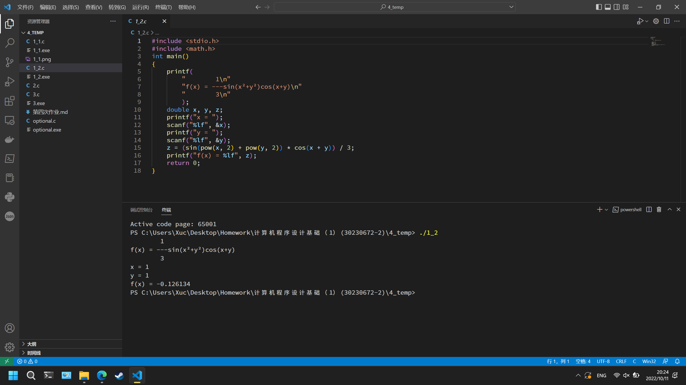

# 第四次作业

## 1

### (1)

```c
#include <stdio.h>
#include <math.h>
const double PI = 3.141592654;
int main()
{
    printf(
        "                x²\n"
        "             - ---\n"
        "         1      2\n"
        "f(x) = ----- e\n"
        "       √(2π)\n"
    );
    double x, y;
    printf("x = ");
    scanf("%lf", &x);
    y = (exp(-(pow(x, 2)) / 2))/(sqrt(2 * PI));
    printf("f(x) = %lf", y);
    return 0;
}
```

运行结果为

```sh
                x²
             - ---
         1      2
f(x) = ----- e
       √(2π)
x = 1
f(x) = 0.241971
```


### (2)

```c
#include <stdio.h>
#include <math.h>
int main()
{
    printf(
        "        1\n"
        "f(x) = ---sin(x²+y²)cos(x+y)\n"
        "        3\n"
        );
    double x, y, z;
    printf("x = ");
    scanf("%lf", &x);
    printf("y = ");
    scanf("%lf", &y);
    z = (sin(pow(x, 2) + pow(y, 2)) * cos(x + y)) / 3;
    printf("f(x) = %lf", z);
    return 0;
}
```

运行结果为

```sh
        1
f(x) = ---sin(x²+y²)cos(x+y)
        3
x = 1
y = 1
f(x) = -0.126134
```



## 2

```
0
0
0
1
1
1
1
```

## 3

### (1)

```c
a + b == 1 && b + c == 1 && b + c == 1
```

### (2)

```c
#include <stdio.h>
#include <stdbool.h>
int main()
{
    int i;
    bool a[3] = {0};
    for(i = 0; i <= 2; i++)
    {
        a[i] = 1;
        if(a[0] + a[1] == 1 && a[1] + a[2] == 1 && a[1] + a[2] == 1)
        {
            printf("说谎者是");
            switch (i)
            {
            case 0:
                printf("甲。\n");
                break;
            case 1:
                printf("乙。\n");
                break;
            case 2:
                printf("丙。\n");
                break;
            default:
                break;
            }
            break;
        }
        a[i] = 0;
    }
    return 0;
}
```

运行结果为

```sh
说谎者是乙。
```


## 选做题

```c
#include <stdio.h>
int main()
{
    int chick, cock, hen, flag = 0;
    printf("母鸡\t公鸡\t小鸡\n");
    for(hen = 66; hen > 0; hen--)
    {
        for(cock = 100; cock > 0; cock--)
            for(chick = 200; chick > 0; chick--)
                if(hen + cock + chick == 100 && 15*hen + 10*cock + 5*chick == 1000)
                {
                    printf("%d\t%d\t%d\n", hen, cock, chick);
                    flag = 1;
                }
        if(flag)
            break;
    }
    return 0;
}
```

运行结果为
```sh
母鸡    公鸡    小鸡
49      2       49
```

