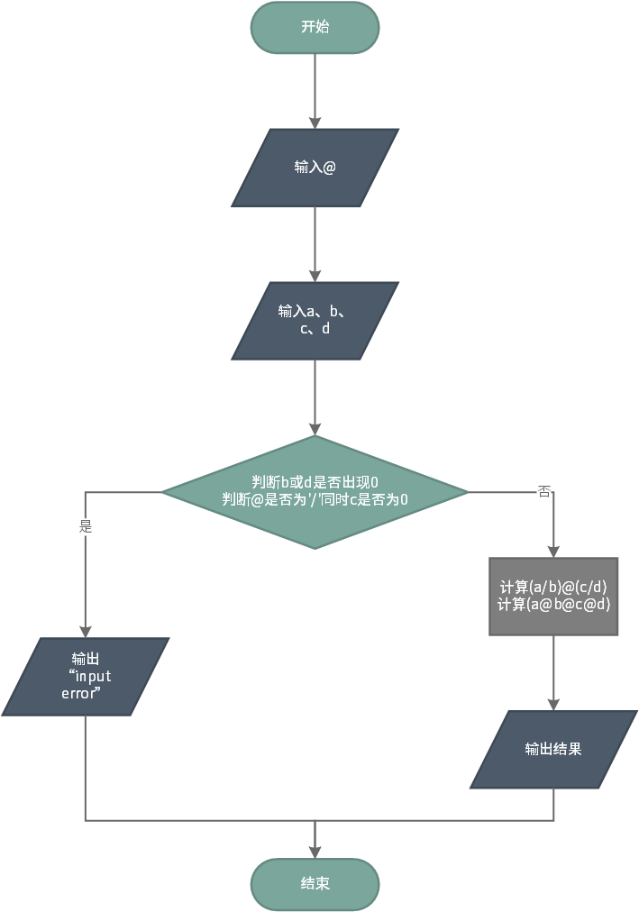
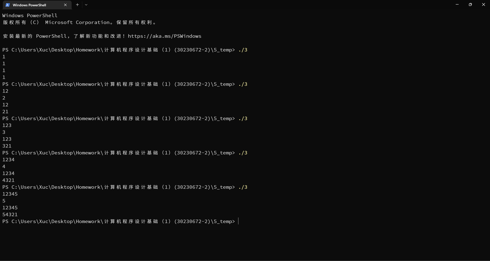
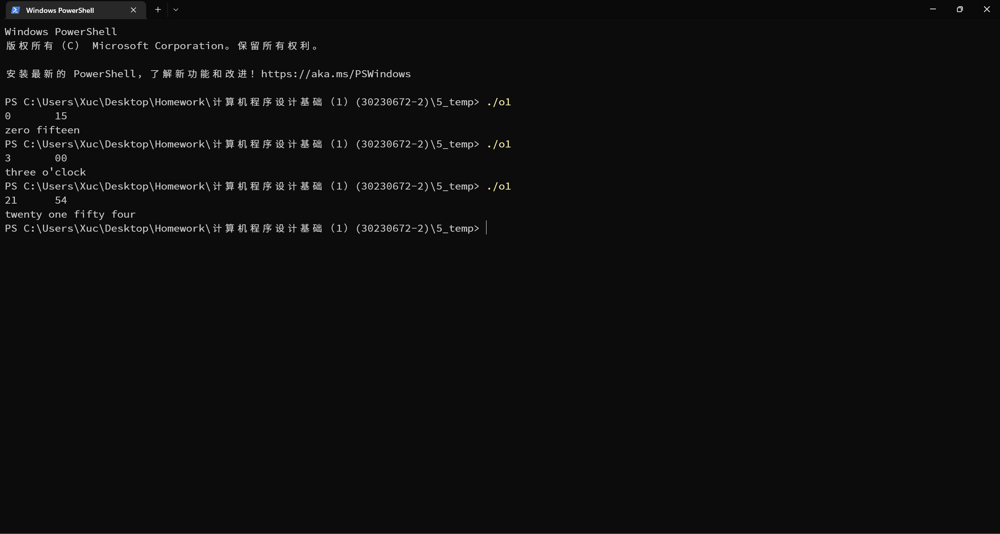
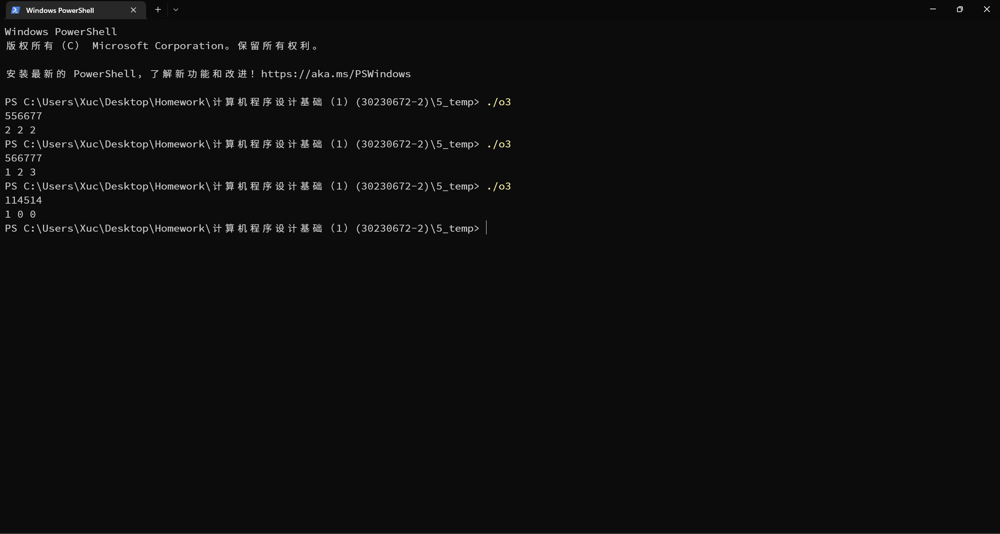

# 第五次作业

## 实验目的

完成本次作业，巩固上课所学知识

## 实验环境

设备：OMEN by HP Laptop 16-b1xxx
操作系统: Windows 11 专业版 22H2
编辑器: Visual Studio Code 1.72.1
编译器: gcc 12.1.0
终端：Windows Powershell

## 实验内容

### 必做第1题

流程图


程序代码
```c
#include <stdio.h>
void sort(int ar[], int size)
{
    int i, j;
    int temp;
    for(i = 0; i < size - 1; i++)
    {
        for(j = 0; j < size - 1; j++)
        {
            if(ar[j] > ar[j+1])
            {
                temp = ar[j];
                ar[j] = ar[j+1];
                ar[j+1] = temp;
            }
        }
    }
}
int main()
{
    int a[3] = {0};
    scanf("%d %d %d", a, a+1, a+2);
    sort(a, 3);
    if(a[0] + a[1] <= a[2])
    {
        printf("Not triangle\n");
    }
    else if(a[0] == a[1] && a[1] == a[2])
    {
        printf("Equilateral triangle\n");
    }
    else if(a[0] == a[1] || a[1] == a[2])
    {
        printf("Isosceles triangle\n");
    }
    else
    {
        printf("Triangle\n");
    }
    return 0;
}
```

运行结果


### 必做第2题

流程图


程序代码
```c
#include <stdio.h>
int main()
{
    double a, b, c, d;
    double o1, o2;
    char symbol;
    scanf("%c", &symbol);
    scanf("%lf %lf %lf %lf", &a, &b, &c, &d);
    if((b == 0 || d == 0) || (symbol == '/' && c == 0))
        printf("input error\n");
    else
    {
        switch(symbol)
        {
            case '+':
                o1 = (a/b)+(c/d);
                o2 = a+b+c+d;
                printf("%lf %lf", o1, o2);
                break;
            case '-':
                o1 = (a/b)-(c/d);
                o2 = a-b-c-d;
                printf("%lf %lf", o1, o2);
                break;
            case '*':
                o1 = (a/b)*(c/d);
                o2 = a*b*c*d;
                printf("%lf %lf", o1, o2);
                break;
            case '/':
                o1 = (a/b)/(c/d);
                o2 = a/b/c/d;
                printf("%lf %lf", o1, o2);
                break;
            default:
                printf("input error\n");
                break;
        }
    }
    return 0;
}
```

运行结果


### 必做第3题

程序代码
```c
#include <stdio.h>
int main()
{
    int a = 0, i = 0, cnt = 0;
    int n[6] = {-1};
    scanf("%d", &a);
    do
    {
        n[i] = a % 10;
        a /= 10;
        i++;
        cnt++;
    } while (a > 0);
    printf("%d\n", cnt);
    for(i = 0; i < cnt; i++)
        printf("%d", n[i]);
    printf("\n");
    for(i = cnt - 1; i >= 0; i--)
        printf("%d", n[i]);
    return 0;
}
```

运行结果



### 选做第1题

程序代码
```c
#include <stdio.h>
int main()
{
    int h, m;
    int h1, h2, m1, m2;
    scanf("%d %d", &h, &m);
    h1 = h / 10; h2 = h % 10;
    m1 = m / 10; m2 = m % 10;
    hour:
    switch(h1)
    {
        case 0:
            break;
        case 1:
            switch(h2)
            {
                case 0:
                    printf("ten ");
                    goto minute;
                    break;
                case 1:
                    printf("eleven ");
                    goto minute;
                    break;
                case 2:
                    printf("twelve ");
                    goto minute;
                    break;
                case 3:
                    printf("thirteen ");
                    goto minute;
                    break;
                case 4:
                    printf("fourteen ");
                    goto minute;
                    break;
                case 5:
                    printf("fifteen ");
                    goto minute;
                    break;
                case 6:
                    printf("sixteen ");
                    goto minute;
                    break;
                case 7:
                    printf("seventeen ");
                    goto minute;
                    break;
                case 8:
                    printf("eighteen ");
                    goto minute;
                    break;
                case 9:
                    printf("nineteen ");
                    goto minute;
                    break;
                default:
                    break;
            }
            break;
        case 2:
            printf("twenty ");
            break;
        default:
            break;
    }
    switch(h2)
    {
        case 0:
            if(h1 == 0)
                printf("zero ");
            break;
        case 1:
            printf("one ");
            break;
        case 2:
            printf("two ");
            break;
        case 3:
            printf("three ");
            break;
        case 4:
            printf("four ");
            break;
        case 5:
            printf("five ");
            break;
        case 6:
            printf("six ");
            break;
        case 7:
            printf("seven ");
            break;
        case 8:
            printf("eight ");
            break;
        case 9:
            printf("nine ");
            break;
        default:
            break;
    }
    minute:
    switch(m1)
    {
        case 0:
            break;
        case 1:
            switch(m2)
            {
                case 0:
                    printf("ten");
                    goto end;
                    break;
                case 1:
                    printf("eleven");
                    goto end;
                    break;
                case 2:
                    printf("twelve");
                    goto end;
                    break;
                case 3:
                    printf("thirteen");
                    goto end;
                    break;
                case 4:
                    printf("fourteen");
                    goto end;
                    break;
                case 5:
                    printf("fifteen");
                    goto end;
                    break;
                case 6:
                    printf("sixteen");
                    goto end;
                    break;
                case 7:
                    printf("seventeen");
                    goto end;
                    break;
                case 8:
                    printf("eighteen");
                    goto end;
                    break;
                case 9:
                    printf("nineteen");
                    goto end;
                    break;
                default:
                    break;
            }
            break;
        case 2:
            printf("twenty ");
            break;
        case 3:
            printf("thirty ");
            break;
        case 4:
            printf("forty ");
            break;
        case 5:
            printf("fifty ");
            break;
        default:
            break;
    }
    switch(m2)
    {
        case 0:
            if(m1 == 0)
                printf("o'clock");
            break;
        case 1:
            printf("one");
            break;
        case 2:
            printf("two");
            break;
        case 3:
            printf("three");
            break;
        case 4:
            printf("four");
            break;
        case 5:
            printf("five");
            break;
        case 6:
            printf("six");
            break;
        case 7:
            printf("seven");
            break;
        case 8:
            printf("eight");
            break;
        case 9:
            printf("nine");
            break;
        default:
            break;
    }
    end:
    return 0;
}
```

运行结果


### 选做第2题

程序代码
```c
#include <stdio.h>
#include <math.h>
int main()
{
    double x, y;
    scanf("%lf %lf", &x, &y);
    if(pow(x-2, 2) + pow(y-2, 2) <= 1)
        printf("10m\n");
    else if(pow(x+2, 2) + pow(y-2, 2) <= 1)
        printf("9m\n");
    else if(pow(x+2, 2) + pow(y+2, 2) <= 1)
        printf("8m\n");
    else if(pow(x-2, 2) + pow(y+2, 2) <= 1)
        printf("7m\n");
    else printf("0m\n");
}
```

运行结果


### 选做第3题

程序代码
```c
#include <stdio.h>
int main()
{
    int n;
    int cnt5 = 0, cnt6 = 0, cnt7 = 0;
    scanf("%d", &n);
    do
    {
        switch(n % 10)
        {
        case 5:
            cnt5++;
            break;
        case 6:
            cnt6++;
            break;
        case 7:
            cnt7++;
            break;
        default:
            break;
        }
        n /= 10;
    } while (n != 0);
    printf("%d %d %d", cnt5, cnt6, cnt7);
}
```

运行结果


## 实验体会
顺序结构和分支结构需要认真学习，仔细完成作业。