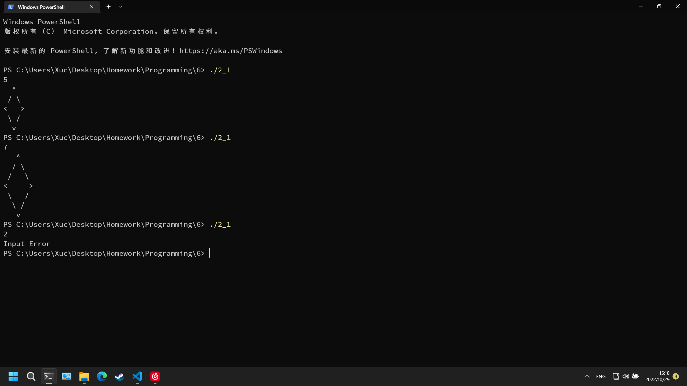
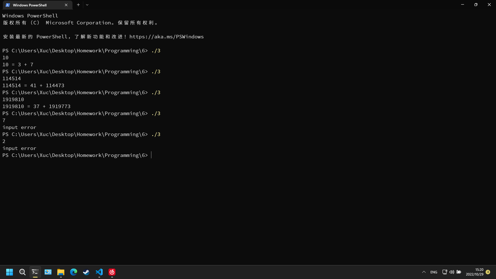

# 第六次作业

## 实验目的

完成本次作业，巩固上课所学知识

## 实验环境

设备：OMEN by HP Laptop 16-b1xxx
操作系统: Windows 11 专业版 22H2
编辑器: Visual Studio Code 1.72.1
编译器: gcc 12.1.0
终端：Windows Powershell

## 实验内容

### 必做第1题

流程图


程序代码
```c
#include <stdio.h>
#include <math.h>
int prime(int a)
{
    int ret = 1;
    for(int i = 2; i <= (int)sqrt(a); i++)
        if(a % i == 0)
            ret = 0;
    return ret;
}
int main()
{
    for(int i = 10; i <= 198; i++)
        if(prime(i) && prime(i+2))
            printf("%d %d\n", i, i+2);
    return 0;
}
```

运行结果


### 必做第2题

流程图


程序代码
第一种
```c
#include <stdio.h>
int main()
{
    int n;
    scanf("%d", &n);
    if(n > 2 && n % 2)
    {
        for(int i = 1; i <= (n - 1) / 2; i++)
            printf(" ");
        printf("^\n");
        for(int i = 1; i <= (n - 3) / 2; i++)
        {
            for(int j = 1; j <= (n - 1) / 2 - i; j++)
            {
                printf(" ");
            }
            printf("/");
            for(int j = 1; j <= 2 * i - 1; j++)
            {
                printf(" ");
            }
            printf("\\\n");
        }
        printf("<");
        for(int i = 1; i <= n - 2; i++)
            printf(" ");
        printf(">\n");
        for(int i = 1; i <= (n - 3) / 2; i++)
        {
            for(int j = 1; j <= i; j++)
            {
                printf(" ");
            }
            printf("\\");
            for(int j = 1; j <= n - 2 * i - 2; j++)
            {
                printf(" ");
            }
            printf("/\n");
        }
        for(int i = 1; i <= (n - 1) / 2; i++)
            printf(" ");
        printf("v\n");
    }
    else printf("Input Error\n");
    return 0;
}
```
第二种
```c
#include <stdio.h>
int main()
{
    int n;
    char c[110][110];
    scanf("%d", &n);
    for(int i = 1; i <= n; i++)
        for(int j = 1; j <= n; j++)
            c[i][j]=' ';
    if(n > 2 && n % 2)
    {
        c[1][(n + 1) / 2] = '^';
        c[(n + 1) / 2][1] = '<';
        c[(n + 1) / 2][n] = '>';
        c[n][(n + 1) / 2] = 'v';
        for(int i = 2; i <= (n - 1) / 2; i++)
        {
            c[i][(n + 3) / 2 - i] = '/';
            c[i][(n - 1) / 2 + i] = '\\';
            c[n - i + 1][(n + 3) / 2 - i] = '\\';
            c[n - i + 1][(n - 1) / 2 + i] = '/';
        }
        for(int i = 1; i <= n; i++)
        {
            for(int j = 1; j <= n; j++)
                printf("%c", c[i][j]);
            printf("\n");
        }
    }
    else printf("Input Error\n");
    return 0;
}
```

运行结果



### 必做第3题

流程图


程序代码
```c
#include <stdio.h>
#include <math.h>
int prime(int a)
{
    int ret = 1;
    for(int i = 2; i <= (int)sqrt(a); i++)
        if(a % i == 0)
            ret = 0;
    return ret;
}
int main()
{
    int n, p1, p2;
    scanf("%d", &n);
    if(n >= 4 && n % 2 == 0)
    {
        for(p1 = 2; p1 <= n / 2; p1++)
        {
            p2 = n - p1;
            if(prime(p1) && prime(p2))
            {
                printf("%d = %d + %d\n", n, p1, p2);
                goto end;
            }
        }
    }
    else printf("input error\n");
    end:
    return 0;
}
```

运行结果


### 选做第1题

流程图


程序代码
```c
#include <stdio.h>
int main()
{
    int a[6] = {0};
    int  i = 4, sum = 0;
    a[5] = 11;
    sum = a[5];
    for(i = 4; i >= 1; i--)
    {
        a[i] = (a[i] + sum + 1) / i;
        sum += a[i];
    }
    printf("原来共有%d个苹果。\n", sum);
    printf("A得到%d个苹果。\n", a[1]);
    printf("B得到%d个苹果。\n", a[2]);
    printf("C得到%d个苹果。\n", a[3]);
    printf("D得到%d个苹果。\n", a[4]);
    printf("E得到%d个苹果。\n", a[5]);
}
```

运行结果


### 选做第2题

流程图


程序代码
```c
#include <stdio.h>
int main()
{
    int n = 0, k = 1, s = 0;
    scanf("%d", &n);
    for(int i = 1; i <= n; i++)
    {
        k = 1;
        for(int j = 1; j <= i; j++)
        {
            k *= j;
        }
        s += k;
    }
    printf("%d", s);
    return 0;
}
```

运行结果


### 选做第3题

流程图


程序代码
```c
#include <stdio.h>
#include <math.h>
int main()
{
    int i = 1, j = 1, cnt = 0, k = 0;
    int a[5] = {0};
    int b[5] = {0};
    printf("这些数是：\n");
    for(i = 1; i <= 1000; i++)
    {
        if(pow((int)sqrt(i), 2) == i)
        {
            cnt = 0; k = 0;
            for(j = 1; j < (int)sqrt(i); j++)
            {
                if(i % j == 0)
                {
                    cnt += 2;
                    a[k] = j;
                    b[k] = i / j;
                    k++;
                    if(k > 4) break;
                }
            }
            if(cnt == 4)
                printf("%5d:%5d%5d%5d%5d%5d\n", i, a[0], a[1], (int)sqrt(i), b[1], b[0]);
        }
    }
    return 0;
}
```

运行结果


### 选做第4题

流程图


程序代码
```c
#include <stdio.h>
int main()
{
    int a[6] = {0};
    int cnt = 0;
    for(a[0] = 0; a[0] <= 1; a[0]++)
        for(a[1] = 0; a[1] <= 1; a[1]++)
            for(a[2] = 0; a[2] <= 1; a[2]++)
                for(a[3] = 0; a[3] <= 1; a[3]++)
                    for(a[4] = 0; a[4] <= 1; a[4]++)
                        for(a[5] = 0; a[5] <= 1; a[5]++)
                            if(a[0] + a[1] + a[2] + a[3] + a[4] + a[5] == 3)
                                {
                                    for(int i = 0; i <= 5; i++)
                                    {
                                        printf("%c--", i + 65);
                                        switch (a[i])
                                        {
                                        case 0:
                                            printf("白");
                                            break;
                                        case 1:
                                            printf("黑");
                                            break;
                                        default:
                                            break;
                                        }
                                        if(i != 5) printf("  ");
                                        else printf("\n");
                                    }
                                    cnt++;
                                }
    printf("共%d种。\n", cnt);
    return 0;
}
```

运行结果


### 选做第5题

流程图


程序代码
```c
#include <stdio.h>
#include <math.h>
int main()
{
    int n = 0, t = 0;
    int i, a, b, c, d, e;
    int num[5] = {0};
    int min1 = 0, min2 = 0;
    scanf("%d", &n);
    if(n >= 10000 && n <= 99999)
    {
        for(i = 0; i <= 4; i++)
        {
            num[i] = n % 10;
            n /= 10;
        }
        for(a = 0; a <= 4; a++)
            for(b = 0; b <= 4; b++)
                if(a != b)
                    for(c = 0; c <= 4; c++)
                        if(c != a && c != b)
                            for(d = 0; d <= 4; d++)
                                if(d != a && d != b && d != c)
                                    for(e = 0; e <= 4; e++)
                                        if(e != a && e != b && e != c && e != d)
                                        {
                                            t = num[0] * pow(10, a) + num[1] * pow(10, b)
                                                + num[2] * pow(10, c) + num[3] * pow(10, d)
                                                + num[4] * pow(10, e);
                                            if(fabs(t - 40000) < fabs(min1 - 40000)) min1 = t;
                                            if(fabs(t - 60000) < fabs(min2 - 60000)) min2 = t;
                                        }
        printf("%d  %d\n", min1, min2);
    }
    else
    {
        printf("错误提示。\n");
    }
    return 0;
}
```

运行结果


## 实验体会

顺序结构和分支结构需要认真学习，仔细完成作业。