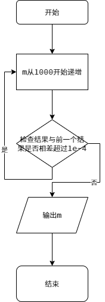
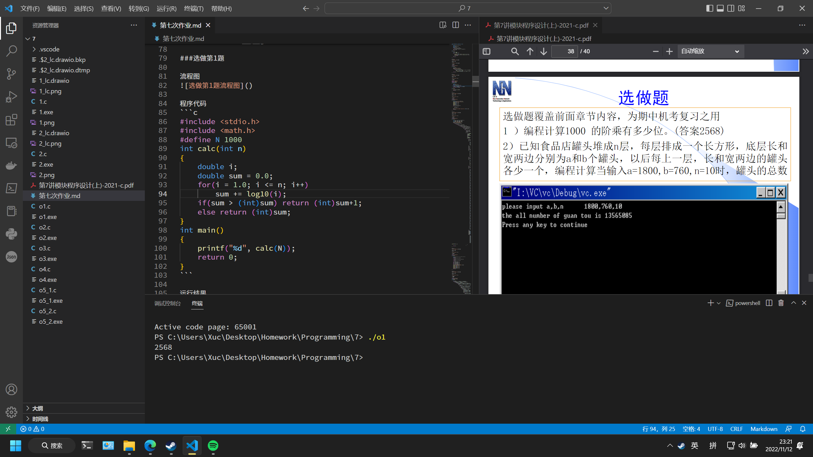
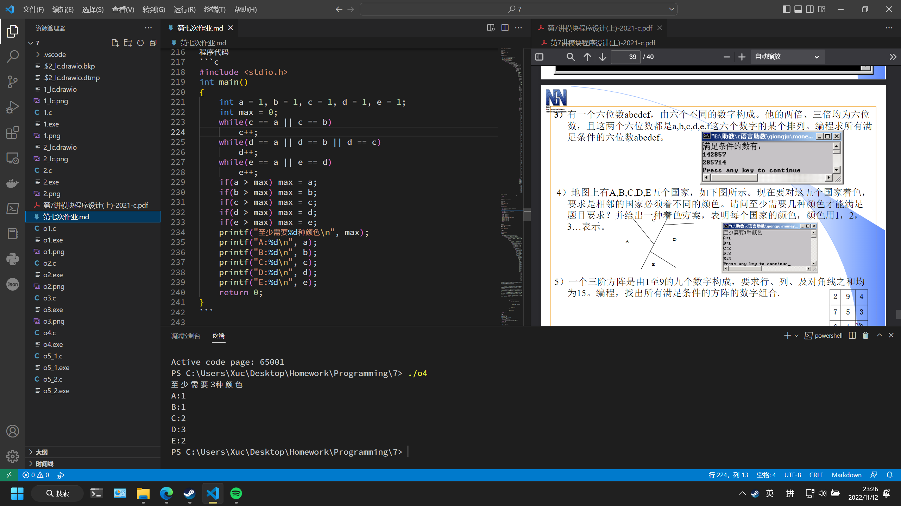

# 第七次作业

## 实验目的
完成本次作业，巩固上课所学知识

## 实验环境
设备：OMEN by HP Laptop 16-b1xxx
操作系统: Windows 11 专业版 22H2
编辑器: Visual Studio Code 1.72.1
编译器: gcc 12.1.0
终端：Windows Powershell

## 实验内容
### 必做第1题

流程图


程序代码
```c
#include <stdio.h>
#include <math.h>
double f(double x)
{
    double ret;
    ret = pow(exp(1.0), -x*x);
    return ret;
}
double S(double a, double b, int m)
{
    double h = (b - a) / m;
    int k = 1;
    double sum = 0.0;
    double ret;
    for(k = 1; k < m; k++)
        sum += f(a + (k * h));
    ret = (( f(a) + f(b) ) / 2 + sum) * h;
    return ret;
}
int main()
{
    int m = 1000;
    for(m = 1000;; m++)
    {
        printf("S=%.4lf, m=%d\n", S(-1.0, 1.0, m), m);
        if(fabs(S(-1.0, 1.0, m) - S(-1.0, 1.0, m - 1)) < 1e-4) break;
    }
    return 0;
}
```

运行结果


### 必做第2题

流程图


程序代码
```c
#include <stdio.h>
int main()
{
    int a, b;
    printf("站\t躺\t老\n");
    for(a = 1; a <= 20; a++)
        for(b = 1; b <= 33; b++)
            if(a * 5 + b * 3 + (100 - a - b) / 3 == 100 && (100 - a - b) % 3 == 0)
                printf("%d\t%d\t%d\n", a, b, 100 - a - b);
    return 0;
}
```

运行结果


### 选做第1题

流程图


程序代码
```c
#include <stdio.h>
#include <math.h>
#define N 1000
int calc(int n)
{
    double i;
    double sum = 0.0;
    for(i = 1.0; i <= n; i++)
        sum += log10(i);
    if(sum > (int)sum) return (int)sum+1;
    else return (int)sum;
}
int main()
{
    printf("%d", calc(N));
    return 0;
}
```

运行结果


### 选做第2题

流程图


程序代码
```c
#include <stdio.h>
int main()
{
    long long a, b, n, i, sum = 0;
    printf("please input a,b,n\t\t");
    scanf("%lld", &a);
    getchar();
    scanf("%lld", &b);
    getchar();
    scanf("%lld", &n);
    for(i = 1; i <= n; i++)
    {
        sum += a * b;
        a--; b--;
    }
    printf("the all number of guan tou is %lld", sum);
    return 0;
}
```

运行结果


### 选做第3题

流程图


程序代码
```c
#include <stdio.h>
int main()
{
    int a, b, c, d, e, f, n, n1, n2, i;
    int s1[6] = {0}, s2[6] = {0};
    int c1[6] = {0}, c2[6] = {0};
    printf("满足条件的数有：\n");
    for(a = 1; a <= 3; a++)
        for(b = 0; b <= 9; b++)
            if(a != b)
                for(c = 0; c <= 9; c++)
                    if(c != a && c != b)
                        for(d = 0; d <= 9; d++)
                            if(d != a && d != b && d != c)
                                for(e = 0; e <= 9; e++)
                                    if(e != a && e != b && e != c && e != d)
                                        for(f = 0; f <= 9; f++)
                                            if(f != a && f != b && f != c && f != d && f != e)
                                            {
                                                n = a*100000+b*10000+c*1000+d*100+e*10+f;
                                                if(n > 100000 && n < 333333)
                                                {
                                                    for(i = 0; i <= 5; i++)
                                                    {
                                                        c1[i] = 0;
                                                        c2[i] = 0;
                                                    }
                                                    n1 = n * 2;
                                                    n2 = n * 3;
                                                    for(i = 0; i <= 5; i++)
                                                    {
                                                        s1[i] = n1 % 10;
                                                        n1 /= 10;
                                                    }
                                                    for(i = 0; i <= 5; i++)
                                                    {
                                                        s2[i] = n2 % 10;
                                                        n2 /= 10;
                                                    }
                                                    for(i = 0; i <= 5; i++)
                                                    {
                                                        if(s1[i] == a) c1[0]++;
                                                        if(s1[i] == b) c1[1]++;
                                                        if(s1[i] == c) c1[2]++;
                                                        if(s1[i] == d) c1[3]++;
                                                        if(s1[i] == e) c1[4]++;
                                                        if(s1[i] == f) c1[5]++;
                                                        if(s2[i] == a) c2[0]++;
                                                        if(s2[i] == b) c2[1]++;
                                                        if(s2[i] == c) c2[2]++;
                                                        if(s2[i] == d) c2[3]++;
                                                        if(s2[i] == e) c2[4]++;
                                                        if(s2[i] == f) c2[5]++;
                                                    }
                                                    if(c1[0]&&c1[1]&&c1[2]&&c1[3]&&c1[4]&&c1[5])
                                                        if(c2[0]&&c2[1]&&c2[2]&&c2[3]&&c2[4]&&c2[5])
                                                            printf("%d\n", n);
                                                }
                                            }
    return 0;
}
```

运行结果


### 选做第4题

流程图


程序代码
```c
#include <stdio.h>
int main()
{
    int a = 1, b = 1, c = 1, d = 1, e = 1;
    int max = 0;
    while(c == a || c == b)
        c++;
    while(d == a || d == b || d == c)
        d++;
    while(e == a || e == d)
        e++;
    if(a > max) max = a;
    if(b > max) max = b;
    if(c > max) max = c;
    if(d > max) max = d;
    if(e > max) max = e;
    printf("至少需要%d种颜色\n", max);
    printf("A:%d\n", a);
    printf("B:%d\n", b);
    printf("C:%d\n", c);
    printf("D:%d\n", d);
    printf("E:%d\n", e);
    return 0;
}
```

运行结果


### 选做第5题

流程图


程序代码
第一种
```c
#include <stdio.h>
int a[3][3] = {0};
int main()
{
    int i, j;
    for(a[0][0] = 1; a[0][0] <= 9; a[0][0]++)
        for(a[0][1] = 1; a[0][1] <= 9; a[0][1]++)
            if(a[0][1] != a[0][0])
                for(a[0][2] = 1; a[0][2] <= 9; a[0][2]++)
                    if(a[0][2] != a[0][0] && a[0][2] != a[0][1])
                        for(a[1][0] = 1; a[1][0] <= 9; a[1][0]++)
                            if(a[1][0] != a[0][0] && a[1][0] != a[0][1] && a[1][0] != a[0][2])
                                for(a[1][1] = 1; a[1][1] <= 9; a[1][1]++)
                                    if(a[1][1] != a[0][0] && a[1][1] != a[0][1] && a[1][1] != a[0][2] && a[1][1] != a[1][0])
                                        for(a[1][2] = 1; a[1][2] <= 9; a[1][2]++)
                                            if(a[1][2] != a[0][0] && a[1][2] != a[0][1] && a[1][2] != a[0][2] && a[1][2] != a[1][0] && a[1][2] != a[1][1])
                                                for(a[2][0] = 1; a[2][0] <= 9; a[2][0]++)
                                                    if(a[2][0] != a[0][0] && a[2][0] != a[0][1] && a[2][0] != a[0][2] && a[2][0] != a[1][0] && a[2][0] != a[1][1] && a[2][0] != a[1][2])
                                                        for(a[2][1] = 1; a[2][1] <= 9; a[2][1]++)
                                                            if(a[2][1] != a[0][0] && a[2][1] != a[0][1] && a[2][1] != a[0][2] && a[2][1] != a[1][0] && a[2][1] != a[1][1] && a[2][1] != a[1][2] && a[2][1] != a[2][0])
                                                                for(a[2][2] = 1; a[2][2] <= 9; a[2][2]++)
                                                                    if(a[2][2] != a[0][0] && a[2][2] != a[0][1] && a[2][2] != a[0][2] && a[2][2] != a[1][0] && a[2][2] != a[1][1] && a[2][2] != a[1][2] && a[2][2] != a[2][0] && a[2][2] != a[2][1])
                                                                        if(a[0][0] + a[0][1] + a[0][2] == 15 && a[1][0] + a[1][1] + a[1][2] == 15 && a[2][0] + a[2][1] + a[2][2] == 15)
                                                                            if(a[0][0] + a[1][0] + a[2][0] == 15 && a[0][1] + a[1][1] + a[2][1] == 15 && a[0][2] + a[1][2] + a[2][2] == 15)
                                                                                if(a[0][0] + a[1][1] + a[2][2] == 15 && a[2][0] + a[1][1] + a[0][2] == 15)
                                                                                {
                                                                                    for(i = 0; i <= 2; i++)
                                                                                    {
                                                                                        for(j = 0; j <= 2; j++)
                                                                                        {
                                                                                            printf("%2d", a[i][j]);
                                                                                        }
                                                                                        printf("\n");
                                                                                    }
                                                                                    printf("\n");
                                                                                }
    return 0;
}
```
第二种
```c
#include <stdio.h>
int a[3][3] = {0};
int checkRepeat(int m, int n)
{
    int i, j, ret = 1;
    for(i = 0; i <= m; i++)
        for(j = 0; i == m ? j < n : j <= 2; j++)
            if(a[i][j] == a[m][n]) ret = 0;
    return ret;
}
int checkRow()
{
    int i, ret = 1;
    for(i = 0; i <= 2; i++)
        if(a[i][0] + a[i][1] + a[i][2] != 15) ret = 0;
    return ret;
}
int checkColumn()
{
    int i, ret = 1;
    for(i = 0; i <= 2; i++)
        if(a[0][i] + a[1][i] + a[2][i] != 15) ret = 0;
    return ret;
}
int checkDiagonal()
{
    int ret = 1;
    if(a[0][0] + a[1][1] + a[2][2] != 15 || a[2][0] + a[1][1] + a[0][2] != 15) ret = 0;
    return ret;
}
void showShowWay()
{
    int i, j;
    for(i = 0; i <= 2; i++)
    {
        for(j = 0; j <= 2; j++)
        {
            printf("%2d", a[i][j]);
        }
        printf("\n");
    }
    printf("\n");
}
int main()
{
    for(a[0][0] = 1; a[0][0] <= 9; a[0][0]++)
        for(a[0][1] = 1; a[0][1] <= 9; a[0][1]++)
        if(checkRepeat(0, 1))
            for(a[0][2] = 1; a[0][2] <= 9; a[0][2]++)
            if(checkRepeat(0, 2))
                for(a[1][0] = 1; a[1][0] <= 9; a[1][0]++)
                if(checkRepeat(1, 0))
                    for(a[1][1] = 1; a[1][1] <= 9; a[1][1]++)
                    if(checkRepeat(1, 1))
                        for(a[1][2] = 1; a[1][2] <= 9; a[1][2]++)
                        if(checkRepeat(1, 2))
                            for(a[2][0] = 1; a[2][0] <= 9; a[2][0]++)
                            if(checkRepeat(2, 0))
                                for(a[2][1] = 1; a[2][1] <= 9; a[2][1]++)
                                if(checkRepeat(2, 1))
                                    for(a[2][2] = 1; a[2][2] <= 9; a[2][2]++)
                                    if(checkRepeat(2, 2))
                                        if(checkRow() && checkColumn() && checkDiagonal())
                                            showShowWay();
    return 0;
}
```

运行结果


## 实验体会
需要认真学习，仔细完成作业。