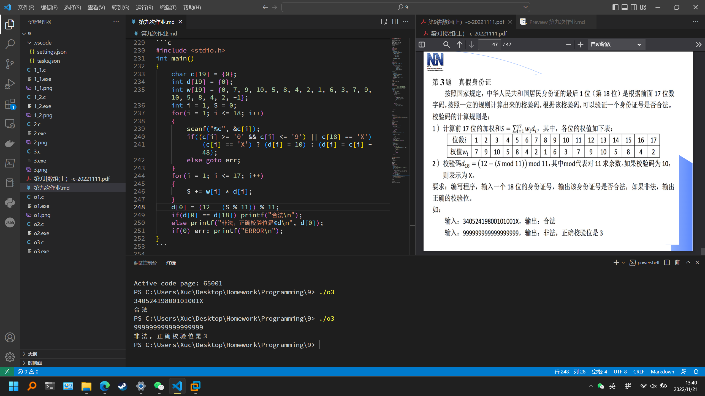

# 第九次作业

## 实验目的
完成本次作业，巩固上课所学知识

## 实验环境
设备：OMEN by HP Laptop 16-b1xxx
操作系统: Windows 11 专业版 22H2
编辑器: Visual Studio Code 1.72.1
编译器: gcc 12.1.0
终端：Windows Powershell

## 实验内容
### 必做第1题

程序代码
第一种
```c
#include <stdio.h>
#include <stdlib.h>
#include <time.h>
int main()
{
    int sheep[110] = {0};
    int i = 0, max = 0, j = 0;
    srand((unsigned int)time(NULL));
    for(i = 1; i <= 100; i++)
        sheep[i] = rand();
    for(i = 1; i <= 100; i++)
    {
        if(max < sheep[i])
        {
            max = sheep[i];
            j = i;
        }
    }
    printf("%d %d\n", max, j);
    return 0;
}
```
第二种
```c
#include <stdio.h>
#include <stdlib.h>
#include <time.h>
void sort(int ar1[], int ar2[], int n)
{
    int i, j, t;
    for(i = 1; i <= n; i++)
        for(j = 1; j <= n; j++)
            if(ar1[j] < ar1[j + 1])
            {
                t = ar1[j];
                ar1[j] = ar1[j + 1];
                ar1[j + 1] = t;
                t = ar2[j];
                ar2[j] = ar2[j + 1];
                ar2[j + 1] = t;
            }
}
int main()
{
    int sheep[110] = {0};
    int num[110];
    int i = 0, max = 0, j = 0;
    srand((unsigned int)time(NULL));
    for(i = 1; i <= 100; i++)
        sheep[i] = rand();
    for(i = 1; i <= 100; i++)
        num[i] = i;
    sort(sheep, num, 100);
    printf("%d %d\n", sheep[1], num[1]);
    return 0;
}
```

运行结果


### 必做第2题

程序代码
```c
#include <stdio.h>
double A[4][4] = {1.1161, 0.1254, 0.1397, 0.1490,
                  0.1582, 1.1675, 0.1768, 0.1871,
                  0.2368, 0.2471, 0.2568, 1.2671,
                  0.1968, 0.2071, 1.2168, 0.2271};
double B[4] = {1.5471, 1.6471, 1.8471, 1.7471};
double x[4] = {0};
int main()
{
    int i, j, k;
    double t, r;
    for(i = 0; i <= 3; i++)
    {
        t = A[i][i];
        for(j = 0; j <= 3; j++)
            A[i][j] /= t;
        B[i] /= t;
        if(i < 3)
        {
            for(j = i + 1; j <= 3; j++)
            {
                r = A[j][i];
                for(k = 0; k <= 3; k++)
                {
                    A[j][k] -= r * A[i][k];
                }
                B[j] -= r * B[i];
            }
        }
    }
    for(i = 3; i >= 0; i--)
    {
        x[i] = B[i];
        if(i < 3)
        {
            for(j = 3; j > i; j--)
                x[i] -= A[i][j] * x[j];
        }
    }
    for(i = 0; i <= 3; i++)
    {
        printf("x(%d)=%lf\n", i + 1, x[i]);
    }
    return 0;
}
```

运行结果


### 必做第3题

程序代码
```c
#include <stdio.h>
int main()
{
    int head = 15, foot = 40;
    printf("Chicken = %d, Rabbit = %d\n", head - (foot - 2 * head) / 2, (foot - 2 * head) / 2);
    return 0;
}
```

运行结果


### 选做第1题

程序代码
```c
#include <stdio.h>
int checkRepeat(int num, int ar[])
{
    int i = 0, ret = 0;
    while(i < num)
    {
        if(ar[i] == ar[num])
        {
            ret = 1;
            break;
        }
        i++;
    }
    return ret;
}
int checkHappiness(int a, int num, int ar[])
{
    int b[11] = {0};
    int cnt = 0, sum = 0, i;
    while(a > 0)
    {
        b[cnt] = a % 10;
        a /= 10;
        cnt++;
    }
    for(i = 0; i < cnt; i++)
        sum += b[i] * b[i];
    ar[num] = sum;
    if(sum == 1) return 1;
    else if(checkRepeat(num, ar)) return -1;
    else return 0;
}
int main()
{
    int num, i, t;
    int temp[110] = {0};
    scanf("%d", &num);
    if(checkHappiness(num, 0, temp) == 1) printf("1\n");
    else
    {
        for(i = 1; ; i++)
        {
            t = checkHappiness(temp[i - 1], i, temp);
            if(t == 1)
            {
                printf("1\n");
                break;
            }
            if(t == -1)
            {
                printf("0\n");
                break;
            }
        }
    }
    return 0;
}
```

运行结果


### 选做第2题

运行结果
```powershell
10, 9, 8, 7, 6, 1, 2, 3, 4, 5,
```

### 选做第3题

程序代码
```c
#include <stdio.h>
int main()
{
    char c[19] = {0};
    int d[19] = {0};
    int w[19] = {0, 7, 9, 10, 5, 8, 4, 2, 1, 6, 3, 7, 9, 10, 5, 8, 4, 2, -1};
    int i = 1, S = 0;
    for(i = 1; i <= 18; i++)
    {
        scanf("%c", &c[i]);
        if((c[i] >= '0' && c[i] <= '9') || c[18] == 'X')
            (c[i] == 'X') ? (d[i] = 10) : (d[i] = c[i] - 48);
        else goto err;
    }
    for(i = 1; i <= 17; i++)
    {
        S += w[i] * d[i];
    }
    d[0] = (12 - (S % 11)) % 11;
    if(d[0] == d[18]) printf("合法\n");
    else if(d[0] == 10) printf("非法，正确校验位是X");
    else printf("非法，正确校验位是%d\n", d[0]);
    if(0) err: printf("ERROR\n");
}
```

运行结果



## 实验体会
需要认真学习，仔细完成作业。