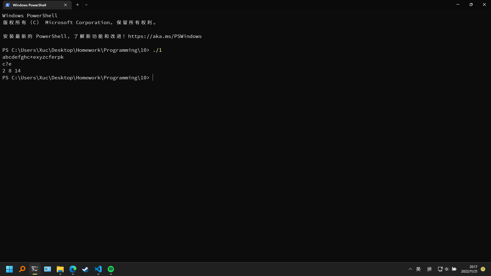
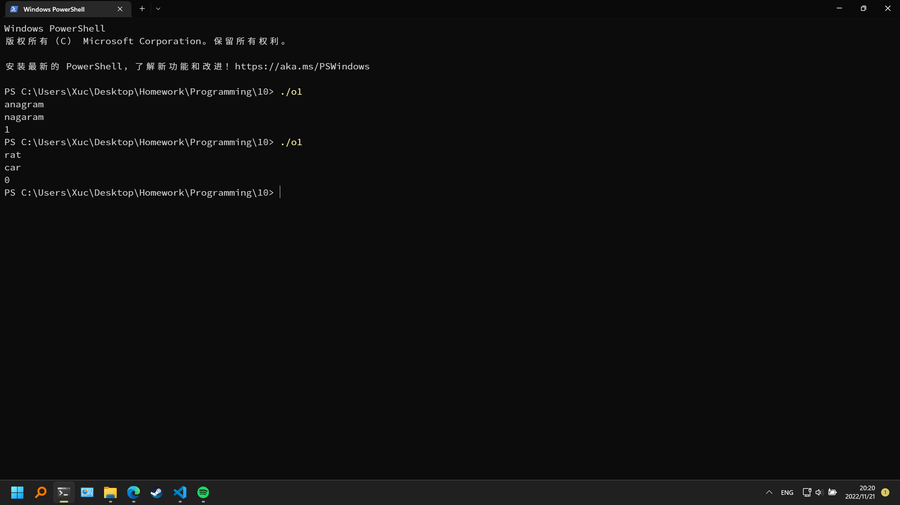
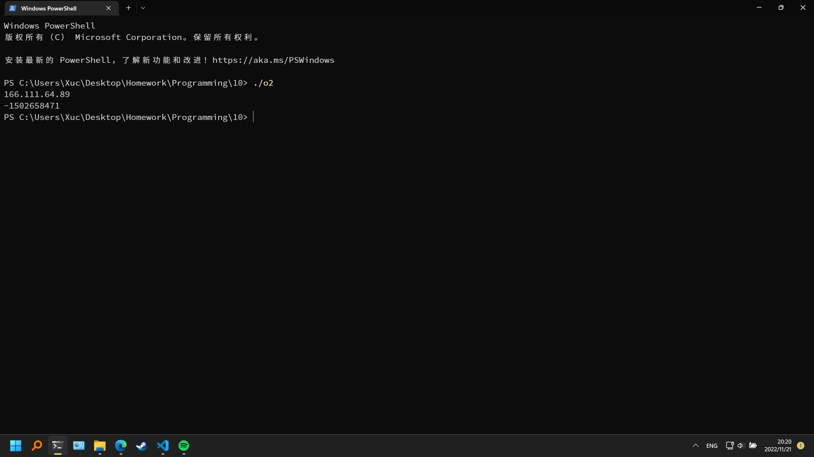

# 第十次作业

## 实验目的
完成本次作业，巩固上课所学知识

## 实验环境
设备：OMEN by HP Laptop 16-b1xxx
操作系统: Windows 11 专业版 22H2
编辑器: Visual Studio Code 1.72.1
编译器: gcc 12.1.0
终端：Windows Powershell

## 实验内容
### 必做第1题

程序代码
```c
#include <stdio.h>
#include <string.h>
int main()
{
    char sA[31] = {0}, sB[31] = {0};
    int i, j, flag, cnt = 0;
    scanf("%s", sA);
    scanf("%s", sB);
    for(i = 0; i <= strlen(sA) - strlen(sB); i++)
        if(sA[i] == *sB)
        {
            flag = 1;
            for(j = 0; j < strlen(sB); j++)
                if(sA[i + j] != sB[j] && sB[j] != '?')
                {
                    flag = 0;
                    break;
                }
            if(flag)
            {
                printf("%d ", i);
                cnt++;
            }
        }
    if(!cnt) printf("No match found\n");
    return 0;
}
```

运行结果



### 必做第2题

程序代码
```c
#include <stdio.h>
#include <string.h>
int main()
{
    char str[110] = {0}, vwl[110] = {0};
    int vwlNum[110] = {0};
    int i = 0, j = 0, l, t;
    scanf("%s", str);
    for(i = 0; i < strlen(str); i++)
        if(str[i] == 'a' || str[i] == 'e' || str[i] == 'i' || str[i] == 'o' || str[i] == 'u')
        {
            vwl[j] = str[i];
            vwlNum[j] = i + 1;
            j++;
        }
    l = strlen(vwl);
    for(i = 0; i < l / 2; i++)
    {
        t = vwl[i];
        vwl[i] = vwl[l - i - 1];
        vwl[l - i - 1] = t;
    }
    for(i = 0; vwlNum[i] != 0; i++)
        str[vwlNum[i] - 1] = vwl[i];
    printf("%s", str);
    return 0;
}
```

运行结果


### 必做第3题

程序代码
```c
#include <stdio.h>
#include <string.h>
void sort(char ar[])
{
    int i, j;
    char t;
    for(i = 0; i < strlen(ar); i++)
        for(j = 0; j < strlen(ar); j++)
            if(ar[j] < ar[j + 1])
            {
                t = ar[j];
                ar[j] = ar[j + 1];
                ar[j + 1] = t;
            }
}
int main()
{
    char str[110] = {0};
    scanf("%s", str);
    sort(str);
    printf("%s", str);
    return 0;
}
```

运行结果


### 选做第1题

程序代码
```c
#include <stdio.h>
#include <string.h>
int main()
{
    char s[110] = {0}, t[110] = {0};
    int sCnt[26] = {0}, tCnt[26] = {0};
    int i, flag = 1;
    scanf("%s", s);
    scanf("%s", t);
    for(i = 0; i < strlen(s); i++)
        sCnt[s[i] - 97]++;
    for(i = 0; i < strlen(t); i++)
        tCnt[t[i] - 97]++;
    for(i = 0; i < 26; i++)
        if(sCnt[i] != tCnt[i])
        {
            flag = 0;
            break;
        }
    printf("%d", flag);
    return 0;
}
```

运行结果


### 选做第2题

程序代码
```c
#include <stdio.h>
#include <string.h>
#include <math.h>
int aton(const char str[])
{
    int a[4] = {0};
    int i = 0, j = 0, cnt = 0;
    long long ret = 1;
    for(i = 0; i < strlen(str); i++)
    {
        if(str[i] >= '0' && str[i] <= '9')
        {
            a[j] *= 10;
            a[j] += (str[i] - 48);
        }
        else if(str[i] == '.')
        {
            cnt++;
            j++;
        }
        else
        {
            ret = 0;
            break;
        }
        if(cnt > 3)
        {
            ret = 0;
            break;
        }
        if(a[j] > 255 || a[j] < 0)
        {
            ret = 0;
            break;
        }
    }
    if(ret)
    {
        ret = 0;
        for(i = 0; i <= 3; i++)
            ret += a[i] * (int)pow(256.0, (double)(3 - i));
    }
    return ret;
}
int main()
{
    char ipv4[16] = {0};
    scanf("%s", ipv4);
    printf("%d", aton(ipv4));
    return 0;
}
```

运行结果


## 实验体会
需要认真学习，仔细完成作业。