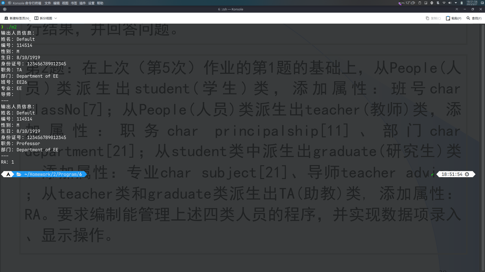
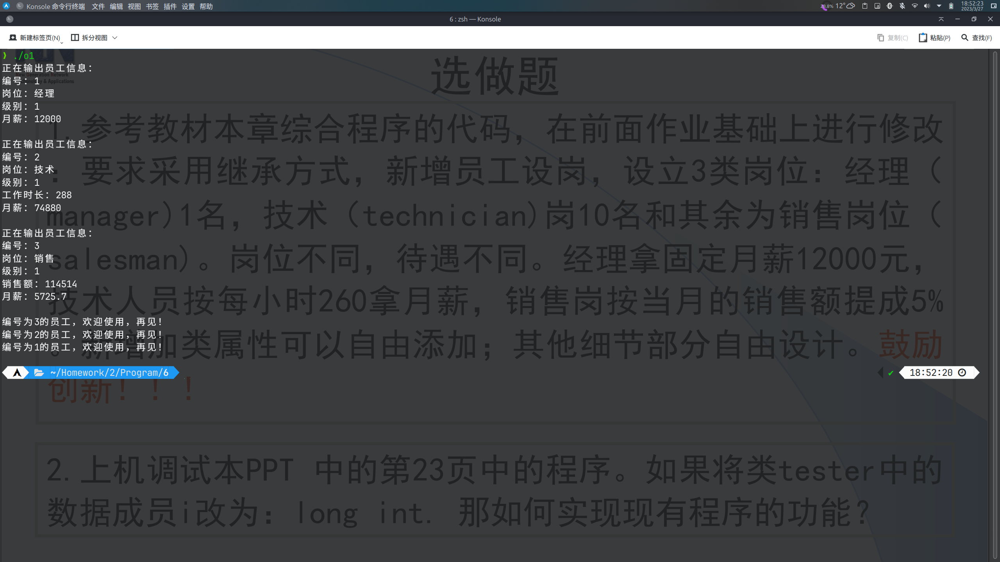

# 第6次作业

## 必做题

### 第1题

原代码

```cpp
#include <iostream>
using namespace std;
class Base
{
private:
	int b_number;

public:
	Base() {}
	Base(int i) : b_number(i) {}
	int get_number() { return b_number; }
	void print() { cout << b_number << endl; }
};
class Derived : public Base
{
private:
	int d_number;

public:
	Derived(int i, int j) : Base(i), d_number(j){};
	void print()
	{
		cout << get_number() << " ";
		cout << d_number << endl;
	}
};
int main()
{
	Base a(2);
	Derived b(3, 4);
	cout << "a is ";
	cout << "b is ";
	b.print();
	cout << "base part of b is ";
	b.Base::print();
	return 0;
}
```

问题1

> 编译器报错。因为此时`b.Base`不可访问。

问题2

> 编译器报错。因为此时`b.Base`不可访问。

### 第2题

源代码

```cpp
#include <iostream>
#include <cstring>
using namespace std;

class People
{
public:
	People()
	{
		strcpy(name, "Default");
		strcpy(number, "114514");
		strcpy(sex, "M");
		birthday.y = 1919;
		birthday.m = 8;
		birthday.d = 10;
		strcpy(id, "123456789012345");
	}
	People(People &p)
	{
		strcpy(name, p.name);
		strcpy(number, p.number);
		strcpy(sex, p.sex);
		birthday.y = p.birthday.y;
		birthday.m = p.birthday.m;
		birthday.d = p.birthday.d;
		strcpy(id, p.id);
	}
	~People()
	{
	}
	void display()
	{
		cout << "输出人员信息：" << endl
			 << "姓名：" << name << endl
			 << "编号：" << number << endl
			 << "性别：" << sex << endl
			 << "生日：" << birthday.m << '/' << birthday.d << '/' << birthday.y << endl
			 << "身份证号：" << id << endl;
	}
	void set()
	{
		cout << "输入人员信息：" << endl;
		cout << "姓名：";
		cin >> name;
		cout << "编号：";
		cin >> number;
		cout << "性别：";
		cin >> sex;
		cout << "生日：";
		cin >> birthday.m >> birthday.d >> birthday.y;
		cout << "身份证号：";
		cin >> id;
	}

protected:
	char name[11];
	char number[7];
	char sex[3];
	class Date
	{
	public:
		int m;
		int d;
		int y;
	} birthday;
	char id[16];
};

class Student : virtual public People
{
public:
	Student()
	{
		strcpy(name, "Default");
		strcpy(number, "114514");
		strcpy(sex, "M");
		birthday.y = 1919;
		birthday.m = 8;
		birthday.d = 10;
		strcpy(id, "123456789012345");
		strcpy(classNo, "EE26");
	}
	Student(Student &p)
	{
		strcpy(name, p.name);
		strcpy(number, p.number);
		strcpy(sex, p.sex);
		birthday.y = p.birthday.y;
		birthday.m = p.birthday.m;
		birthday.d = p.birthday.d;
		strcpy(id, p.id);
		strcpy(classNo, p.classNo);
	}
	~Student()
	{
	}
	void display()
	{
		cout << "输出人员信息：" << endl
			 << "姓名：" << name << endl
			 << "编号：" << number << endl
			 << "性别：" << sex << endl
			 << "生日：" << birthday.m << '/' << birthday.d << '/' << birthday.y << endl
			 << "身份证号：" << id << endl
			 << "班号：" << classNo << endl;
	}
	void set()
	{
		cout << "输入人员信息：" << endl;
		cout << "姓名：";
		cin >> name;
		cout << "编号：";
		cin >> number;
		cout << "性别：";
		cin >> sex;
		cout << "生日：";
		cin >> birthday.m >> birthday.d >> birthday.y;
		cout << "身份证号：";
		cin >> id;
		cout << "班号：";
		cin >> classNo;
	}

protected:
	char classNo[7];
};

class Teacher : virtual public People
{
public:
	Teacher()
	{
		strcpy(name, "Default");
		strcpy(number, "114514");
		strcpy(sex, "M");
		birthday.y = 1919;
		birthday.m = 8;
		birthday.d = 10;
		strcpy(id, "123456789012345");
		strcpy(principalship, "Professor");
		strcpy(department, "Department of EE");
	}
	Teacher(Teacher &p)
	{
		strcpy(name, p.name);
		strcpy(number, p.number);
		strcpy(sex, p.sex);
		birthday.y = p.birthday.y;
		birthday.m = p.birthday.m;
		birthday.d = p.birthday.d;
		strcpy(id, p.id);
		strcpy(principalship, p.principalship);
		strcpy(department, p.department);
	}
	~Teacher()
	{
	}
	void display()
	{
		cout << "输出人员信息：" << endl
			 << "姓名：" << name << endl
			 << "编号：" << number << endl
			 << "性别：" << sex << endl
			 << "生日：" << birthday.m << '/' << birthday.d << '/' << birthday.y << endl
			 << "身份证号：" << id << endl
			 << "职务：" << principalship << endl
			 << "部门：" << department << endl;
	}
	void set()
	{
		cout << "输入人员信息：" << endl;
		cout << "姓名：";
		cin >> name;
		cout << "编号：";
		cin >> number;
		cout << "性别：";
		cin >> sex;
		cout << "生日：";
		cin >> birthday.m >> birthday.d >> birthday.y;
		cout << "身份证号：";
		cin >> id;
		cout << "职务：";
		cin >> principalship;
		cout << "部门：";
		cin >> department;
	}

protected:
	char principalship[11];
	char department[21];
};

class Graduate : virtual public Student
{
public:
	Graduate()
	{
		strcpy(name, "Default");
		strcpy(number, "114514");
		strcpy(sex, "M");
		birthday.y = 1919;
		birthday.m = 8;
		birthday.d = 10;
		strcpy(id, "123456789012345");
		strcpy(subject, "EE");
		Teacher advisor();
	}
	Graduate(Graduate &p)
	{
		strcpy(name, p.name);
		strcpy(number, p.number);
		strcpy(sex, p.sex);
		birthday.y = p.birthday.y;
		birthday.m = p.birthday.m;
		birthday.d = p.birthday.d;
		strcpy(id, p.id);
		strcpy(subject, p.subject);
		Teacher advisor(p.advisor);
	}
	~Graduate()
	{
	}
	void display()
	{
		cout << "输出人员信息：" << endl
			 << "姓名：" << name << endl
			 << "编号：" << number << endl
			 << "性别：" << sex << endl
			 << "生日：" << birthday.m << '/' << birthday.d << '/' << birthday.y << endl
			 << "身份证号：" << id << endl
			 << "班号：" << classNo << endl
			 << "专业：" << subject << endl
			 << "导师：" << endl
			 << "---" << endl;
		advisor.display();
		cout << "---" << endl;
	}
	void set()
	{
		cout << "输入人员信息：" << endl;
		cout << "姓名：";
		cin >> name;
		cout << "编号：";
		cin >> number;
		cout << "性别：";
		cin >> sex;
		cout << "生日：";
		cin >> birthday.m >> birthday.d >> birthday.y;
		cout << "身份证号：";
		cin >> id;
		cout << "班号：";
		cin >> classNo;
		cout << "专业：";
		cin >> subject;
		cout << "导师：" << endl
			 << "---" << endl;
		advisor.set();
		cout << "---" << endl;
	}

protected:
	char subject[21];
	Teacher advisor;
};

class TA : virtual public Teacher, virtual public Graduate
{
public:
	TA()
	{
		strcpy(name, "Default");
		strcpy(number, "114514");
		strcpy(sex, "M");
		birthday.y = 1919;
		birthday.m = 8;
		birthday.d = 10;
		strcpy(id, "123456789012345");
		strcpy(principalship, "TA");
		strcpy(department, "Department of EE");
		strcpy(subject, "EE");
		Teacher advisor();
		RA = true;
	}
	TA(TA &p)
	{
		strcpy(name, p.name);
		strcpy(number, p.number);
		strcpy(sex, p.sex);
		birthday.y = p.birthday.y;
		birthday.m = p.birthday.m;
		birthday.d = p.birthday.d;
		strcpy(id, p.id);
		strcpy(principalship, p.principalship);
		strcpy(department, p.department);
		strcpy(subject, p.subject);
		Teacher advisor(p.advisor);
		RA = p.RA;
	}
	~TA()
	{
	}
	void display()
	{
		cout << "输出人员信息：" << endl
			 << "姓名：" << name << endl
			 << "编号：" << number << endl
			 << "性别：" << sex << endl
			 << "生日：" << birthday.m << '/' << birthday.d << '/' << birthday.y << endl
			 << "身份证号：" << id << endl
			 << "职务：" << principalship << endl
			 << "部门：" << department << endl
			 << "班号：" << classNo << endl
			 << "专业：" << subject << endl
			 << "导师：" << endl
			 << "---" << endl;
		advisor.display();
		cout << "---" << endl;
		cout << "RA：" << RA << endl;
	}
	void set()
	{
		cout << "输入人员信息：" << endl;
		cout << "姓名：";
		cin >> name;
		cout << "编号：";
		cin >> number;
		cout << "性别：";
		cin >> sex;
		cout << "生日：";
		cin >> birthday.m >> birthday.d >> birthday.y;
		cout << "身份证号：";
		cin >> id;
		cout << "职务：";
		cin >> principalship;
		cout << "部门：";
		cin >> department;
		cout << "班号：";
		cin >> classNo;
		cout << "专业：";
		cin >> subject;
		cout << "导师：" << endl
			 << "---" << endl;
		advisor.set();
		cout << "---" << endl;
		cout << "RA：";
		cin >> RA;
	}

protected:
	bool RA;
};

int main()
{
	TA t;
	// t.set();
	t.display();
	return 0;
}
```

运行结果



## 选做题

### 第1题

源代码

```cpp
#include <iostream>
using namespace std;
class employee
{
public:
	employee()
	{
		individualEmpNo = currentEmpNo; // 职工编号自动产生
		currentEmpNo++;					// 自动加1
		grade = 1;
		accumPay = 1000;
	}
	employee(int g, int p)
	{
		individualEmpNo = currentEmpNo; // 职工编号自动产生
		currentEmpNo++;					// 自动加1
		grade = g;
		accumPay = p;
	}
	void set_emp()
	{
		cout << "请输入编号为" << individualEmpNo << "的员工的级别：" << endl;
		cin >> grade;
		cout << "请输入编号为" << individualEmpNo << "的员工的月薪：" << endl;
		cin >> accumPay;
	}
	void show()
	{
		cout << "正在输出员工信息：" << endl
			 << "编号：" << individualEmpNo << endl
			 << "级别：" << grade << endl
			 << "月薪：" << accumPay << endl
			 << endl;
	}
	~employee()
	{
		cout << "编号为" << individualEmpNo << "的员工，欢迎使用，再见！" << endl;
	}

protected:
	int individualEmpNo;
	int grade;
	int accumPay;
	static int currentEmpNo;
};

class manager : virtual public employee
{
public:
	manager()
	{
		accumPay = 12000;
	}
	manager(int g, int p)
	{
		grade = g;
		accumPay = p;
	}
	void show()
	{
		cout << "正在输出员工信息：" << endl
			 << "编号：" << individualEmpNo << endl
			 << "岗位：经理" << endl
			 << "级别：" << grade << endl
			 << "月薪：" << accumPay << endl
			 << endl;
	}
};

class technician : virtual public employee
{
public:
	technician()
	{
		workhour = 288;
		accumPay = 260 * workhour;
	}
	technician(int g, int h)
	{
		grade = g;
		workhour = h;
		accumPay = 260 * workhour;
	}
	void set_emp()
	{
		cout << "请输入编号为" << individualEmpNo << "的员工的级别：" << endl;
		cin >> grade;
		cout << "请输入编号为" << individualEmpNo << "的员工的工作时长：" << endl;
		cin >> workhour;
		accumPay = 260 * workhour;
	}
	void show()
	{
		cout << "正在输出员工信息：" << endl
			 << "编号：" << individualEmpNo << endl
			 << "岗位：技术" << endl
			 << "级别：" << grade << endl
			 << "工作时长：" << workhour << endl
			 << "月薪：" << accumPay << endl
			 << endl;
	}

protected:
	int workhour;
};

class salesman : virtual public employee
{
public:
	salesman()
	{
		sale = 114514;
		accumPay = 0.05 * sale;
	}
	salesman(int g, int s)
	{
		grade = g;
		sale = s;
		accumPay = 0.05 * sale;
	}
	void set_emp()
	{
		cout << "请输入编号为" << individualEmpNo << "的员工的级别：" << endl;
		cin >> grade;
		cout << "请输入编号为" << individualEmpNo << "的员工的销售额：" << endl;
		cin >> sale;
		accumPay = 0.05 * sale;
	}
	void show()
	{
		cout << "正在输出员工信息：" << endl
			 << "编号：" << individualEmpNo << endl
			 << "岗位：销售" << endl
			 << "级别：" << grade << endl
			 << "销售额：" << sale << endl
			 << "月薪：" << accumPay << endl
			 << endl;
	}

protected:
	double sale;
	double accumPay;
};

int employee::currentEmpNo = 1;

int main()
{
	manager man;
	technician tech;
	salesman sale;
	man.show();
	tech.show();
	sale.show();
	return 0;
}
```

运行结果



### 第2题

源代码

```cpp
#include <iostream>
#include "string"
using namespace std;
class tester
{
public:
	tester() : i(5), ch('x'){};

private:
	int i;
	char ch;
};
class tester1 : public tester
{
private:
	int y = 0;
};
int main(void)
{
	tester1 myTester1;
	char *p = NULL;
	p = (char *)&myTester1 + sizeof(int);
	cout << "Address of ch = " << (void *)p << endl;
	cout << "ch = " << *(p) << endl;
	// getchar();
	*p = 'y';
	cout << "Now ch = " << *(p) << endl;
	return 0;
}
```

将类`tester`中的数据成员`i`改为`long int`后的代码
```cpp
#include <iostream>
#include "string"
using namespace std;
class tester
{
public:
	tester() : i(5), ch('x'){};

private:
	long int i;
	char ch;
};
class tester1 : public tester
{
private:
	int y = 0;
};
int main(void)
{
	tester1 myTester1;
	char *p = NULL;
	p = (char *)&myTester1 + sizeof(long int);
	cout << "Address of ch = " << (void *)p << endl;
	cout << "ch = " << *(p) << endl;
	// getchar();
	*p = 'y';
	cout << "Now ch = " << *(p) << endl;
	return 0;
}
```

运行结果

