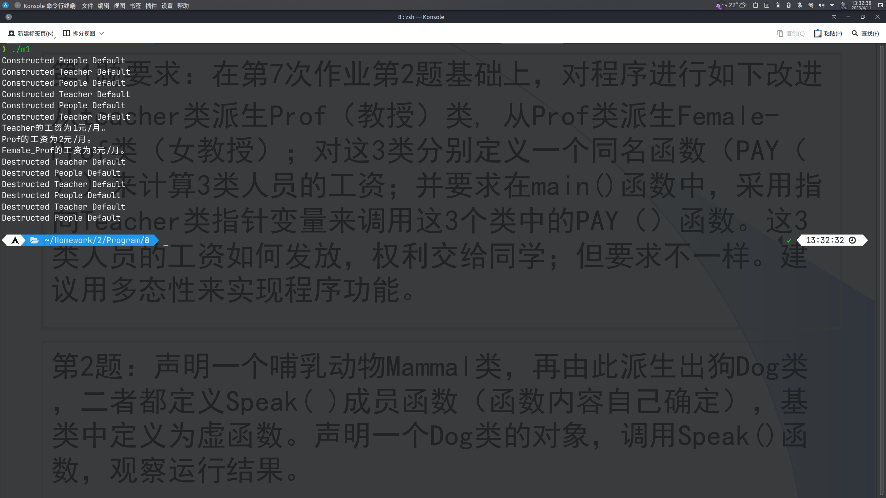

# 第8次作业

## 必做题

### 第1题

源代码

```cpp
#include <iostream>
#include <cstring>
using namespace std;

class People
{
public:
	People()
	{
		strcpy(name, "Default");
		strcpy(number, "114514");
		strcpy(sex, "M");
		birthday.y = 1919;
		birthday.m = 8;
		birthday.d = 10;
		strcpy(id, "123456789012345");
		cout << "Constructed People " << name << endl;
	}
	People(People &p)
	{
		strcpy(name, p.name);
		strcpy(number, p.number);
		strcpy(sex, p.sex);
		birthday.y = p.birthday.y;
		birthday.m = p.birthday.m;
		birthday.d = p.birthday.d;
		strcpy(id, p.id);
		cout << "Copied People " << name << endl;
	}
	~People()
	{
		cout << "Destructed People " << name << endl;
	}
	void display()
	{
		cout << "输出人员信息：" << endl
			 << "姓名：" << name << endl
			 << "编号：" << number << endl
			 << "性别：" << sex << endl
			 << "生日：" << birthday.m << '/' << birthday.d << '/' << birthday.y << endl
			 << "身份证号：" << id << endl;
	}
	void set()
	{
		cout << "输入人员信息：" << endl;
		cout << "姓名：";
		cin >> name;
		cout << "编号：";
		cin >> number;
		cout << "性别：";
		cin >> sex;
		cout << "生日：";
		cin >> birthday.m >> birthday.d >> birthday.y;
		cout << "身份证号：";
		cin >> id;
	}

protected:
	char name[11];
	char number[7];
	char sex[3];
	class Date
	{
	public:
		int m;
		int d;
		int y;
	} birthday;
	char id[16];
};

class Student : virtual public People
{
public:
	Student()
	{
		strcpy(name, "Default");
		strcpy(number, "114514");
		strcpy(sex, "M");
		birthday.y = 1919;
		birthday.m = 8;
		birthday.d = 10;
		strcpy(id, "123456789012345");
		strcpy(classNo, "EE26");
		cout << "Constructed Student " << name << endl;
	}
	Student(Student &p)
	{
		strcpy(name, p.name);
		strcpy(number, p.number);
		strcpy(sex, p.sex);
		birthday.y = p.birthday.y;
		birthday.m = p.birthday.m;
		birthday.d = p.birthday.d;
		strcpy(id, p.id);
		strcpy(classNo, p.classNo);
		cout << "Copied Student " << name << endl;
	}
	~Student()
	{
		cout << "Destructed Student " << name << endl;
	}
	void display()
	{
		cout << "输出人员信息：" << endl
			 << "姓名：" << name << endl
			 << "编号：" << number << endl
			 << "性别：" << sex << endl
			 << "生日：" << birthday.m << '/' << birthday.d << '/' << birthday.y << endl
			 << "身份证号：" << id << endl
			 << "班号：" << classNo << endl;
	}
	void set()
	{
		cout << "输入人员信息：" << endl;
		cout << "姓名：";
		cin >> name;
		cout << "编号：";
		cin >> number;
		cout << "性别：";
		cin >> sex;
		cout << "生日：";
		cin >> birthday.m >> birthday.d >> birthday.y;
		cout << "身份证号：";
		cin >> id;
		cout << "班号：";
		cin >> classNo;
	}

protected:
	char classNo[7];
};

class Teacher : virtual public People
{
public:
	Teacher()
	{
		strcpy(name, "Default");
		strcpy(number, "114514");
		strcpy(sex, "M");
		birthday.y = 1919;
		birthday.m = 8;
		birthday.d = 10;
		strcpy(id, "123456789012345");
		strcpy(principalship, "Professor");
		strcpy(department, "Department of EE");
		cout << "Constructed Teacher " << name << endl;
	}
	Teacher(Teacher &p)
	{
		strcpy(name, p.name);
		strcpy(number, p.number);
		strcpy(sex, p.sex);
		birthday.y = p.birthday.y;
		birthday.m = p.birthday.m;
		birthday.d = p.birthday.d;
		strcpy(id, p.id);
		strcpy(principalship, p.principalship);
		strcpy(department, p.department);
		cout << "Copied Teacher " << name << endl;
	}
	~Teacher()
	{
		cout << "Destructed Teacher " << name << endl;
	}
	void display()
	{
		cout << "输出人员信息：" << endl
			 << "姓名：" << name << endl
			 << "编号：" << number << endl
			 << "性别：" << sex << endl
			 << "生日：" << birthday.m << '/' << birthday.d << '/' << birthday.y << endl
			 << "身份证号：" << id << endl
			 << "职务：" << principalship << endl
			 << "部门：" << department << endl;
	}
	void set()
	{
		cout << "输入人员信息：" << endl;
		cout << "姓名：";
		cin >> name;
		cout << "编号：";
		cin >> number;
		cout << "性别：";
		cin >> sex;
		cout << "生日：";
		cin >> birthday.m >> birthday.d >> birthday.y;
		cout << "身份证号：";
		cin >> id;
		cout << "职务：";
		cin >> principalship;
		cout << "部门：";
		cin >> department;
	}
	virtual void PAY()
	{
		cout << "Teacher的工资为1元/月。" << endl;
	}

protected:
	char principalship[11];
	char department[21];
};

class Graduate : virtual public Student
{
public:
	Graduate()
	{
		strcpy(name, "Default");
		strcpy(number, "114514");
		strcpy(sex, "M");
		birthday.y = 1919;
		birthday.m = 8;
		birthday.d = 10;
		strcpy(id, "123456789012345");
		strcpy(subject, "EE");
		Teacher advisor();
		cout << "Constructed Graduate " << name << endl;
	}
	Graduate(Graduate &p)
	{
		strcpy(name, p.name);
		strcpy(number, p.number);
		strcpy(sex, p.sex);
		birthday.y = p.birthday.y;
		birthday.m = p.birthday.m;
		birthday.d = p.birthday.d;
		strcpy(id, p.id);
		strcpy(subject, p.subject);
		Teacher advisor(p.advisor);
		cout << "Copied Graduate " << name << endl;
	}
	~Graduate()
	{
		cout << "Destructed Graduate " << name << endl;
	}
	void display()
	{
		cout << "输出人员信息：" << endl
			 << "姓名：" << name << endl
			 << "编号：" << number << endl
			 << "性别：" << sex << endl
			 << "生日：" << birthday.m << '/' << birthday.d << '/' << birthday.y << endl
			 << "身份证号：" << id << endl
			 << "班号：" << classNo << endl
			 << "专业：" << subject << endl
			 << "导师：" << endl
			 << "---" << endl;
		advisor.display();
		cout << "---" << endl;
	}
	void set()
	{
		cout << "输入人员信息：" << endl;
		cout << "姓名：";
		cin >> name;
		cout << "编号：";
		cin >> number;
		cout << "性别：";
		cin >> sex;
		cout << "生日：";
		cin >> birthday.m >> birthday.d >> birthday.y;
		cout << "身份证号：";
		cin >> id;
		cout << "班号：";
		cin >> classNo;
		cout << "专业：";
		cin >> subject;
		cout << "导师：" << endl
			 << "---" << endl;
		advisor.set();
		cout << "---" << endl;
	}

protected:
	char subject[21];
	Teacher advisor;
};

class TA : virtual public Teacher, virtual public Graduate
{
public:
	TA()
	{
		strcpy(name, "Default");
		strcpy(number, "114514");
		strcpy(sex, "M");
		birthday.y = 1919;
		birthday.m = 8;
		birthday.d = 10;
		strcpy(id, "123456789012345");
		strcpy(principalship, "TA");
		strcpy(department, "Department of EE");
		strcpy(subject, "EE");
		Teacher advisor();
		RA = true;
		cout << "Constructed TA " << name << endl;
	}
	TA(TA &p)
	{
		strcpy(name, p.name);
		strcpy(number, p.number);
		strcpy(sex, p.sex);
		birthday.y = p.birthday.y;
		birthday.m = p.birthday.m;
		birthday.d = p.birthday.d;
		strcpy(id, p.id);
		strcpy(principalship, p.principalship);
		strcpy(department, p.department);
		strcpy(subject, p.subject);
		Teacher advisor(p.advisor);
		RA = p.RA;
		cout << "Copied TA " << name << endl;
	}
	~TA()
	{
		cout << "Destructed TA " << name << endl;
	}
	void display()
	{
		cout << "输出人员信息：" << endl
			 << "姓名：" << name << endl
			 << "编号：" << number << endl
			 << "性别：" << sex << endl
			 << "生日：" << birthday.m << '/' << birthday.d << '/' << birthday.y << endl
			 << "身份证号：" << id << endl
			 << "职务：" << principalship << endl
			 << "部门：" << department << endl
			 << "班号：" << classNo << endl
			 << "专业：" << subject << endl
			 << "导师：" << endl
			 << "---" << endl;
		advisor.display();
		cout << "---" << endl;
		cout << "RA：" << RA << endl;
	}
	void set()
	{
		cout << "输入人员信息：" << endl;
		cout << "姓名：";
		cin >> name;
		cout << "编号：";
		cin >> number;
		cout << "性别：";
		cin >> sex;
		cout << "生日：";
		cin >> birthday.m >> birthday.d >> birthday.y;
		cout << "身份证号：";
		cin >> id;
		cout << "职务：";
		cin >> principalship;
		cout << "部门：";
		cin >> department;
		cout << "班号：";
		cin >> classNo;
		cout << "专业：";
		cin >> subject;
		cout << "导师：" << endl
			 << "---" << endl;
		advisor.set();
		cout << "---" << endl;
		cout << "RA：";
		cin >> RA;
	}

protected:
	bool RA;
};

class Prof : virtual public Teacher
{
public:
	virtual void PAY()
	{
		cout << "Prof的工资为2元/月。" << endl;
	}
};

class Female_Prof : virtual public Prof
{
public:
	Female_Prof()
	{
		strcpy(sex, "F");
	}
	virtual void PAY()
	{
		cout << "Female_Prof的工资为3元/月。" << endl;
	}
};

int main()
{
	Teacher t;
	Prof p;
	Female_Prof fp;
	Teacher *f[3];
	f[0] = &t, f[1] = &p, f[2] = &fp;
	for (int i = 0; i < 3; i++)
	{
		f[i]->PAY();
	}
	return 0;
}
```

运行结果



### 第2题

源代码

```cpp
#include <iostream>
#include <cstring>
using namespace std;
class Mammal
{
public:
	Mammal(char *s = "114514")
	{
		len = strlen(s);
		str = new char[len + 1];
		strcpy(str, s);
	}
	virtual void Speak()
	{
		cout << " ";
		for (int i = 0; i < len + 2; i++)
			cout << "_";
		cout << " " << endl
			 << "< " << str << " >" << endl
			 << " ";
		for (int i = 0; i < len + 2; i++)
			cout << "-";
		cout << " " << endl
			 << "  \\   ^__^" << endl
			 << "   \\  (oo)\\_______" << endl
			 << "      (__)\\       )\\/\\" << endl
			 << "          ||----w |" << endl
			 << "          ||     ||" << endl
			 << endl;
	}
	~Mammal()
	{
		delete[] str;
	}

protected:
	char *str;
	int len;
};

class Dog : virtual public Mammal
{
public:
	Dog(char *s = "114514")
	{
		len = strlen(s);
		str = new char[len + 1];
		strcpy(str, s);
	}
	virtual void Speak()
	{
		cout << " ";
		for (int i = 0; i < len + 2; i++)
			cout << "_";
		cout << " " << endl
			 << "< " << str << " >" << endl
			 << " ";
		for (int i = 0; i < len + 2; i++)
			cout << "-";
		cout << " " << endl
			 << "      \\                    / \\  //\\" << endl
			 << "       \\    |\\___/|      /   \\//  \\" << endl
			 << "            /0  0  \\__  /    //  | \\ \\    " << endl
			 << "           /     /  \\/_/    //   |  \\  \\  " << endl
			 << "           @_^_@'/   \\/_   //    |   \\   \\ " << endl
			 << "           //_^_/     \\/_ //     |    \\    \\" << endl
			 << "        ( //) |        \\///      |     \\     \\" << endl
			 << "      ( / /) _|_ /   )  //       |      \\     _\\" << endl
			 << "    ( // /) '/,_ _ _/  ( ; -.    |    _ _\\.-~        .-~~~^-." << endl
			 << "  (( / / )) ,-{        _      `-.|.-~-.           .~         `." << endl
			 << " (( // / ))  '/\\      /                 ~-. _ .-~      .-~^-.  \\" << endl
			 << " (( /// ))      `.   {            }                   /      \\  \\" << endl
			 << "  (( / ))     .----~-.\\        \\-'                 .~         \\  `. \\^-." << endl
			 << "             ///.----..>        \\             _ -~             `.  ^-`  ^-_" << endl
			 << "               ///-._ _ _ _ _ _ _}^ - - - - ~                     ~-- ,.-~" << endl
			 << "                                                                  /.-~" << endl
			 << endl;
	}
};

int main()
{
	Mammal m("I'm a mammal.");
	Dog d("I'm a dog.");
	m.Speak();
	d.Speak();
	return 0;
}
```

运行结果


## 选做题

源代码

```cpp
#include <iostream>
using namespace std;
class Shape
{
public:
	Shape() {}
	~Shape() {}
	virtual float GetArea() = 0;
	virtual float GetPerim() = 0;
};
class Rectangle : public Shape
{
public:
	Rectangle(float aa = 4, float bb = 3)
	{
		a = aa;
		b = bb;
	}
	virtual float GetArea()
	{
		return a * b;
	}
	virtual float GetPerim()
	{
		return (a + b) * 2;
	}

private:
	float a, b;
};
class Circle : public Shape
{
public:
	Circle(float rr = 1)
	{
		r = rr;
	}
	virtual float GetArea()
	{
		return r * r * 3.141592653;
	}
	virtual float GetPerim()
	{
		return r * 3.141592653 * 2;
	}

private:
	float r;
};
int main()
{
	float a, b, r;
	cout << "Enter a, b, r:" << endl;
	cin >> a >> b >> r;
	Rectangle rect(a, b);
	Circle cir(r);
	cout << "Rectangle Area = " << rect.GetArea() << endl
		 << "Rectangle Perim = " << rect.GetPerim() << endl
		 << "Circle Area = " << cir.GetArea() << endl
		 << "Circle Perim = " << cir.GetPerim() << endl;
}
```

运行结果

