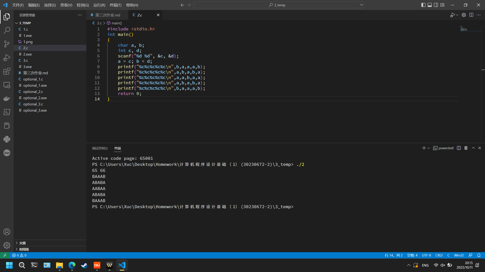
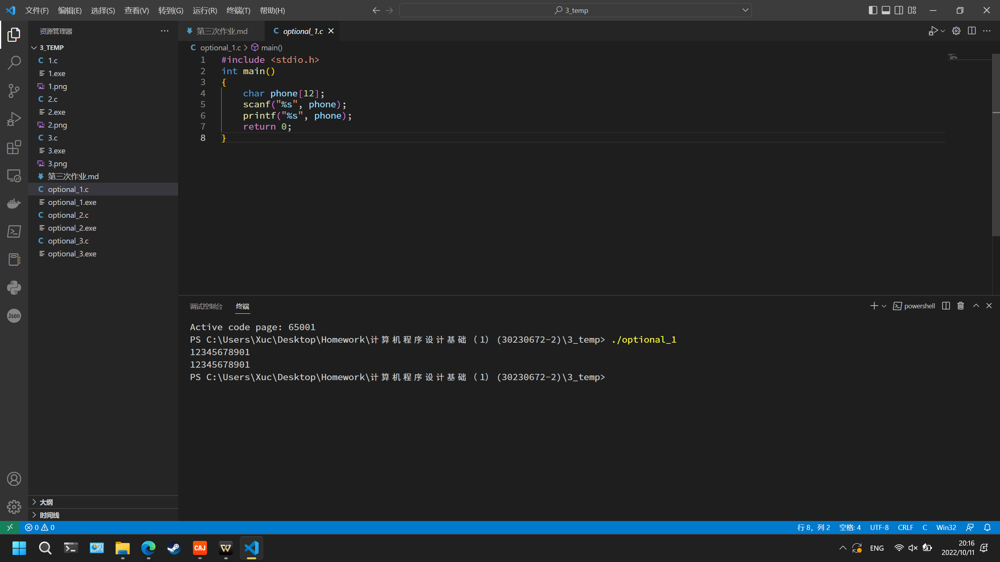

# 第三次作业

## 必做题

### 1

```c
#include <stdio.h>
#include <stdbool.h>
int main()
{
    printf("short = %zd\n", sizeof(short));
    printf("int = %zd\n", sizeof(int));
    printf("long = %zd\n", sizeof(long));
    printf("unsigned short = %zd\n", sizeof(unsigned short));
    printf("unsigned long = %zd\n", sizeof(unsigned long));
    printf("char = %zd\n", sizeof(char));
    printf("bool = %zd\n", sizeof(bool));
    printf("double = %zd\n", sizeof(double));
    printf("float = %zd\n", sizeof(float));
    float a = 1.111111111111111111111111111111111111111111, b = 1.0, c = 0;
    int i = 0;
    do
    {
        b = 10 * b + 1;
        a = 10 * a;
        i++;
        c = a - b;
    }
    while (c > 0);
    printf("%d", i);
    return 0;
}
```

运行结果为

```sh
short = 2
int = 4
long = 4
unsigned short = 2
unsigned long = 4
char = 1
bool = 1
double = 8
float = 4
7
```


### 2

```c
#include <stdio.h>
int main()
{
    char a, b;
    int c, d;
    scanf("%d %d", &c, &d);
    a = c; b = d;
    printf("%c%c%c%c%c\n",b,a,a,a,b);
    printf("%c%c%c%c%c\n",a,b,a,b,a);
    printf("%c%c%c%c%c\n",a,a,b,a,a);
    printf("%c%c%c%c%c\n",a,b,a,b,a);
    printf("%c%c%c%c%c\n",b,a,a,a,b);
    return 0;
}
```

输入

```sh
65 66
```

运行结果为

```sh
BAAAB
ABABA
AABAA
ABABA
BAAAB
```



### 3

```c
#include <stdio.h>
#define MAXMONTH 6
int main()
{
    int month = 1, bigSheep = 0, smallSheep = 2,
        money = ((bigSheep + smallSheep) * 10), temp = 0;
    printf("月份\t羊数量\t钱\n");
    printf("%d\t%d\t%d\n", month, bigSheep + smallSheep, money);
    for (month = 2; month <= MAXMONTH; month++)
    {
        temp = smallSheep;
        smallSheep = bigSheep;
        bigSheep += temp;
        money = ((bigSheep + smallSheep) * 10);
        printf("%d\t%d\t%d\n", month, bigSheep + smallSheep, money);
    }
    return 0;
}
```

输出结果为

```sh
月份    羊数量  钱
1       2       20
2       2       20
3       4       40
4       6       60
5       10      100
6       16      160
```


## 选做题

①通过`long long`来实现

```c
#include <stdio.h>
int main()
{
    long long phone;
    scanf("%lld", &phone);
    printf("%lld", phone);
    return 0;
}
```


②通过字符串来实现

```c
#include <stdio.h>
int main()
{
    char phone[12];
    scanf("%s", phone);
    printf("%s", phone);
    return 0;
}
```

