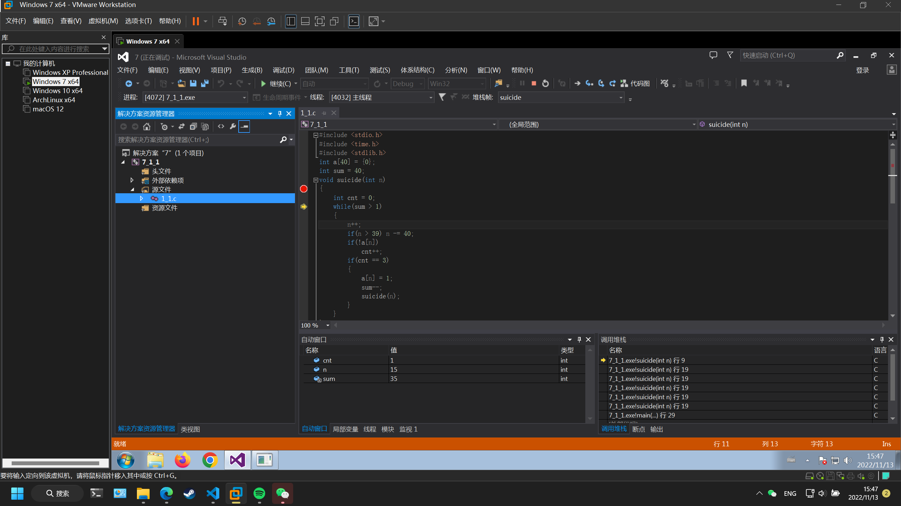
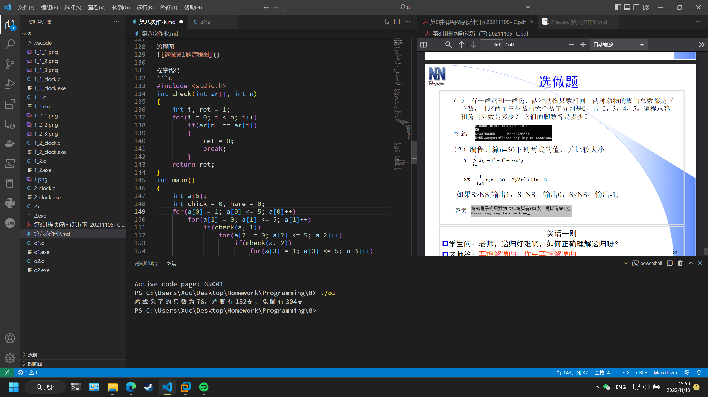

# 第八次作业

## 实验目的
完成本次作业，巩固上课所学知识

## 实验环境
设备：OMEN by HP Laptop 16-b1xxx
操作系统: Windows 11 专业版 22H2
编辑器: Visual Studio Code 1.72.1
编译器: gcc 12.1.0
终端：Windows Powershell

## 实验内容
### 必做第1题

流程图


程序代码
递归
```c
#include <stdio.h>
int a[40] = {0};
int sum = 40;
void suicide(int n)
{
    int cnt = 0;
    while(sum > 1)
    {
        n++;
        if(n > 39) n -= 40;
        if(!a[n])
            cnt++;
        if(cnt == 3)
        {
            a[n] = 1;
            sum--;
            suicide(n);
        }
    }
}
int main()
{
    int i;
    suicide(-1);
    for(i = 0; i <= 39; i++)
    {
        if(!a[i])
        {
            printf("%d\n", i + 1);
            break;
        }
    }
    return 0;
}
```
递推
```c
#include <stdio.h>
int main()
{
    int a[40] = {0};
    int sum = 40;
    int n = -1;
    int cnt = 0;
    int i;
    while(sum > 1)
    {
        n++;
        if(n > 39) n -= 40;
        if(!a[n])
            cnt++;
        if(cnt == 3)
        {
            cnt = 0;
            a[n] = 1;
            sum--;
        }
    }
    for(i = 0; i <= 39; i++)
    {
        if(!a[i])
        {
            printf("%d\n", i + 1);
            break;
        }
    }
    return 0;
}
```

运行结果
在我的设备上，二者并无差距（可能是1ms的精度不够？）
原因：递归涉及到的内存操作要比递推复杂


### 必做第2题

流程图


程序代码
```c
#include <stdio.h>
int GoDown(int n)
{
    int ret;
    if(n == 1)
        ret = 1;
    else if(n == 2)
        ret = 2;
    else if(n == 3)
        ret = 4;
    else ret = GoDown(n - 1) + GoDown(n - 2) + GoDown(n - 3);
    return ret;
}
int main()
{
    int n;
    scanf("%d", &n);
    printf("%d\n", GoDown(n));
    return 0;
}
```

运行结果
```powershell
结果
13
24
44
81
149
274
504
927
1705
3136
5768
10609
19513
35890
66012
121415
```
```powershell
n   耗时
15  0 0 0
25  16 15 15
35  593 608 593
```

### 选做第1题

流程图


程序代码
```c
#include <stdio.h>
int check(int ar[], int n)
{
    int i, ret = 1;
    for(i = 0; i < n; i++)
        if(ar[n] == ar[i])
        {
            ret = 0;
            break;
        }
    return ret;
}
int main()
{
    int a[6];
    int chick = 0, hare = 0;
    for(a[0] = 1; a[0] <= 5; a[0]++)
        for(a[1] = 0; a[1] <= 5; a[1]++)
            if(check(a, 1))
                for(a[2] = 0; a[2] <= 5; a[2]++)
                    if(check(a, 2))
                        for(a[3] = 1; a[3] <= 5; a[3]++)
                            if(check(a, 3))
                                for(a[4] = 0; a[4] <= 5; a[4]++)
                                    if(check(a, 4))
                                        for(a[5] = 0; a[5] <= 5; a[5]++)
                                            if(check(a, 5))
                                            {
                                                chick = a[0]*100 + a[1]*10 + a[2];
                                                hare = a[3]*100 + a[4]*10 + a[5];
                                                if(hare == chick * 2 && hare % 4 == 0)
                                                {
                                                    printf("鸡或兔子的只数为%d，鸡脚有%d支，兔脚有%d支\n", hare / 4, chick, hare);
                                                }
                                            }
    return 0;
}
```

运行结果


### 选做第2题

流程图


程序代码
```c
#include <stdio.h>
long long Sk(int k)
{
    long long ret = 0;
    int i;
    for(i = 1; i <= k; i++)
        ret += i * i;
    ret *= k;
    return ret;
}
long long Sn(int n)
{
    long long ret = 0;
    int i;
    for(i = 1; i <= n; i++)
        ret += Sk(i);
    return ret;
}
int main()
{
    long long S, NS;
    long long n;
    printf("please input integer num n\n");
    scanf("%d", &n);
    S = Sn(n);
    NS = (n * (n + 1) * (n + 2) * (8 * n * n + 11 * n + 1)) / 120;
    printf("S=%lld\tNS=%lld\n", S, NS);
    if(S > NS) printf("S>NS,output=1");
    if(S == NS) printf("S=NS,output=0");
    if(S < NS) printf("S<NS,output=-1");
    return 0;
}
```

运行结果


## 实验体会
需要认真学习，仔细完成作业。