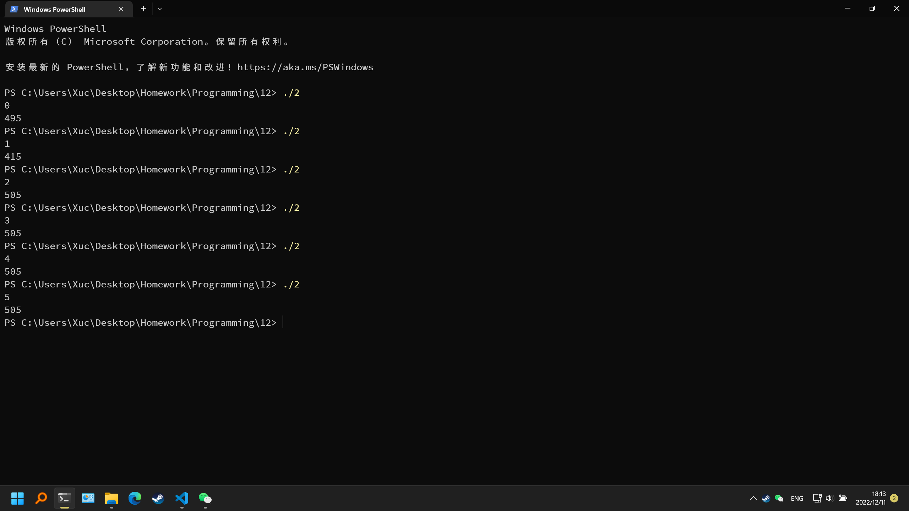

# 第十二次作业

## 实验目的
完成本次作业，巩固上课所学知识

## 实验环境
设备：OMEN by HP Laptop 16-b1xxx
操作系统: Windows 11 专业版 22H2
编辑器: Visual Studio Code 1.72.1
编译器: gcc 12.1.0
终端：Windows Powershell

## 实验内容
### 必做第1题

程序代码
```c
#include <stdio.h>
#include <stdlib.h>
#include <string.h>
void input(int n, char **p)
{
    int i = 0;
    char str[80] = {0};
    for(i = 0; i < n; i++)
    {
        scanf("%s", str);
        p[i] = (char*)malloc(sizeof(strlen(str)));
        strcpy(p[i], str);
    }
}
void sort(int n, char **p)
{
    char *t;
    int i = 0, j = 0, k = 0;
    for(k = 79; k >= 0; k--)
    {
        for(i = 0; i < n - 1; i++)
        {
            for(j = 0; j < n - 1 - i; j++)
            {
                if(p[j][k] > p[j + 1][k])
                {
                    t = p[j];
                    p[j] = p[j + 1];
                    p[j + 1] = t;
                }
            }
        }
    }
}
int main()
{
    int n, i;
    scanf("%d", &n);
    char **p = (char**)malloc(sizeof(char*) * n);
    input(n, p);
    sort(n, p);
    printf("\n\n");
    for(i = 0; i < n; i++)
    {
        printf("%s\n", p[i]);
    }
    return 0;
}
```

运行结果


### 必做第2题

程序代码
```c
#include <stdio.h>
#define N 10
int maruplus(int i, int n)
{
    int ret;
    if(i + n <= N) ret = i + n;
    else ret = (i + n) % N;
    return ret;
}
int main()
{
    int a[10][10];
    int *p;
    int sum = 0, i = 1, n;

    for(p = (int*)a; p < (int*)a + 100; p++)
    {
        *p = p - (int*)a;
    }
    scanf("%d", &n);
    for(i = 1; i <= N; i++)
    {
        sum += *((int*)a + (i - 1) * N + maruplus((i - 1), n));
    }
    printf("%d", sum);
    return 0;
}
```

运行结果


### 必做第3题

程序代码
```c
#include <stdio.h>
#include <string.h>
int main()
{
    char tweet[140] = {0};
    char charBegin, charEnd;
    char *emojiBegin, *emojiEnd, *p;
    int i = 0, hasBegin = 0, hasEnd = 0;
    printf("转义符：");
    scanf("%c", &charBegin);
    getchar();
    printf("终止符：");
    scanf("%c", &charEnd);
    getchar();
    printf("输入文字：");
    gets(tweet);
    for(i = 0; i < strlen(tweet); i++)
    {
        if(*(tweet + i) == charBegin && !hasEnd)
        {
            emojiBegin = tweet + i;
            hasBegin = 1;
        }
        if(*(tweet + i) == charEnd && hasBegin)
        {
            emojiEnd = tweet + i;
            hasEnd = 1;
            break;
        }
    }
    printf("输出：");
    for(p = emojiBegin + 1; p < emojiEnd; p++)
        printf("%c", *p);
    return 0;
}
```

运行结果


### 选做第1题

程序代码
```c
```

运行结果


### 选做第2题

运行结果
```powershell
FFINALEEXAM
```

## 实验体会
需要认真学习，仔细完成作业。