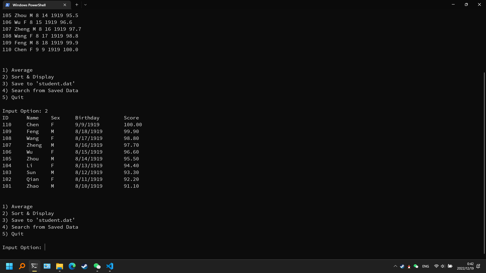
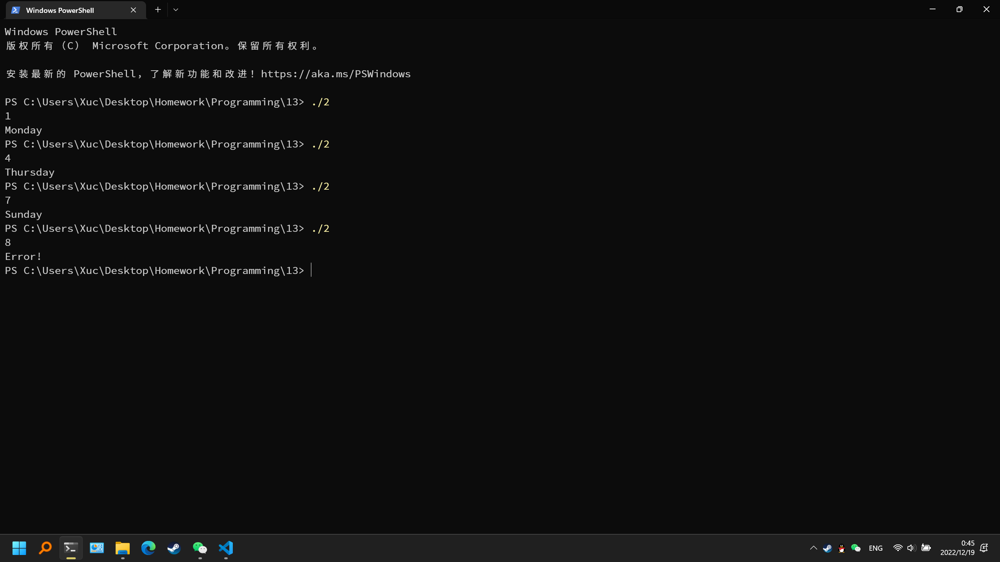

# 第十三次作业

## 实验目的
完成本次作业，巩固上课所学知识

## 实验环境
设备：OMEN by HP Laptop 16-b1xxx
操作系统: Windows 11 专业版 22H2
编辑器: Visual Studio Code 1.72.1
编译器: gcc 12.1.0
终端：Windows Powershell

## 实验内容
### 必做第1题

程序代码
```c
#include <stdio.h>
#include <stdlib.h>
#define N 10
struct student
{
    int ID;
    char name[16];
    char sex;
    struct
    {
        int month;
        int day;
        int year;
    }birthday;
    float score;
};
float average(struct student stu[])
{
    float scoreSum = 0.0, scoreAve = 0.0;
    int i = 0;
    for(i = 0; i < N; i++)
        scoreSum += stu[i].score;
    scoreAve = scoreSum / N;
    return scoreAve;
}
void sortnShow(struct student stu[])
{
    int i = 0, j = 0;
    struct student t, *p;
    for(i = 0; i < N - 1; i++)
        for(j = i + 1; j < N; j++)
            if(stu[i].score < stu[j].score)
            {
                t = stu[i];
                stu[i] = stu[j];
                stu[j] = t;
            }
    printf("ID\tName\tSex\tBirthday\tScore\n");
    for(p = stu; p < stu + N; p++)
        printf("%d\t%s\t%c\t%d/%d/%d\t%.2f\n", p->ID, p->name, p->sex, p->birthday.month, p->birthday.day, p->birthday.year, p->score);
}
void save(struct student stu[])
{
    FILE *fp;
    struct student *p;
    if((fp = fopen("student.dat", "wb")) == NULL)
    {
        printf("Cannot Open File!\n");
        exit(0);
    }
    fwrite(stu, sizeof(struct student), N, fp);
    fclose(fp);
}
void search()
{
    int searchID, flag = 0;
    struct student dat[N], *p;
    FILE *fp;
    if((fp = fopen("student.dat", "rb")) == NULL)
    {
        printf("Cannot Open File.\n");
        exit(0);
    }
    fread(dat, sizeof(struct student), N, fp);
    fclose(fp);
    scanf("%d", &searchID);
    for(p = dat; p < dat + N; p++)
        if(p->ID == searchID)
        {
            printf("ID\tName\tSex\tBirthday\tScore\n");
            printf("%d\t%s\t%c\t%d/%d/%d\t%.2f\n", p->ID, p->name, p->sex, p->birthday.month, p->birthday.day, p->birthday.year, p->score);
            flag = 1;
            break;
        }
    if(!flag) printf("No Result.\n");
}
void interface(struct student stu[])
{
    int opt = 0;
    do
    {
        printf("\n\n");
        printf("1) Average\n");
        printf("2) Sort & Display\n");
        printf("3) Save to 'student.dat'\n");
        printf("4) Search from Saved Data\n");
        printf("5) Quit\n");
        printf("\nInput Option: ");
        scanf("%d", &opt);
        switch(opt)
        {
            case 1: printf("\nAverage Score = %.2f\n", average(stu)); break;
            case 2: sortnShow(stu); break;
            case 3: save(stu); printf("\nSaved Successfully!\n"); break;
            case 4: search(stu); break;
            case 5: break;
            default: printf("\nPlease Input a Valid Value.\n"); break;
        }
    }
    while(opt != 5);
}
int main()
{
    struct student stu[N];
    int i = 0;
    printf("Input Data: ID Name Sex Birthday(MDY) Score\n");
    for(i = 0; i < N; i++)
    {
        scanf("%d", &stu[i].ID);
        scanf("%s", stu[i].name);
        getchar();
        scanf("%c", &stu[i].sex);
        scanf("%d", &stu[i].birthday.month);
        scanf("%d", &stu[i].birthday.day);
        scanf("%d", &stu[i].birthday.year);
        scanf("%f", &stu[i].score);
    }
    interface(stu);
    return 0;
}
```

运行结果



### 必做第2题

程序代码
```c
#include <stdio.h>
int main()
{
    enum week{Monday = 1, Tuesday, Wednesday, Thursday, Friday, Saturday, Sunday} day;
    scanf("%d", &day);
    switch(day){
        case Monday: puts("Monday"); break;
        case Tuesday: puts("Tuesday"); break;
        case Wednesday: puts("Wednesday"); break;
        case Thursday: puts("Thursday"); break;
        case Friday: puts("Friday"); break;
        case Saturday: puts("Saturday"); break;
        case Sunday: puts("Sunday"); break;
        default: puts("Error!");
    }
    return 0;
}
```

运行结果


### 必做第3题

程序代码
```c
#include <stdio.h>
#define N 10
struct fraction
{
    long long int numerator;
    unsigned long long int denominator;
};
struct fraction Fra_Red(struct fraction f)
{
    int i = 2;
    while(i <= f.denominator)
    {
        if(f.denominator % i == 0 && f.numerator % i == 0)
        {
            f.denominator /= i;
            f.numerator /= i;
            i = 2;
        }
        i++;
    }
    return f;
}
struct fraction Fra_Add(struct fraction f1, struct fraction f2)
{
    struct fraction ret;
    if(f1.denominator == 0 || f2.denominator == 0)
    {
        ret.denominator = 0;
        ret.numerator = 0;
    }
    else
    {
        ret.denominator = f1.denominator * f2.denominator;
        ret.numerator = f1.numerator * f2.denominator + f2.numerator * f1.denominator;
        ret = Fra_Red(ret);
    }
    return ret;
}
struct fraction Fra_Sub(struct fraction f1, struct fraction f2)
{
    struct fraction ret;
    if(f1.denominator == 0 || f2.denominator == 0)
    {
        ret.denominator = 0;
        ret.numerator = 0;
    }
    else
    {
        ret.denominator = f1.denominator * f2.denominator;
        ret.numerator = f1.numerator * f2.denominator - f2.numerator * f1.denominator;
        ret = Fra_Red(ret);
    }
    return ret;
}
int main()
{
    struct fraction f = {4, 1}, sum = {0, 1};
    double sumValue = 0.0;
    int i = 1;
    for(i = 1; i <= N; i++)
    {
        f.denominator = 2 * i - 1;
        if(i % 2) sum = Fra_Add(sum, f);
        else sum = Fra_Sub(sum, f);
    }
    sumValue = (double)sum.numerator / (double)sum.denominator;
    printf("%lld/%llu\n", sum.numerator, sum.denominator);
    printf("%lf\n", sumValue);
    return 0;
}
```

运行结果


## 实验体会
需要认真学习，仔细完成作业。