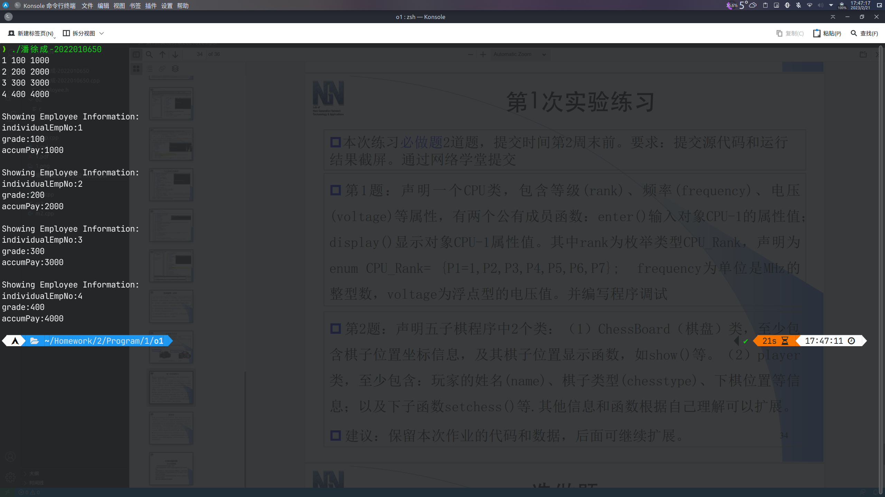

# 第1次作业

## 必做题

### 第1题

代码

```cpp
#include <iostream>
using namespace std;
enum CPU_Rank
{
	P1 = 1,
	P2,
	P3,
	P4,
	P5,
	P6,
	P7
};
class CPU
{
public:
	void enter();
	void display();

private:
	CPU_Rank rank;
	int frequency;
	float voltage;
};
void CPU::enter()
{
	int r;
	cout << "请依次输入CPU的等级、频率和电压\n";
	cin >> r >> frequency >> voltage;
	rank = (CPU_Rank)r;
}
void CPU::display()
{
	cout << "等级："
		 << "P" << rank << endl;
	cout << "频率：" << frequency << endl;
	cout << "电压：" << voltage << endl;
}
int main()
{
	CPU CPU_1;
	CPU_1.enter();
	CPU_1.display();
	return 0;
}
```

运行结果


### 第2题

```cpp
#include <iostream>
using namespace std;

#define SIZE 15

struct Position
{
	int x, y;
};

enum ChessColor
{
	black = 1,
	white = 2
};

class ChessBoard
{
public:
	void show();
	bool setchess(int x, int y, int chesstype);

private:
	short boardinfo[SIZE][SIZE];
} board;

class player
{
public:
	void setchess();
	void setplayer();

private:
	char name[17];
	int chesstype;
	Position chesspos[114];
	int currentStep;
} p1, p2;

void ChessBoard::show()
{
	for (int i = 0; i < SIZE; i++)
	{
		for (int j = 0; j < SIZE; j++)
		{
			switch (boardinfo[i][j])
			{
			case 0:
				if (i > 0 && j > 0 && i < SIZE - 1 && j < SIZE - 1)
					printf("┼");
				else if (i == 0 && j > 0 && j < SIZE - 1)
					printf("┬");
				else if (i == SIZE - 1 && j > 0 && j < SIZE - 1)
					printf("┴");
				else if (j == 0 && i > 0 && i < SIZE - 1)
					printf("├");
				else if (j == SIZE - 1 && i > 0 && i < SIZE - 1)
					printf("┤");
				else if (i == 0 && j == 0)
					printf("┌");
				else if (i == 0 && j == SIZE - 1)
					printf("┐");
				else if (i == SIZE - 1 && j == 0)
					printf("└");
				else if (i == SIZE - 1 && j == SIZE - 1)
					printf("┘");
				break;
			case 1:
				printf("●");
				break;
			case 2:
				printf("○");
				break;
			}
		}
		printf("\n");
	}
}

bool ChessBoard::setchess(int x, int y, int chesstype)
{
	if (x >= 0 && x < SIZE && y >= 0 && y < SIZE)
	{
		if (!boardinfo[x][y])
		{
			boardinfo[x][y] = chesstype;
			return true;
		}
		else
		{
			printf("该位置已被占用！\n");
			return false;
		}
	}
	else
	{
		printf("该位置超出范围！\n");
		return false;
	}
}

void player::setchess()
{
	bool flag;
	Position currentchess;
	do
	{
		printf("请输入下子的位置：");
		cin >> currentchess.x >> currentchess.y;
		flag = board.setchess(currentchess.x, currentchess.y, chesstype);
	} while (!flag);
	chesspos[currentStep] = currentchess;
	currentStep++;
}

void player::setplayer()
{
	cin >> name;
	currentStep = 0;
}

// int main()
// {
// 	board.show();
// }
```

## 选做题

### 第1题

代码

`employee.h`

```cpp
#include <iostream>
using namespace std;
class employee
{
public:
	void set_emp()
	{
		cin >> individualEmpNo >> grade >> accumPay;
	};
	void show()
	{
		cout << endl
			 << "Showing Employee Information:\n"
			 << "individualEmpNo:" << individualEmpNo << endl
			 << "grade:" << grade << endl
			 << "accumPay:" << accumPay << endl;
	};

private:
	int individualEmpNo;
	int grade;
	int accumPay;
};
```

`XXX.cpp`

```cpp
#include "employee.h"
int main()
{
	employee emp1, emp2, emp3, emp4;
	emp1.set_emp();
	emp2.set_emp();
	emp3.set_emp();
	emp4.set_emp();
	emp1.show();
	emp2.show();
	emp3.show();
	emp4.show();
	return 0;
}
```

运行结果



### 第2题

运行测试结果


代码功能与注释

`C`

```c
#include <stdio.h>
#include <stdlib.h>
#include <stdbool.h>
#define STACK_SIZE 100 // 定义栈的容量
struct Stack		   // 定义栈的结构体
{
	int top;				// 定义栈顶
	int buffer[STACK_SIZE]; // 定义数量为栈的容量的栈的缓冲
};
bool stack_push(struct Stack *s, int i) // 定义推入函数
{
	if (s->top == STACK_SIZE - 1) // 检测栈是否已满
	{
		printf("Stack is overflow.\n"); // 显示提示信息
		return false;					// 返回错误信息
	}
	else // 栈未满，继续推入
	{
		s->buffer[++(s->top)] = i; // 在栈的缓冲中存入所推入的变量，并将栈顶上移
		return true;			   // 返回成功信息
	}
}
bool stack_pop(struct Stack *s, int *i) // 定义弹出函数
{
	if (s->top == -1) // 检测栈是否已空
	{
		printf("Stack is empty.\n"); // 显示提示信息
		return false;				 // 返回错误信息
	}
	else // 栈未空，继续弹出
	{
		*i = s->buffer[(s->top)--]; // 记录弹出的变量，并将栈顶下移
		return true;				// 返回成功信息
	}
}
int main()
{
	struct Stack st1, st2; // 声明2个栈
	int x;				   // 声明一个整型变量
	st1.top = -1;		   // 初始化st1的栈顶
	st2.top = -1;		   // 初始化st2的栈顶
	stack_push(&st1, 12);  // 向st1中推入12
	stack_pop(&st1, &x);   // 弹出st1的栈顶
	stack_push(&st1, 20);  // 向st1中推入20
	stack_pop(&st1, &x);   // 弹出st1的栈顶
	return 0;
}
```

`C++`

```cpp
#include <iostream>
using namespace std;
#define STACK_SIZE 100 // 定义栈的容量
class Stack			   // 定义栈的类
{
	int top;				// 定义栈顶
	int buffer[STACK_SIZE]; // 定义数量为栈的容量的栈的缓冲
public:
	Stack() { top = -1; } // 定义构造函数，初始化栈顶
	bool push(int i);	  // 声明推入函数
	bool pop(int &i);	  // 声明弹出函数
};
bool Stack::push(int i) // 定义推入函数
{
	if (top == STACK_SIZE - 1) // 检测栈是否已满
	{
		cout << "Stack is overflow.\n"; // 显示提示信息
		return false;					// 返回错误信息
	}
	else // 栈未满，继续推入
	{
		buffer[++top] = i; // 在栈的缓冲中存入所推入的变量，并将栈顶上移
		return true;	   // 返回成功信息
	}
}
bool Stack::pop(int &i) // 定义弹出函数
{
	if (top == -1) // 检测栈是否已空
	{
		cout << "Stack is empty.\n"; // 显示提示信息
		return false;				 // 返回错误信息
	}
	else // 栈未空，继续弹出
	{
		i = buffer[top--]; // 记录弹出的变量，并将栈顶下移
		return true;	   // 返回成功信息
	}
}
int main()
{
	Stack st1, st2; // 声明2个栈
	int x;			// 声明一个整型变量
	st1.push(12);	// 向st1中推入12
	st1.pop(x);		// 弹出st1的栈顶
	st2.push(20);	// 向st1中推入20
	st2.pop(x);		// 弹出st1的栈顶
	return 0;
}
```
