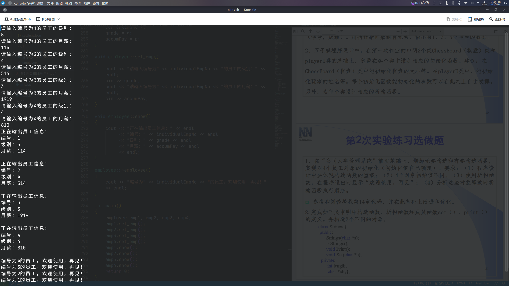

# 第二次作业

## 必做题

### 第1题

源程序

```cpp
#include <iostream>
using namespace std;
class Student
{
public:
	Student(int i, int g);
	int getID();
	int getGrade();

private:
	int studentID;
	int grade;
};
Student::Student(int i, int g)
{
	studentID = i;
	grade = g;
}
int Student::getID()
{
	return studentID;
}
int Student::getGrade()
{
	return grade;
}
int main()
{
	Student stu[5] = {Student(1, 100), Student(2, 99), Student(3, 98), Student(4, 97), Student(5, 96)};
	Student *p = stu;
	for (p = stu; p <= stu + 4; p += 2)
		cout << "第" << p - stu + 1 << "个学生的学号为" << p->getID() << "，成绩为" << p->getGrade() << "。" << endl;
	return 0;
}
```

运行结果


### 第2题

源程序

```cpp
#include <iostream>
#include <cstring>
using namespace std;

struct Position
{
	int x, y;
};

enum ChessColor
{
	black = 1,
	white = 2
};

class ChessBoard
{
public:
	ChessBoard();
	ChessBoard(int s);
	void init();
	void show();
	bool setchess(int x, int y, int chesstype);
	~ChessBoard();

private:
	int size;
	char **boardinfo;
} board;

class player
{
public:
	player();
	player(char *n);
	void setchess();
	void setname(char *n);
	~player();

private:
	char *name;
	int chesstype;
	Position chesspos[114];
	int currentStep;
} p1, p2;


ChessBoard::ChessBoard()
{
	size = 15;
	init();
}

ChessBoard::ChessBoard(int s)
{
	size = s;
	init();
}

void ChessBoard::init()
{
	boardinfo = new char *[size];
	for (int i = 0; i < size; i++)
	{
		boardinfo[i] = new char[size];
	}
	for (int i = 0; i < size; i++)
	{
		for (int j = 0; j < size; j++)
		{
			boardinfo[i][j] = 0;
		}
	}
}

void ChessBoard::show()
{
	for (int i = 0; i < size; i++)
	{
		for (int j = 0; j < size; j++)
		{
			switch (boardinfo[i][j])
			{
			case 0:
				if (i > 0 && j > 0 && i < size - 1 && j < size - 1)
					printf("┼");
				else if (i == 0 && j > 0 && j < size - 1)
					printf("┬");
				else if (i == size - 1 && j > 0 && j < size - 1)
					printf("┴");
				else if (j == 0 && i > 0 && i < size - 1)
					printf("├");
				else if (j == size - 1 && i > 0 && i < size - 1)
					printf("┤");
				else if (i == 0 && j == 0)
					printf("┌");
				else if (i == 0 && j == size - 1)
					printf("┐");
				else if (i == size - 1 && j == 0)
					printf("└");
				else if (i == size - 1 && j == size - 1)
					printf("┘");
				break;
			case 1:
				printf("●");
				break;
			case 2:
				printf("○");
				break;
			}
		}
		printf("\n");
	}
}

bool ChessBoard::setchess(int x, int y, int chesstype)
{
	if (x >= 0 && x < size && y >= 0 && y < size)
	{
		if (!boardinfo[x][y])
		{
			boardinfo[x][y] = chesstype;
			return true;
		}
		else
		{
			printf("该位置已被占用！\n");
			return false;
		}
	}
	else
	{
		printf("该位置超出范围！\n");
		return false;
	}
}

ChessBoard::~ChessBoard()
{
	for (int i = 0; i < size; i++)
	{
		delete[] boardinfo[i];
	}
	delete[] boardinfo;
}

player::player()
{
	name = new char[14];
	strcpy(name, "PlayerUnknown");
}

player::player(char *n)
{
	name = new char[strlen(n) + 1];
	strcpy(name, n);
}

void player::setchess()
{
	bool flag;
	Position currentchess;
	do
	{
		printf("请输入下子的位置：");
		cin >> currentchess.x >> currentchess.y;
		flag = board.setchess(currentchess.x, currentchess.y, chesstype);
	} while (!flag);
	chesspos[currentStep] = currentchess;
	currentStep++;
}

void player::setname(char *n)
{
	delete[] name;
	name = new char[strlen(n) + 1];
	strcpy(name, n);
}

player::~player()
{
	delete[] name;
}

// int main()
// {
// 	board.show();
// }
```

## 选做题

### 第1题

源程序

`employee.h`

```cpp
#include <iostream>
using namespace std;
class employee
{
public:
	employee();
	employee(int g, int p);
	void set_emp();
	void show();
	~employee();

private:
	int individualEmpNo;
	int grade;
	int accumPay;
	static int currentEmpNo;
};
```
`XXX.cpp`

```cpp
#include "employee.h"

int employee::currentEmpNo = 1;

employee::employee()
{
	individualEmpNo = currentEmpNo;
	currentEmpNo++;
	grade = individualEmpNo * 10;
	accumPay = individualEmpNo * 1000;
}

employee::employee(int g, int p)
{
	individualEmpNo = currentEmpNo;
	currentEmpNo++;
	grade = g;
	accumPay = p;
}

void employee::set_emp()
{
	cout << "请输入编号为" << individualEmpNo << "的员工的级别：" << endl;
	cin >> grade;
	cout << "请输入编号为" << individualEmpNo << "的员工的月薪：" << endl;
	cin >> accumPay;
}

void employee::show()
{
	cout << "正在输出员工信息：" << endl
		 << "编号：" << individualEmpNo << endl
		 << "级别：" << grade << endl
		 << "月薪：" << accumPay << endl
		 << endl;
}

employee::~employee()
{
	cout << "编号为" << individualEmpNo << "的员工，欢迎使用，再见！" << endl;
}

int main()
{
	employee emp1, emp2, emp3, emp4;
	emp1.set_emp();
	emp2.set_emp();
	emp3.set_emp();
	emp4.set_emp();
	emp1.show();
	emp2.show();
	emp3.show();
	emp4.show();
	return 0;
}
```

运行结果



### 第2题

源程序

```cpp
#include <iostream>
#include <cstring>
using namespace std;
class Strings
{
public:
	Strings(char *s);
	~Strings();
	void Print();
	void Set(char *s);

private:
	int length;
	char *str;
};

Strings::Strings(char *s)
{
	length = strlen(s);
	str = new char[length + 1];
	strcpy(str, s);
}

Strings::~Strings()
{
	delete[] str;
}

void Strings::Print()
{
	cout << "str = " << str << endl
		 << "length = " << length << endl;
}

void Strings::Set(char *s)
{
	delete[] str;
	length = strlen(s);
	str = new char[length + 1];
	strcpy(str, s);
}

int main()
{
	Strings str1("114");
	Strings str2("514");
	str1.Print();
	str2.Print();
	return 0;
}
```

运行结果


