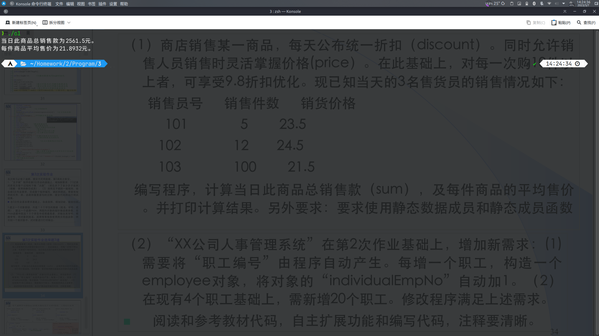
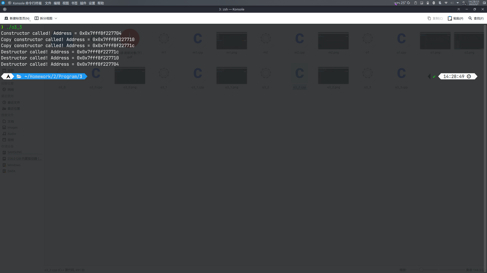

# 第三次作业

## 必做题

### 第1题

源代码

```cpp
#include <iostream>
#include <cstring>
using namespace std;

struct Position
{
	int x, y;
};

class ChessBoard;
class player;

class ChessBoard
{
public:											// 为避免麻烦全部公有
	ChessBoard(int s = 15);						// 声明构造函数
	void init();								// 声明初始化棋盘函数
	void show();								// 声明展示棋盘函数
	bool setchess(int x, int y, int chesstype); // 声明全局下子函数
	char judge(player &p);						// 声明判断输赢函数
	~ChessBoard();								// 声明析构函数
	char **boardinfo;							// 棋盘
	static int step;							// 总步数
	int size;									// 棋盘大小
};

int ChessBoard::step = 0;

class player
{
public:
	player(char *n = "PlayerUnknown");					   // 声明构造函数
	void setchess(ChessBoard &board);					   // 声明玩家下子函数
	void setname(char *n);								   // 声明玩家设置名称函数
	char *getname();									   // 声明玩家获取名称函数
	char getChessType();								   // 声明玩家获取棋子类型函数
	Position getLastChess();							   // 声明获取玩家最后一步落子位置函数
	bool checkRow(ChessBoard &board, Position lastChess);  // 声明检查是否五子连珠函数
	bool checkCol(ChessBoard &board, Position lastChess);  // 声明检查是否五子连珠函数
	bool checkDiag(ChessBoard &board, Position lastChess); // 声明检查是否五子连珠函数
	bool checkGaid(ChessBoard &board, Position lastChess); // 声明检查是否五子连珠函数
	~player();//声明析构函数

private:
	char *name;				// 玩家名称
	char chesstype;			// 棋子类型
	Position chesspos[114]; // 玩家每步落子位置
	int currentStep;		// 当前步数
	static char temp;
};

char player::temp = 1;

//棋盘构造函数
ChessBoard::ChessBoard(int s)
{
	size = s;
	init();
}

//棋盘初始化函数
void ChessBoard::init()
{
	boardinfo = new char *[size];
	for (int i = 0; i < size; i++)
	{
		boardinfo[i] = new char[size];
	}
	for (int i = 0; i < size; i++)
	{
		for (int j = 0; j < size; j++)
		{
			boardinfo[i][j] = 0;
		}
	}
}

//棋盘展示函数
void ChessBoard::show()
{
	system("clear"); // Windows `system("cls");`
	printf(" ");
	for (int i = 0; i < size; i++)
		printf("%d", i % 10);
	printf("\n");
	for (int i = 0; i < size; i++)
	{
		printf("%d", i % 10);
		for (int j = 0; j < size; j++)
		{
			switch (boardinfo[i][j])
			{
			case 0:
				if (i > 0 && j > 0 && i < size - 1 && j < size - 1)
					printf("┼");
				else if (i == 0 && j > 0 && j < size - 1)
					printf("┬");
				else if (i == size - 1 && j > 0 && j < size - 1)
					printf("┴");
				else if (j == 0 && i > 0 && i < size - 1)
					printf("├");
				else if (j == size - 1 && i > 0 && i < size - 1)
					printf("┤");
				else if (i == 0 && j == 0)
					printf("┌");
				else if (i == 0 && j == size - 1)
					printf("┐");
				else if (i == size - 1 && j == 0)
					printf("└");
				else if (i == size - 1 && j == size - 1)
					printf("┘");
				break;
			case 1:
				printf("●");
				break;
			case 2:
				printf("○");
				break;
			}
		}
		printf("\n");
	}
}

//全局下子函数
bool ChessBoard::setchess(int x, int y, int chesstype)
{
	if (x >= 0 && x < size && y >= 0 && y < size)
	{
		if (!boardinfo[x][y])
		{
			boardinfo[x][y] = chesstype;
			step++;
			return true;
		}
		else
		{
			printf("该位置已被占用！\n");
			return false;
		}
	}
	else
	{
		printf("该位置超出范围！\n");
		return false;
	}
}

//全局判断输赢函数
char ChessBoard::judge(player &p)
{
	Position lastChess = p.getLastChess();
	if (p.checkRow(*this, lastChess) || p.checkCol(*this, lastChess) || p.checkDiag(*this, lastChess) || p.checkGaid(*this, lastChess))
		return p.getChessType();
	else
		return 0;
}

//棋盘析构函数
ChessBoard::~ChessBoard()
{
	for (int i = 0; i < size; i++)
	{
		delete[] boardinfo[i];
	}
	delete[] boardinfo;
}

//玩家构造函数
player::player(char *n)
{
	name = new char[strlen(n) + 1];
	strcpy(name, n);
	currentStep = 0;
	chesstype = temp;
	temp++;
}

//玩家下子函数
void player::setchess(ChessBoard &board)
{
	bool flag;
	Position currentchess;
	do
	{
		cout << name << "，请输入下子的位置：（纵向x 横向y）" << endl;
		cin >> currentchess.x >> currentchess.y;
		flag = board.setchess(currentchess.x, currentchess.y, chesstype);
	} while (!flag);
	chesspos[currentStep] = currentchess;
	currentStep++;
}

//玩家设置名称函数
void player::setname(char *n)
{
	delete[] name;
	name = new char[strlen(n) + 1];
	strcpy(name, n);
}

//玩家获取名称函数
char *player::getname()
{
	return name;
}

//玩家获取棋子类型函数
char player::getChessType()
{
	return chesstype;
}

//玩家获取最后一步落子位置函数
Position player::getLastChess()
{
	return chesspos[currentStep - 1];
}

//检查是否五子连珠
bool player::checkRow(ChessBoard &board, Position lastChess)
{
	int count = 0;
	bool flag = false;
	for (int i = ((lastChess.x < 4) ? 0 : lastChess.x - 4); i <= ((lastChess.x > board.size - 5) ? board.size - 1 : lastChess.x + 4); i++)
	{
		if (board.boardinfo[i][lastChess.y] == chesstype)
			count++;
		else
			count = 0;
		if (count >= 5)
		{
			flag = true;
			break;
		}
	}
	return flag;
}

//检查是否五子连珠
bool player::checkCol(ChessBoard &board, Position lastChess)
{
	int count = 0;
	bool flag = false;
	for (int i = ((lastChess.y < 4) ? 0 : lastChess.y - 4); i <= ((lastChess.y > board.size - 5) ? board.size - 1 : lastChess.y + 4); i++)
	{
		if (board.boardinfo[lastChess.x][i] == chesstype)
			count++;
		else
			count = 0;
		if (count >= 5)
		{
			flag = true;
			break;
		}
	}
	return flag;
}

//检查是否五子连珠
bool player::checkDiag(ChessBoard &board, Position lastChess)
{
	int count = 0;
	bool flag = false;
	for (int i = ((lastChess.x > lastChess.y) ? ((lastChess.y < 4) ? lastChess.x - lastChess.y : lastChess.x - 4) : ((lastChess.x < 4) ? 0 : lastChess.x - 4)); i <= ((lastChess.x > lastChess.y) ? ((lastChess.x > board.size - 5) ? board.size - 1 : lastChess.x + 4) : ((lastChess.y > board.size - 5) ? board.size - lastChess.y + lastChess.x - 1 : lastChess.x + 4)); i++)
	{
		if (board.boardinfo[i][i + lastChess.y - lastChess.x] == chesstype)
			count++;
		else
			count = 0;
		if (count >= 5)
		{
			flag = true;
			break;
		}
	}
	return flag;
}

//检查是否五子连珠
bool player::checkGaid(ChessBoard &board, Position lastChess)
{
	int x = lastChess.x, y = lastChess.y;
	char **_boardinfo = new char *[board.size];
	for (int i = 0; i < board.size; i++)
	{
		_boardinfo[i] = new char[board.size];
	}
	for (int i = 0; i < board.size; i++)
	{
		for (int j = 0; j < board.size; j++)
		{
			_boardinfo[i][j] = board.boardinfo[i][board.size - j - 1];
		}
	}
	int count = 0;
	bool flag = false;
	y = board.size - y - 1;
	for (int i = ((x > y) ? ((y < 4) ? x - y : x - 4) : ((x < 4) ? 0 : x - 4)); i <= ((x > y) ? ((x > board.size - 5) ? board.size - 1 : x + 4) : ((y > board.size - 5) ? board.size - y + x - 1 : x + 4)); i++)
	{
		if (_boardinfo[i][i + y - x] == chesstype)
			count++;
		else
			count = 0;
		if (count >= 5)
		{
			flag = true;
			break;
		}
	}
	for (int i = 0; i < board.size; i++)
	{
		delete[] _boardinfo[i];
	}
	delete[] _boardinfo;
	return flag;
}

//玩家析构函数
player::~player()
{
	delete[] name;
}

int main()
{
	char p1n[17] = {0}, p2n[17] = {0};
	int size = 0;
	char flag = 0;
	player p[2];
	int i = 0;
	cout << "--五子棋--" << endl
		 << endl;
	cout << "输入玩家1（黑子）名称：" << endl
		 << ">>> ";
	cin >> p1n;
	cout << "输入玩家2（白子）名称：" << endl
		 << ">>> ";
	cin >> p2n;
	cout << "输入棋盘大小：" << endl
		 << ">>> ";
	cin >> size;
	p[0].setname(p1n);
	p[1].setname(p2n);
	ChessBoard board(size);
	do
	{
		board.show();
		cout << p[i].getname() << "来下第" << board.step + 1 << "步棋！";
		p[i].setchess(board);
		flag = board.judge(p[i]);
		i++;
		i %= 2;
	} while (!flag);
	board.show();
	cout << "本场游戏共下了" << board.step << "步棋，最终" << ((flag % 2) ? p[0].getname() : p[1].getname()) << "获胜！" << endl;
	return 0;
}
```

运行结果


### 第2题

源代码

```cpp
#include <iostream>
#include <cstring>
using namespace std;

class Student
{
public:
	Student()
	{
		char defname[] = {"DefaultName"};
		stuName = new char[strlen(defname) + 1];
		strcpy(stuName, defname);
	}
	Student(Student &stu)
	{
		stuName = new char[strlen(stu.stuName) + 1];
		strcpy(stuName, stu.stuName);
		stuNo = stu.stuNo;
		stuScore = stu.stuScore;
	}
	void set(char *_stuName, int _stuNo, int _stuScore)
	{
		delete[] stuName;
		stuName = new char[strlen(_stuName) + 1];
		strcpy(stuName, _stuName);
		stuNo = _stuNo;
		stuScore = _stuScore;
	}
	char *getName()
	{
		return stuName;
	}
	int getNo()
	{
		return stuNo;
	}
	int getScore()
	{
		return stuScore;
	}
	void print()
	{
		cout << "Student Info:" << endl
			 << "StuName: " << stuName << endl
			 << "StuNo: " << stuNo << endl
			 << "StuScore: " << stuScore << endl;
	}
	~Student()
	{
		delete[] stuName;
	}

private:
	char *stuName;
	int stuNo;
	int stuScore;
};

Student *max(Student stu[], int n)
{
	Student *p, *max = stu;
	for (p = stu; p - stu < n; p++)
	{
		if (p->getScore() > max->getScore())
			max = p;
	}
	cout << max->getNo() << endl;
	return max;
}

int main()
{
	Student stu[10];
	Student *p;
	stu[0].set("Hitotsu", 1919810, 233);
	stu[1].set("Futatsu", 1919811, 666);
	stu[2].set("Mittsu", 1919812, 114);
	stu[3].set("Yottsu", 1919813, 514);
	stu[4].set("Itsutsu", 1919814, 251);
	stu[5].set("Muttsu", 1919815, 486);
	stu[6].set("Nanatsu", 1919816, 196);
	stu[7].set("Yattsu", 1919817, 384);
	stu[8].set("Kokonotsu", 1919818, 667);
	stu[9].set("Too", 1919819, 665);
	p = max(stu, 10);
	Student newStu(*p);
	newStu.print();
	return 0;
}
```

运行结果


## 选做题

### 第1题

源代码

```cpp
#include <iostream>
using namespace std;

class Salesman
{
public:
	Salesman(int _saleNo, int _saleNum, float _salePri);
	static float getSum();
	static float getAvePri();

private:
	int saleNo;
	int saleNum;
	float salePri;
	static int sumNum;
	static float sumPri;
	static float avePri;
};

int Salesman::sumNum = 0;
float Salesman::sumPri = 0;
float Salesman::avePri = 0;

Salesman::Salesman(int _saleNo, int _saleNum, float _salePri)
{
	saleNo = _saleNo;
	saleNum = _saleNum;
	salePri = _salePri;
	sumNum += saleNum;
	sumPri += salePri * saleNum;
	avePri = sumPri / sumNum;
}

float Salesman::getSum()
{
	return sumPri;
}

float Salesman::getAvePri()
{
	return avePri;
}

int main()
{
	Salesman s1(101, 5, 23.5), s2(102, 12, 24.5), s3(103, 100, 21.5);
	cout << "当日此商品总销售款为" << s3.getSum() << "元。" << endl
		 << "每件商品平均售价为" << s3.getAvePri() << "元。" << endl;
	return 0;
}
```

运行结果



### 第2题

源代码

`employee.h`

```cpp
#include <iostream>
using namespace std;
class employee
{
public:
	employee();
	employee(int g, int p);
	void set_emp();
	void show();
	~employee();

private:
	int individualEmpNo;
	int grade;
	int accumPay;
	static int currentEmpNo;
};
```

`XXX.cpp`

```cpp
#include "employee.h"

int employee::currentEmpNo = 1;

employee::employee()
{
	individualEmpNo = currentEmpNo; // 职工编号自动产生
	currentEmpNo++;					// 自动加1
	grade = 1;
	accumPay = 1000;
}

employee::employee(int g, int p)
{
	individualEmpNo = currentEmpNo; // 职工编号自动产生
	currentEmpNo++;					// 自动加1
	grade = g;
	accumPay = p;
}

void employee::set_emp()
{
	cout << "请输入编号为" << individualEmpNo << "的员工的级别：" << endl;
	cin >> grade;
	cout << "请输入编号为" << individualEmpNo << "的员工的月薪：" << endl;
	cin >> accumPay;
}

void employee::show()
{
	cout << "正在输出员工信息：" << endl
		 << "编号：" << individualEmpNo << endl
		 << "级别：" << grade << endl
		 << "月薪：" << accumPay << endl
		 << endl;
}

employee::~employee()
{
	cout << "编号为" << individualEmpNo << "的员工，欢迎使用，再见！" << endl;
}

int main()
{
	employee emp[20];
	for (int i = 0; i < 20; i++)
		emp[i].set_emp();
	for (int i = 0; i < 20; i++)
		emp[i].show();
	return 0;
}
```

运行结果


### 第3题

源代码0

```cpp
#include <iostream>
#include <iomanip>
using namespace std;
class Date
{
	int d, m, y;

public:
	Date(int dd = 0, int mm = 0, int yy = 0);
	Date(Date &D);
	~Date();
	/**/
};
Date::Date(int dd, int mm, int yy) : d(dd), m(mm), y(yy)
{
	cout << "Constructor called! Address = 0x" << hex << setw(8) << setfill('0') << this << endl;
}
Date::Date(Date &D)
{
	d = D.d;
	m = D.m;
	y = D.y;
	cout << "Copy constructor called! Address = 0x" << hex << setw(8) << setfill('0') << this << endl;
}
Date::~Date()
{
	cout << "Destructor called! Address = 0x" << hex << setw(8) << setfill('0') << this << endl;
}
Date func(Date A)
{
	return Date(A);
}
int main()
{
	Date today;
	today = func(today);
}
```

源代码1

```cpp
#include <iostream>
#include <iomanip>
using namespace std;
class Date
{
	int d, m, y;

public:
	Date(int dd = 0, int mm = 0, int yy = 0);
	Date(Date &D);
	~Date();
	/**/
};
Date::Date(int dd, int mm, int yy) : d(dd), m(mm), y(yy)
{
	cout << "Constructor called! Address = 0x" << hex << setw(8) << setfill('0') << this << endl;
}
Date::Date(Date &D)
{
	d = D.d;
	m = D.m;
	y = D.y;
	cout << "Copy constructor called! Address = 0x" << hex << setw(8) << setfill('0') << this << endl;
}
Date::~Date()
{
	cout << "Destructor called! Address = 0x" << hex << setw(8) << setfill('0') << this << endl;
}
Date func(Date A)
{
	Date B(A);
	return B;
}
int main()
{
	Date today;
	today = func(today);
}
```

源代码2

```cpp
#include <iostream>
#include <iomanip>
using namespace std;
class Date
{
	int d, m, y;

public:
	Date(int dd = 0, int mm = 0, int yy = 0);
	Date(Date &D);
	~Date();
	/**/
};
Date::Date(int dd, int mm, int yy) : d(dd), m(mm), y(yy)
{
	cout << "Constructor called! Address = 0x" << hex << setw(8) << setfill('0') << this << endl;
}
Date::Date(Date &D)
{
	d = D.d;
	m = D.m;
	y = D.y;
	cout << "Copy constructor called! Address = 0x" << hex << setw(8) << setfill('0') << this << endl;
}
Date::~Date()
{
	cout << "Destructor called! Address = 0x" << hex << setw(8) << setfill('0') << this << endl;
}
Date &func(Date A)
{
	Date B(A);
	return B;
}
int main()
{
	Date today;
	today = func(today);
}
```

源代码3

```cpp
#include <iostream>
#include <iomanip>
using namespace std;
class Date
{
	int d, m, y;

public:
	Date(int dd = 0, int mm = 0, int yy = 0);
	Date(Date &D);
	~Date();
	/**/
};
Date::Date(int dd, int mm, int yy) : d(dd), m(mm), y(yy)
{
	cout << "Constructor called! Address = 0x" << hex << setw(8) << setfill('0') << this << endl;
}
Date::Date(Date &D)
{
	d = D.d;
	m = D.m;
	y = D.y;
	cout << "Copy constructor called! Address = 0x" << hex << setw(8) << setfill('0') << this << endl;
}
Date::~Date()
{
	cout << "Destructor called! Address = 0x" << hex << setw(8) << setfill('0') << this << endl;
}
Date func(Date A)
{
	return A;
}
int main()
{
	Date today;
	today = func(today);
}
```

运行结果


