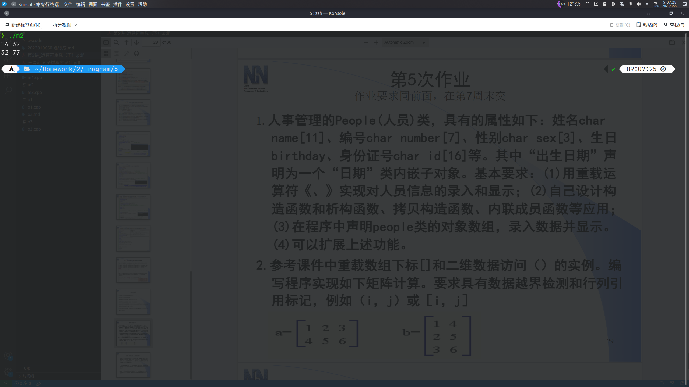

# 第5次作业

## 必做题

### 第1题

源代码

```cpp
#include <iostream>
#include <cstring>
using namespace std;

class People
{
public:
	People()
	{
		strcpy(name, "Default");
		strcpy(number, "114514");
		strcpy(sex, "M");
		birthday.y = 1919;
		birthday.m = 8;
		birthday.d = 10;
		strcpy(id, "123456789012345");
	}
	People(People &p)
	{
		strcpy(name, p.name);
		strcpy(number, p.number);
		strcpy(sex, p.sex);
		birthday.y = p.birthday.y;
		birthday.m = p.birthday.m;
		birthday.d = p.birthday.d;
		strcpy(id, p.id);
	}
	~People()
	{
		delete[] name;
		delete[] number;
		delete[] sex;
		delete[] id;
	}
	friend ostream &operator<<(ostream &output, People &p)
	{
		output << "输出人员信息：" << endl
			   << "姓名：" << p.name << endl
			   << "编号：" << p.number << endl
			   << "性别：" << p.sex << endl
			   << "生日：" << p.birthday.m << '/' << p.birthday.d << '/' << p.birthday.y << endl
			   << "身份证号：" << p.id << endl;
	}
	friend istream &operator>>(istream &input, People &p)
	{
		cout << "输入人员信息：" << endl;
		cout << "姓名：";
		input >> p.name;
		cout << "编号：";
		input >> p.number;
		cout << "性别：";
		input >> p.sex;
		cout << "生日：";
		input >> p.birthday.m >> p.birthday.d >> p.birthday.y;
		cout << "身份证号：";
		input >> p.id;
	}

private:
	char name[11];
	char number[7];
	char sex[3];
	class Date
	{
	public:
		int m;
		int d;
		int y;
	} birthday;
	char id[16];
};

int main()
{
	People p[10];
	for (int i = 0; i < 10; i++)
	{
		cin >> p[i];
	}
	for (int i = 0; i < 10; i++)
	{
		cout << p[i];
	}
	return 0;
}
```

运行结果

*略*

### 第2题

源代码

```cpp
#include <iostream>
#include <cassert>
using namespace std;

class Matrix
{
	double *data;
	int row;
	int col;

public:
	Matrix();
	Matrix(int r, int c);
	Matrix(double *pData, int r, int c);
	Matrix(Matrix &mat);
	~Matrix();
	double &operator[](int n);
	double &operator()(int r, int c);
	Matrix RMulti(Matrix &rmat);
	void show();
};

Matrix::Matrix()
{
	data = NULL;
	row = 0;
	col = 0;
}
Matrix::Matrix(int r, int c)
{
	data = new double[r * c];
	row = r;
	col = c;
}
Matrix::Matrix(double *pData, int r, int c)
{
	data = new double[r * c];
	for (int i = 0; i < r * c; i++)
	{
		data[i] = pData[i];
	}
	row = r;
	col = c;
}
Matrix::Matrix(Matrix &mat)
{
	row = mat.row;
	col = mat.col;
	data = new double[mat.row * mat.col];
	for (int i = 0; i < row * col; i++)
	{
		data[i] = mat.data[i];
	}
}
Matrix::~Matrix()
{
	delete[] data;
}
double &Matrix::operator[](int n)
{
	assert(n >= 0 && n < row * col);
	return data[n];
}
double &Matrix::operator()(int r, int c)
{
	assert(r >= 0 && r < row && c >= 0 && c < col);
	return data[col * r + c];
}
Matrix Matrix::RMulti(Matrix &rmat)
{
	double temp = 0.0;
	if (col == rmat.row && row == rmat.col)
	{
		Matrix ret(row, row);
		for (int i = 0; i < row; i++)
		{
			for (int j = 0; j < row; j++)
			{
				temp = 0.0;
				for (int k = 0; k < col; k++)
				{
					temp += (*this)(i, k) * rmat(k, j);
				}
				ret(i, j) = temp;
			}
		}
		return ret;
	}
	else
		return Matrix();
}
void Matrix::show()
{
	for (int i = 0; i < row; i++)
	{
		for (int j = 0; j < col; j++)
		{
			cout << (*this)(i, j) << ' ';
		}
		cout << endl;
	}
}
int main()
{
	double _a[6] = {1, 2, 3, 4, 5, 6};
	double _b[6] = {1, 4, 2, 5, 3, 6};
	Matrix a(_a, 2, 3);
	Matrix b(_b, 3, 2);
	Matrix ret(a.RMulti(b));
	ret.show();
	return 0;
}
```

运行结果



## 选做题

### 第1题

源代码

```cpp
#include <iostream>
#include <cstring>
using namespace std;
class Teacher
{
public:
	Teacher(char *_name = "Teacher", char *_number = "000000", char *_sex = "M", double _score = 0.0)
	{
		name = new char[strlen(_name)];
		strcpy(name, _name);
		number = new char[strlen(_number)];
		strcpy(number, _number);
		sex = new char[strlen(_sex)];
		strcpy(sex, _sex);
		score = _score;
	}
	~Teacher()
	{
		delete[] name;
		delete[] number;
		delete[] sex;
	}
	char *getName()
	{
		return name;
	}
	char *getNumber()
	{
		return number;
	}
	char *getSex()
	{
		return sex;
	}
	void print()
	{
		cout << "Teacher Info:" << endl
			 << "Name: " << name << endl
			 << "Number: " << number << endl
			 << "Sex: " << sex << endl
			 << "Score: " << score << endl;
	}

private:
	char *name;
	char *number;
	char *sex;
	double score;
};
class Student
{
public:
	Student(char *_name = "Student", char *_number = "000000", char *_sex = "M", double _gpa = 0.0)
	{
		name = new char[strlen(_name)];
		strcpy(name, _name);
		number = new char[strlen(_number)];
		strcpy(number, _number);
		sex = new char[strlen(_sex)];
		strcpy(sex, _sex);
		gpa = _gpa;
	}
	~Student()
	{
		delete[] name;
		delete[] number;
		delete[] sex;
	}
	char *getName()
	{
		return name;
	}
	char *getNumber()
	{
		return number;
	}
	char *getSex()
	{
		return sex;
	}
	void print()
	{
		cout << "Student Info:" << endl
			 << "Name: " << name << endl
			 << "Number: " << number << endl
			 << "Sex: " << sex << endl
			 << "GPA: " << gpa << endl;
	}
	void convert(Teacher &tea);

private:
	char *name;
	char *number;
	char *sex;
	double gpa;
};

void Student::convert(Teacher &tea)
{
	delete[] name;
	name = new char[strlen(tea.getName())];
	strcpy(name, tea.getName());
	delete[] number;
	number = new char[strlen(tea.getNumber())];
	strcpy(number, tea.getNumber());
	delete[] sex;
	sex = new char[strlen(tea.getSex())];
	strcpy(sex, tea.getSex());
}
int main()
{
	Teacher tea("Tadokoro", "114514", "Male", 100);
	Student stu("Kouji", "1919810", "Male", 4.0);
	stu.convert(tea);
	tea.print();
	cout << endl;
	stu.print();
}
```

运行结果


### 第2题

> **主要区别：**
>
> - 使用对象数组存储雇员信息
>
> - 使用文件进行个人信息的输入输出操作
>
> - 对`>>`和`<<`进行了重载，使得使用一个运算符能完成等级与月薪的输入、基本信息的输出

### 第3题

> **修改内容**
>
> - 优化大量重复代码，精简代码结构；
>
> - 优化判定输赢算法，不再使用双重循环遍历整个棋盘，而是只检查最后落子周围的棋盘，提升效率

修改后代码

```cpp
// 由于使用Okular阅读器直接复制自`张晋珩-五子棋程序设计.pdf`，可能有部分符号（主要体现在全半角和空格上）与原文档不符。
// 为适配我的ArchLinux系统与UTF-8编码环境，更改了部分代码（主要体现在棋盘数组大小和`system("clear");`上）。

// 老师。之前我传给您的版本没有注释,且平局判断过于复杂冗长,因此我对其进行了完善, 并进行了注释, 还望您重新验收、评定。下面是我对程序的总 体说明 :
// 首先,考虑到用户的游戏体验,游戏先询问了玩家的名字,并将其储存下来,以在以后称呼对应的玩家;然后, 询问 player1 的棋型, 通过输入 12 代表 黑白, 并且如果输入的不是 1 或 2, 则会报错并提示玩家重新输入。然后进行简 短的游戏说明, 就开始绘制棋盘开始游戏。在游戏过程中, 玩家通过输入棋子坐 标的方式下棋, 输入的 x、y 对应意思是“x 行 y 列”。若输入的坐标为小数, 则 通过 floor 函数将其转化为不超过它的最大整数。若转化后的整数仍不属于 0 ~14,则会报错, 提示玩家重新输入。每一步下完棋, 交给对手下时, 都会为后者提示 上一步对手下的位置。每次下完棋都通过系统 clear 命令清屏、重新绘制棋盘, 棋 盘的绘制是通过记录二维数组的每个元素的值(0、1、2), 来判断该在此处画 什么形状。至于胜负判断, 我们只需要写出四个判断函数, 分别是横连线、竖连 线、一三象限斜连线、二四象限斜连线。判断胜负无果后再判断平局。这样, 我 们就可以判断输赢, 然后进行结尾的输出, 也就是宣布获胜的一方(或平局),然后说“欢迎使用, 再见”之类的话。需要注意的是, 题目中要求记录双方对弈 的点数, 我选择用静态类成员变量, 理由很简单, 因为游戏中有两个玩家类, 但 是我们要想让两个玩家操作的时候这个计数变量均自增, 因此 static 变量就是 一个优选。最后输出这一数据的值即可。为了契合我们所学的内容, 析构函数执 行时进行了语句说明, 体现了三个对象的析构过程。 这些就是我五子棋程序的要 点。
// 具体的注释在附件中的程序源代码。
// 请用 VS2012 等对中文支持较好的编译器编译验收,谢谢。
#include <iostream>
#include <cstring>
#include <cstdlib>
#include <cmath>
using namespace std;
int board[15][15] = {0}; // 定义一个二维数组, 来储存棋盘上各点的棋子情况
char type[11];			 // 全局变量, 代表 Player 1 棋型
bool ping()				 // 判断棋盘是否已下满
{
	bool p = true;
	for (int i = 0; i < 15; i++)
	{
		for (int j = 0; j < 15; j++)
		{ // 遍历棋盘
			if (board[i][j] == 0)
			{
				p = false;
				break;
			}
		}
	}
	return p;
}
class ChessBoard
{
private:
	int x;
	int y;	  // 棋子位置
	int size; // 棋盘大小
public:
	void show(); // 展示棋子位置
	void setx(int a);
	void sety(int a);
	int getx() { return x; }
	int gety() { return y; }														  // 设定棋子位置
	ChessBoard(int sizee = 15, int xx = 0, int yy = 0) : size(sizee), x(xx), y(yy) {} // 构造函数
	~ChessBoard()																	  // 析构函数
	{
		cout << "Destructor called." << endl; // 调用语句
	}
};
void ChessBoard::show() // 显示对手的上一步
{
	cout << "Your opponent's last step:" << endl
		 << "Location x is: " << x << endl
		 << "Location y is: " << y << endl;
}
void ChessBoard::setx(int a)
{
	x = a;
}
void ChessBoard::sety(int a)
{
	y = a;
}
class player // 建立玩家类
{
private:
	char name[21]; // 玩家姓名
	enum chesstype // 枚举变量,定义棋型
	{
		black = 1,
		white
	};
	float px;
	float py;

public:
	static int numb;	   // 静态成员,记录对弈点数
	void setchess(int n);  // 玩家 n(1 或 2)下棋
	int givex();		   // 访问 x 的端口
	int givey();		   // 访问 y 的端口
	void give_name(int n); // 赋予名字
	void put_name();	   // 输出名字
	void pick_type();	   // 选择棋型
	void show_type();	   // 展示棋型
	~player()			   // player 类的析构函数
	{
		cout << "Destructor called." << endl;
	}
};
//
void player::give_name(int n)
{
	printf("Player %d,please enter your name (no longer than 20 letters):", n);
	cin >> name;
	cout << name << ",welcome!" << endl;
}
void player::show_type()
{
	printf("So,%s,your chess type is:", name);
	puts(type);
}
void player::pick_type()
{
	cout << "\n"
		 << name << ",which colour would you want to play?\nOne thing you need to know is that black plays first.\nPlease enter '1' for black or '2' for white:";
	int a;
	cin >> a;
	switch (a)
	{
	case 1:
		strcpy(type, "black");
		break;
	case 2:
		strcpy(type, "white");
		break;
	default:
		cout << "Input error!" << endl;
		pick_type();
		break; // 防止恶意输入,提示Input error
	}
}
void player::setchess(int n) // 程序中最重要的函数之一:下棋函数
{
	printf("%s,please set chess. Enter the x&y location of it.Input example: 7 7 \n", name);
	cin >> px >> py;
	int a, b;
	a = floor(px);
	b = floor(py); // 防止恶意输入小数
	bool loclegal1 = false;
	bool loclegal2 = false;
	bool loclegal = true; // 三个布尔型变量,判断坐标的合法性
	for (int i = 0; i < 15; i++)
	{
		if (floor(px) == i)
			loclegal1 = true;
		if (floor(py) == i)
			loclegal2 = true; // 遍历判断法
	}
	if ((loclegal1 == false) || (loclegal2 == false) || board[a][b] != 0)
		loclegal = false; // 数据越界或下在已有棋子的位置上均会报错
	if (loclegal == false)
	{
		cout << "Input error!" << endl;
		setchess(n);
	}
	if (loclegal)
	{
		board[a][b] = n; // 如果输入正确,就为二维数组赋值,并增加棋子数
		numb++;
	}
}
int player::givex()
{
	return px;
}
int player::givey()
{
	return py;
}
void player::put_name()
{
	cout << name;
}
// 检查是否五子连珠
bool win_shu(int x, int y, int chesstype)
{
	int count = 0;
	bool flag = false;
	for (int i = ((x < 4) ? 0 : x - 4); i <= ((x > 15 - 5) ? 15 - 1 : x + 4); i++)
	{
		if (board[i][y] == chesstype)
			count++;
		else
			count = 0;
		if (count >= 5)
		{
			flag = true;
			break;
		}
	}
	return flag;
}

// 检查是否五子连珠
bool win_heng(int x, int y, int chesstype)
{
	int count = 0;
	bool flag = false;
	for (int i = ((y < 4) ? 0 : y - 4); i <= ((y > 15 - 5) ? 15 - 1 : y + 4); i++)
	{
		if (board[x][i] == chesstype)
			count++;
		else
			count = 0;
		if (count >= 5)
		{
			flag = true;
			break;
		}
	}
	return flag;
}

// 检查是否五子连珠
bool win_xie_1(int x, int y, int chesstype)
{
	int count = 0;
	bool flag = false;
	for (int i = ((x > y) ? ((y < 4) ? x - y : x - 4) : ((x < 4) ? 0 : x - 4)); i <= ((x > y) ? ((x > 15 - 5) ? 15 - 1 : x + 4) : ((y > 15 - 5) ? 15 - y + x - 1 : x + 4)); i++)
	{
		if (board[i][i + y - x] == chesstype)
			count++;
		else
			count = 0;
		if (count >= 5)
		{
			flag = true;
			break;
		}
	}
	return flag;
}

// 检查是否五子连珠
bool win_xie_2(int x, int y, int chesstype)
{
	int **_boardinfo = new int *[15];
	for (int i = 0; i < 15; i++)
	{
		_boardinfo[i] = new int[15];
	}
	for (int i = 0; i < 15; i++)
	{
		for (int j = 0; j < 15; j++)
		{
			_boardinfo[i][j] = board[i][15 - j - 1];
		}
	}
	int count = 0;
	bool flag = false;
	y = 15 - y - 1;
	for (int i = ((x > y) ? ((y < 4) ? x - y : x - 4) : ((x < 4) ? 0 : x - 4)); i <= ((x > y) ? ((x > 15 - 5) ? 15 - 1 : x + 4) : ((y > 15 - 5) ? 15 - y + x - 1 : x + 4)); i++)
	{
		if (_boardinfo[i][i + y - x] == chesstype)
			count++;
		else
			count = 0;
		if (count >= 5)
		{
			flag = true;
			break;
		}
	}
	for (int i = 0; i < 15; i++)
	{
		delete[] _boardinfo[i];
	}
	delete[] _boardinfo;
	return flag;
}

void drawboard() // 棋盘的绘制函数
{
	char sign[15][15][7];
	for (int i = 0; i < 15; i++)
	{
		for (int j = 0; j < 15; j++)
		{
			if (board[i][j] == 0)
				strcpy(sign[i][j], "   \0");
			if (board[i][j] == 1)
				strcpy(sign[i][j], " ● \0");
			if (board[i][j] == 2)
				strcpy(sign[i][j], " ◎ \0"); // 根据二维数组元素的值绘制对应位置
		}
	}
	printf("\nEnter location to set chess.\n");
	printf("    0   1   2   3   4   5   6   7   8   9   10  11  12  13  14\n");
	printf("  ┌───┬───┬───┬───┬───┬───┬───┬───┬───┬───┬───┬───┬───┬───┬───┐\n");
	for (int i = 0, j = 0; i < 14; i++, j++)
	{
		printf("%2d│%3s│%3s│%3s│%3s│%3s│%3s│%3s│%3s│%3s│%3s│%3s│%3s│%3s│%3s│%3s│%d\n ", j, sign[i][0], sign[i][1], sign[i][2], sign[i][3], sign[i][4], sign[i][5], sign[i][6], sign[i][7], sign[i][8], sign[i][9], sign[i][10], sign[i][11], sign[i][12], sign[i][13], sign[i][14], j);
		printf(" ├───┼───┼───┼───┼───┼───┼───┼───┼───┼───┼───┼───┼───┼───┼───┤\n");
	}
	printf("14│%3s│%3s│%3s│%3s│%3s│%3s│%3s│%3s│%3s│%3s│%3s│%3s│%3s│%3s│%3s│%d\n", sign[14][0], sign[14][1], sign[14][2], sign[14][3], sign[14][4], sign[14][5], sign[14][6], sign[14][7], sign[14][8], sign[14][9], sign[14][10], sign[14][11], sign[14][12], sign[14][13], sign[14][14], 14);
	printf("  └───┴───┴───┴───┴───┴───┴───┴───┴───┴───┴───┴───┴───┴───┴───┘\n");
	printf("    0   1   2   3   4   5   6   7   8   9   10  11  12  13  14\n"); // 提示该位置坐标
}
void claim() // 有关游戏的部分说明
{
	printf("\nAttention:\nI.The vertical direction location,called 'hang' in Chinese,is considered x.\nII.If you input decimal data as location,the program will replace it with the largest integer smaller than it.\nExample:'Location x is 14.3' is equal to 'Location x is 14'.\n");
	cout << "\nGet ready for your fierce battle!\n"
		 << endl;
}
int player::numb = 0; // 类外初始化静态变量

int main()
{ // 开始主游戏程序
	int flag = 0;
	ChessBoard Chess;
	// player P1, P2; // 创建三个对象
	player P[2];
	int a[3] = {0};
	bool pingju = false; // 判断是否平局的变量
	P[0].give_name(1);
	P[1].give_name(2); // 让玩家输入他们的名字
	P[0].pick_type();
	P[0].show_type(); // 棋型的选择与显示
	printf("Thus,");
	P[1].put_name();
	printf(",you play the other colour of chess.\n\n");
	claim();						// 细枝末节的提示
	if (strcmp(type, "black") == 0) // 如果玩家一执黑,主程序主体
		flag = 1;
	if (strcmp(type, "white") == 0) // 如果玩家一执白,主程序主体
		flag = 2;
	do
	{
		drawboard(); // 绘制棋盘
		P[flag - 1].setchess(flag);
		Chess.setx(P[flag - 1].givex());
		Chess.sety(P[flag - 1].givey()); // 下棋
		if (win_xie_1(Chess.getx(), Chess.gety(), flag) || win_shu(Chess.getx(), Chess.gety(), flag) || win_heng(Chess.getx(), Chess.gety(), flag) || win_xie_2(Chess.getx(), Chess.gety(), flag))
		{
			a[flag - 1] = 1;
			system("clear");
			drawboard();
			break;
		} // 判断胜负
		if (ping())
		{
			pingju = true;
			break;
		}
		system("clear"); // 清屏
		Chess.show();	 // 提示上一步对手的走向
		drawboard();
		P[2 - flag].setchess(3 - flag);
		Chess.setx(P[2 - flag].givex());
		Chess.sety(P[2 - flag].givey());
		if (win_xie_1(Chess.getx(), Chess.gety(), 3 - flag) || win_shu(Chess.getx(), Chess.gety(), 3 - flag) || win_heng(Chess.getx(), Chess.gety(), 3 - flag) || win_xie_2(Chess.getx(), Chess.gety(), 3 - flag))
		{
			a[3 - flag] = 1;
			system("clear");
			drawboard();
			break;
		}
		if (ping())
		{
			pingju = true;
			break;
		}
		system("clear");
		Chess.show();
	} while (1); // 循环结束的唯二条件是分出胜负或平局

	if (a[1] == 1) // 如果玩家 1 胜利的情况
	{
		P[0].put_name();
		printf(" wins!\nThere are totally %d chesses played.\nThank you for playing my game.Goodbye.\n", player::numb);
	}
	if (a[2] == 1) // 如果玩家 2 胜利的情况
	{
		P[1].put_name();
		printf(" wins!\nThere are totally %d chesses played.\nThank you for playing my game.Goodbye.\n", player::numb);
	}
	if (pingju)
		printf("You two reaches a peace situation!\nThere are totally %d chesses played.\nThank you for playing my game.Goodbye.\n", player::numb);
	return 0;
}
```

运行结果


