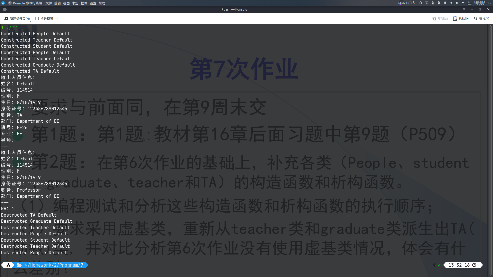

# 第7次作业

## 必做题

### 第1题

> 构造基类`B1`->构造基类`B2`->构造`memberB1`->构造`memberB2`->构造`obj`->析构`obj`->析构`memberB2`->析构`memberB1`->析构基类`B2`->析构基类`B1`

### 第2题

```cpp
#include <iostream>
#include <cstring>
using namespace std;

class People
{
public:
	People()
	{
		strcpy(name, "Default");
		strcpy(number, "114514");
		strcpy(sex, "M");
		birthday.y = 1919;
		birthday.m = 8;
		birthday.d = 10;
		strcpy(id, "123456789012345");
		cout << "Constructed People " << name << endl;
	}
	People(People &p)
	{
		strcpy(name, p.name);
		strcpy(number, p.number);
		strcpy(sex, p.sex);
		birthday.y = p.birthday.y;
		birthday.m = p.birthday.m;
		birthday.d = p.birthday.d;
		strcpy(id, p.id);
		cout << "Copied People " << name << endl;
	}
	~People()
	{
		cout << "Destructed People " << name << endl;
	}
	void display()
	{
		cout << "输出人员信息：" << endl
			 << "姓名：" << name << endl
			 << "编号：" << number << endl
			 << "性别：" << sex << endl
			 << "生日：" << birthday.m << '/' << birthday.d << '/' << birthday.y << endl
			 << "身份证号：" << id << endl;
	}
	void set()
	{
		cout << "输入人员信息：" << endl;
		cout << "姓名：";
		cin >> name;
		cout << "编号：";
		cin >> number;
		cout << "性别：";
		cin >> sex;
		cout << "生日：";
		cin >> birthday.m >> birthday.d >> birthday.y;
		cout << "身份证号：";
		cin >> id;
	}

protected:
	char name[11];
	char number[7];
	char sex[3];
	class Date
	{
	public:
		int m;
		int d;
		int y;
	} birthday;
	char id[16];
};

class Student : virtual public People
{
public:
	Student()
	{
		strcpy(name, "Default");
		strcpy(number, "114514");
		strcpy(sex, "M");
		birthday.y = 1919;
		birthday.m = 8;
		birthday.d = 10;
		strcpy(id, "123456789012345");
		strcpy(classNo, "EE26");
		cout << "Constructed Student " << name << endl;
	}
	Student(Student &p)
	{
		strcpy(name, p.name);
		strcpy(number, p.number);
		strcpy(sex, p.sex);
		birthday.y = p.birthday.y;
		birthday.m = p.birthday.m;
		birthday.d = p.birthday.d;
		strcpy(id, p.id);
		strcpy(classNo, p.classNo);
		cout << "Copied Student " << name << endl;
	}
	~Student()
	{
		cout << "Destructed Student " << name << endl;
	}
	void display()
	{
		cout << "输出人员信息：" << endl
			 << "姓名：" << name << endl
			 << "编号：" << number << endl
			 << "性别：" << sex << endl
			 << "生日：" << birthday.m << '/' << birthday.d << '/' << birthday.y << endl
			 << "身份证号：" << id << endl
			 << "班号：" << classNo << endl;
	}
	void set()
	{
		cout << "输入人员信息：" << endl;
		cout << "姓名：";
		cin >> name;
		cout << "编号：";
		cin >> number;
		cout << "性别：";
		cin >> sex;
		cout << "生日：";
		cin >> birthday.m >> birthday.d >> birthday.y;
		cout << "身份证号：";
		cin >> id;
		cout << "班号：";
		cin >> classNo;
	}

protected:
	char classNo[7];
};

class Teacher : virtual public People
{
public:
	Teacher()
	{
		strcpy(name, "Default");
		strcpy(number, "114514");
		strcpy(sex, "M");
		birthday.y = 1919;
		birthday.m = 8;
		birthday.d = 10;
		strcpy(id, "123456789012345");
		strcpy(principalship, "Professor");
		strcpy(department, "Department of EE");
		cout << "Constructed Teacher " << name << endl;
	}
	Teacher(Teacher &p)
	{
		strcpy(name, p.name);
		strcpy(number, p.number);
		strcpy(sex, p.sex);
		birthday.y = p.birthday.y;
		birthday.m = p.birthday.m;
		birthday.d = p.birthday.d;
		strcpy(id, p.id);
		strcpy(principalship, p.principalship);
		strcpy(department, p.department);
		cout << "Copied Teacher " << name << endl;
	}
	~Teacher()
	{
		cout << "Destructed Teacher " << name << endl;
	}
	void display()
	{
		cout << "输出人员信息：" << endl
			 << "姓名：" << name << endl
			 << "编号：" << number << endl
			 << "性别：" << sex << endl
			 << "生日：" << birthday.m << '/' << birthday.d << '/' << birthday.y << endl
			 << "身份证号：" << id << endl
			 << "职务：" << principalship << endl
			 << "部门：" << department << endl;
	}
	void set()
	{
		cout << "输入人员信息：" << endl;
		cout << "姓名：";
		cin >> name;
		cout << "编号：";
		cin >> number;
		cout << "性别：";
		cin >> sex;
		cout << "生日：";
		cin >> birthday.m >> birthday.d >> birthday.y;
		cout << "身份证号：";
		cin >> id;
		cout << "职务：";
		cin >> principalship;
		cout << "部门：";
		cin >> department;
	}

protected:
	char principalship[11];
	char department[21];
};

class Graduate : virtual public Student
{
public:
	Graduate()
	{
		strcpy(name, "Default");
		strcpy(number, "114514");
		strcpy(sex, "M");
		birthday.y = 1919;
		birthday.m = 8;
		birthday.d = 10;
		strcpy(id, "123456789012345");
		strcpy(subject, "EE");
		Teacher advisor();
		cout << "Constructed Graduate " << name << endl;
	}
	Graduate(Graduate &p)
	{
		strcpy(name, p.name);
		strcpy(number, p.number);
		strcpy(sex, p.sex);
		birthday.y = p.birthday.y;
		birthday.m = p.birthday.m;
		birthday.d = p.birthday.d;
		strcpy(id, p.id);
		strcpy(subject, p.subject);
		Teacher advisor(p.advisor);
		cout << "Copied Graduate " << name << endl;
	}
	~Graduate()
	{
		cout << "Destructed Graduate " << name << endl;
	}
	void display()
	{
		cout << "输出人员信息：" << endl
			 << "姓名：" << name << endl
			 << "编号：" << number << endl
			 << "性别：" << sex << endl
			 << "生日：" << birthday.m << '/' << birthday.d << '/' << birthday.y << endl
			 << "身份证号：" << id << endl
			 << "班号：" << classNo << endl
			 << "专业：" << subject << endl
			 << "导师：" << endl
			 << "---" << endl;
		advisor.display();
		cout << "---" << endl;
	}
	void set()
	{
		cout << "输入人员信息：" << endl;
		cout << "姓名：";
		cin >> name;
		cout << "编号：";
		cin >> number;
		cout << "性别：";
		cin >> sex;
		cout << "生日：";
		cin >> birthday.m >> birthday.d >> birthday.y;
		cout << "身份证号：";
		cin >> id;
		cout << "班号：";
		cin >> classNo;
		cout << "专业：";
		cin >> subject;
		cout << "导师：" << endl
			 << "---" << endl;
		advisor.set();
		cout << "---" << endl;
	}

protected:
	char subject[21];
	Teacher advisor;
};

class TA : virtual public Teacher, virtual public Graduate
{
public:
	TA()
	{
		strcpy(name, "Default");
		strcpy(number, "114514");
		strcpy(sex, "M");
		birthday.y = 1919;
		birthday.m = 8;
		birthday.d = 10;
		strcpy(id, "123456789012345");
		strcpy(principalship, "TA");
		strcpy(department, "Department of EE");
		strcpy(subject, "EE");
		Teacher advisor();
		RA = true;
		cout << "Constructed TA " << name << endl;
	}
	TA(TA &p)
	{
		strcpy(name, p.name);
		strcpy(number, p.number);
		strcpy(sex, p.sex);
		birthday.y = p.birthday.y;
		birthday.m = p.birthday.m;
		birthday.d = p.birthday.d;
		strcpy(id, p.id);
		strcpy(principalship, p.principalship);
		strcpy(department, p.department);
		strcpy(subject, p.subject);
		Teacher advisor(p.advisor);
		RA = p.RA;
		cout << "Copied TA " << name << endl;
	}
	~TA()
	{
		cout << "Destructed TA " << name << endl;
	}
	void display()
	{
		cout << "输出人员信息：" << endl
			 << "姓名：" << name << endl
			 << "编号：" << number << endl
			 << "性别：" << sex << endl
			 << "生日：" << birthday.m << '/' << birthday.d << '/' << birthday.y << endl
			 << "身份证号：" << id << endl
			 << "职务：" << principalship << endl
			 << "部门：" << department << endl
			 << "班号：" << classNo << endl
			 << "专业：" << subject << endl
			 << "导师：" << endl
			 << "---" << endl;
		advisor.display();
		cout << "---" << endl;
		cout << "RA：" << RA << endl;
	}
	void set()
	{
		cout << "输入人员信息：" << endl;
		cout << "姓名：";
		cin >> name;
		cout << "编号：";
		cin >> number;
		cout << "性别：";
		cin >> sex;
		cout << "生日：";
		cin >> birthday.m >> birthday.d >> birthday.y;
		cout << "身份证号：";
		cin >> id;
		cout << "职务：";
		cin >> principalship;
		cout << "部门：";
		cin >> department;
		cout << "班号：";
		cin >> classNo;
		cout << "专业：";
		cin >> subject;
		cout << "导师：" << endl
			 << "---" << endl;
		advisor.set();
		cout << "---" << endl;
		cout << "RA：";
		cin >> RA;
	}

protected:
	bool RA;
};

int main()
{
	TA t;
	// t.set();
	t.display();
	return 0;
}
```

#### (1)



#### (2)

> 虚基类解决了多继承时命名冲突和冗余数据的问题，更加方便。

## 选做题

### 第1题

> `manager`类，运用“虚基类方法”，继承`employee`类。
> `salesman`类，运用“虚基类方法”，继承`employee`类。
> `salemanager`类，运用“多次继承方法”，继承`manager`类与`salesman`类。
> `technician`类，运用“虚基类方法”，继承`employee`类。

### 第2题

```cpp
#include <iostream>
using namespace std;
class TT
{
public:
	TT(int n = 1, int d = 1);
	void Print();
	friend TT Div(TT &r1, TT &r2);

private:
	int N, D;
};
TT Div(TT &r1, TT &r2)
{
	return TT(r1.N / r2.D + r1.D / r2.N, r1.D / r2.D);
}
TT::TT(int n, int d)
{
	N = n;
	D = d;
}
void TT::Print()
{
	cout << "N = " << N << "D = " << D << endl;
}
int main()
{
	TT a(1, 2), b(3, 4), c;
	c = Div(a, b);
	c.Print();
}
```