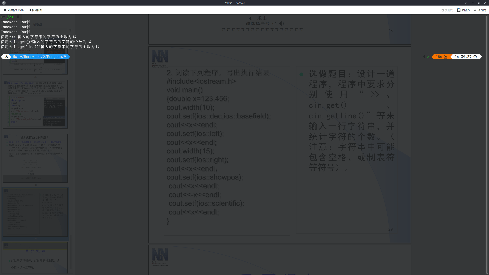

# 第9次作业

## 必做题

### 第1题

源代码

```cpp
#include <iostream>
#include <cstring>
using namespace std;

void interface()
{
	system("clear"); // Windows `system("cls")`
	cout << "＋＋＋＋＋＋＋＋＋＋＋＋＋＋＋＋" << endl
		 << "　　 ＸＸＸ公司人事管理系统" << endl
		 << endl
		 << "＋＋＋＋＋＋＋＋＋＋＋＋＋＋＋＋" << endl
		 << "＃＃＃＃＃＃＃＃＃＃＃＃＃＃＃＃" << endl
		 << endl
		 << "主菜单" << endl
		 << "1.数据录入" << endl
		 << "2.数据查询" << endl
		 << "3.数据保存" << endl
		 << "4.退出" << endl
		 << "请选择序号（1-4）" << endl
		 << "＃＃＃＃＃＃＃＃＃＃＃＃＃＃＃＃" << endl
		 << endl;
}

void tbc()
{
	system("clear"); // Windows `system("cls")`
	cout << "敬请期待！" << endl
		 << endl
		 << "Press Enter to continue..." << endl;
	getchar();
	getchar();
}

int main()
{
	int n = 0;
	do
	{
		interface();
		cout << ">>> ";
		cin >> n;
		if (n == 1 || n == 2 || n == 3)
			tbc();
		if (n < 1 || n > 4)
		{
			cout << "请输入有效答案！" << endl
				 << endl
				 << "Press Enter to continue..." << endl;
			getchar();
			getchar();
		}
	} while (n != 4);
	system("clear"); // Windows `system("cls")`
	return 0;
}
```

运行结果


### 第2题

运行结果

```powershell
   123.456
123.456
        123.456
+123.456
-123.456
+1.234560e+02
```

## 选做题

源代码

```cpp
#include <iostream>
#include <cstring>
using namespace std;

istream &operator>>(istream &input, char *str)
{
	char temp = 0;
	for (int i = 0; i < 100; i++)
	{
		temp = getchar();
		if (temp != '\n')
			str[i] = temp;
		else
			break;
	}
	return input;
}

int main()
{
	char s0[100] = {0}, s1[100] = {0}, s2[100] = {0};
	char temp = 0;
	cin >> s0;
	cin.get(s1, 100);
	cin.ignore(1);
	cin.getline(s2, 100);
	cout << "使用“>>”输入的字符串的字符的个数为" << strlen(s0) << endl;
	cout << "使用“cin.get()”输入的字符串的字符的个数为" << strlen(s1) << endl;
	cout << "使用“cin.getline()”输入的字符串的字符的个数为" << strlen(s2) << endl;
	return 0;
}
```

运行结果

