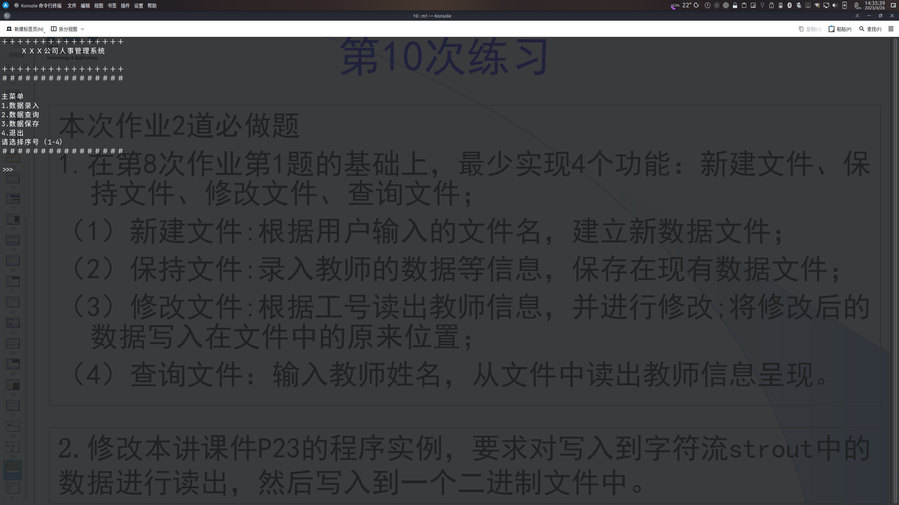
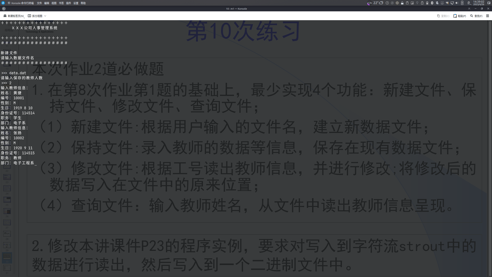
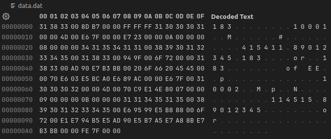

# 第10次作业

## 必做题

### 第1题

源代码

```cpp
#include <iostream>
#include <fstream>
#include <cstring>
using namespace std;

class Teacher
{
public:
	Teacher(char *_name = "Default", char *_number = "114514", char *_sex = "M", int _y = 1919, int _m = 8, int _d = 10, char *_id = "123456789012345", char *_principalship = "Professor", char *_department = "Department of EE")
	{
		strcpy(name, _name);
		strcpy(number, _number);
		strcpy(sex, _sex);
		birthday.y = _y;
		birthday.m = _m;
		birthday.d = _d;
		strcpy(id, _id);
		strcpy(principalship, _principalship);
		strcpy(department, _department);
		// cout << "Constructed Teacher " << name << endl;
	}
	Teacher(Teacher &p)
	{
		strcpy(name, p.name);
		strcpy(number, p.number);
		strcpy(sex, p.sex);
		birthday.y = p.birthday.y;
		birthday.m = p.birthday.m;
		birthday.d = p.birthday.d;
		strcpy(id, p.id);
		strcpy(principalship, p.principalship);
		strcpy(department, p.department);
		// cout << "Copied Teacher " << name << endl;
	}
	~Teacher()
	{
		// cout << "Destructed Teacher " << name << endl;
	}
	char *getName()
	{
		return name;
	}
	char *getNumber()
	{
		return number;
	}
	void display()
	{
		cout << "输出教师信息：" << endl
			 << "姓名：" << name << endl
			 << "编号：" << number << endl
			 << "性别：" << sex << endl
			 << "生日：" << birthday.m << '/' << birthday.d << '/' << birthday.y << endl
			 << "身份证号：" << id << endl
			 << "职务：" << principalship << endl
			 << "部门：" << department << endl;
	}
	void set()
	{
		cout << "输入教师信息：" << endl;
		cout << "姓名：";
		cin >> name;
		cout << "编号：";
		cin >> number;
		cout << "性别：";
		cin >> sex;
		cout << "生日：";
		cin >> birthday.m >> birthday.d >> birthday.y;
		cout << "身份证号：";
		cin >> id;
		cout << "职务：";
		cin >> principalship;
		cout << "部门：";
		cin >> department;
	}

	// protected:
	char name[11];
	char number[7];
	char sex[3];
	class Date
	{
	public:
		int m;
		int d;
		int y;
	} birthday;
	char id[16];
	char principalship[11];
	char department[21];
};

int interface()
{
	int ret = 0;
	system("clear"); // Windows `system("cls")`
	cout << "＋＋＋＋＋＋＋＋＋＋＋＋＋＋＋＋" << endl
		 << "　　 ＸＸＸ公司人事管理系统" << endl
		 << endl
		 << "＋＋＋＋＋＋＋＋＋＋＋＋＋＋＋＋" << endl
		 << "＃＃＃＃＃＃＃＃＃＃＃＃＃＃＃＃" << endl
		 << endl
		 << "主菜单" << endl
		 << "1.数据录入" << endl
		 << "2.数据查询" << endl
		 << "3.数据保存" << endl
		 << "4.退出" << endl
		 << "请选择序号（1-4）" << endl
		 << "＃＃＃＃＃＃＃＃＃＃＃＃＃＃＃＃" << endl
		 << endl;
	cout << ">>> ";
	cin >> ret;
	cin.ignore(1);
	return ret;
}

int datainput()
{
	int ret = 0;
	system("clear"); // Windows `system("cls")`
	cout << "＋＋＋＋＋＋＋＋＋＋＋＋＋＋＋＋" << endl
		 << "　　 ＸＸＸ公司人事管理系统" << endl
		 << endl
		 << "＋＋＋＋＋＋＋＋＋＋＋＋＋＋＋＋" << endl
		 << "＃＃＃＃＃＃＃＃＃＃＃＃＃＃＃＃" << endl
		 << endl
		 << "数据录入" << endl
		 << "1.新建文件" << endl
		 << "2.修改文件" << endl
		 << "3.退出" << endl
		 << "请选择序号（1-3）" << endl
		 << "＃＃＃＃＃＃＃＃＃＃＃＃＃＃＃＃" << endl
		 << endl;
	cout << ">>> ";
	cin >> ret;
	cin.ignore(1);
	return ret;
}

void newfile()
{
	char filename[32];
	int n;
	system("clear"); // Windows `system("cls")`
	cout << "＋＋＋＋＋＋＋＋＋＋＋＋＋＋＋＋" << endl
		 << "　　 ＸＸＸ公司人事管理系统" << endl
		 << endl
		 << "＋＋＋＋＋＋＋＋＋＋＋＋＋＋＋＋" << endl
		 << "＃＃＃＃＃＃＃＃＃＃＃＃＃＃＃＃" << endl
		 << endl
		 << "新建文件" << endl
		 << "请输入数据文件名" << endl
		 << "＃＃＃＃＃＃＃＃＃＃＃＃＃＃＃＃" << endl
		 << endl;
	cout << ">>> ";
	cin.getline(filename, 32);
	ofstream outfile(filename, ios::out | ios::binary);
	if (!outfile)
	{
		cerr << "错误！" << endl;
		exit(1);
	}
	cout << "请输入保存的教师人数" << endl
		 << ">>> ";
	cin >> n;
	Teacher t[n];
	for (int i = 0; i < n; i++)
	{
		t[i].set();
		outfile.write((char *)&t[i], sizeof(t[i]));
	}
	outfile.close();
	system("clear"); // Windows `system("cls")`
	cout << "＋＋＋＋＋＋＋＋＋＋＋＋＋＋＋＋" << endl
		 << "　　 ＸＸＸ公司人事管理系统" << endl
		 << endl
		 << "＋＋＋＋＋＋＋＋＋＋＋＋＋＋＋＋" << endl
		 << "＃＃＃＃＃＃＃＃＃＃＃＃＃＃＃＃" << endl
		 << endl
		 << "新建文件" << endl
		 << "新建文件成功！" << endl
		 << "＃＃＃＃＃＃＃＃＃＃＃＃＃＃＃＃" << endl
		 << endl
		 << "Press Enter to continue..." << endl;
	getchar();
	getchar();
}

void editfile()
{
	char filename[32];
	system("clear"); // Windows `system("cls")`
	cout << "＋＋＋＋＋＋＋＋＋＋＋＋＋＋＋＋" << endl
		 << "　　 ＸＸＸ公司人事管理系统" << endl
		 << endl
		 << "＋＋＋＋＋＋＋＋＋＋＋＋＋＋＋＋" << endl
		 << "＃＃＃＃＃＃＃＃＃＃＃＃＃＃＃＃" << endl
		 << endl
		 << "修改文件" << endl
		 << "请输入数据文件名" << endl
		 << "＃＃＃＃＃＃＃＃＃＃＃＃＃＃＃＃" << endl
		 << endl;
	cout << ">>> ";
	cin.getline(filename, 32);
	ifstream infile(filename, ios::in | ios::binary);
	if (!infile)
	{
		cerr << "错误！" << endl;
		exit(1);
	}
	infile.seekg(ios::end);
	int filelength = infile.tellg();
	infile.seekg(ios::beg);
	Teacher t[filelength];
	for (int i = 0; i < filelength; i++)
	{
		infile.read((char *)&t[i], sizeof(t[i]));
	}
	infile.close();
	cout << "请输入要修改的教师工号" << endl
		 << ">>> ";
	char desiredNumber[7] = {0};
	cin.getline(desiredNumber, 7);
	int n = -1;
	for (int i = 0; i < filelength; i++)
	{
		if (strcmp(t[i].getNumber(), desiredNumber) == 0)
		{
			n = i;
			break;
		}
	}
	if (n == -1)
	{
		cerr << "未查询到教师信息！" << endl;
	}
	t[n].set();
	ofstream outfile(filename, ios::out | ios::binary);
	if (!outfile)
	{
		cerr << "错误！" << endl;
		exit(1);
	}
	for (int i = 0; i < filelength; i++)
	{
		outfile.write((char *)&t[i], sizeof(t[i]));
	}
	outfile.close();
	system("clear"); // Windows `system("cls")`
	cout << "＋＋＋＋＋＋＋＋＋＋＋＋＋＋＋＋" << endl
		 << "　　 ＸＸＸ公司人事管理系统" << endl
		 << endl
		 << "＋＋＋＋＋＋＋＋＋＋＋＋＋＋＋＋" << endl
		 << "＃＃＃＃＃＃＃＃＃＃＃＃＃＃＃＃" << endl
		 << endl
		 << "修改文件" << endl
		 << "修改文件成功！" << endl
		 << "＃＃＃＃＃＃＃＃＃＃＃＃＃＃＃＃" << endl
		 << endl
		 << "Press Enter to continue..." << endl;
	getchar();
	getchar();
}

void datasearch()
{
	char filename[32];
	system("clear"); // Windows `system("cls")`
	cout << "＋＋＋＋＋＋＋＋＋＋＋＋＋＋＋＋" << endl
		 << "　　 ＸＸＸ公司人事管理系统" << endl
		 << endl
		 << "＋＋＋＋＋＋＋＋＋＋＋＋＋＋＋＋" << endl
		 << "＃＃＃＃＃＃＃＃＃＃＃＃＃＃＃＃" << endl
		 << endl
		 << "数据查询" << endl
		 << "请输入数据文件名" << endl
		 << "＃＃＃＃＃＃＃＃＃＃＃＃＃＃＃＃" << endl
		 << endl;
	cout << ">>> ";
	cin.getline(filename, 32);
	ifstream infile(filename, ios::in | ios::binary);
	if (!infile)
	{
		cerr << "错误！" << endl;
		exit(1);
	}
	infile.seekg(ios::end);
	int filelength = infile.tellg();
	infile.seekg(ios::beg);
	Teacher t[filelength];
	for (int i = 0; i < filelength; i++)
	{
		infile.read((char *)&t[i], sizeof(t[i]));
	}
	infile.close();
	cout << "请输入要查询的教师姓名" << endl
		 << ">>> ";
	char desiredName[11] = {0};
	cin.getline(desiredName, 11);
	bool flag = false;
	for (int i = 0; i < filelength; i++)
	{
		if (strcmp(t[i].getName(), desiredName) == 0)
		{
			t[i].display();
			flag = true;
			break;
		}
	}
	if (!flag)
	{
		cerr << "未查询到教师信息！" << endl;
	}
	cout << "Press Enter to continue..." << endl;
	getchar();
}

void tbc()
{
	system("clear"); // Windows `system("cls")`
	cout << "敬请期待！" << endl
		 << endl
		 << "Press Enter to continue..." << endl;
	getchar();
	getchar();
}

int main()
{
	while (true)
	{
	_INTERFACE:
		switch (interface())
		{
		case 1:
		_DATAINPUT:
			switch (datainput())
			{
			case 1:
				newfile();
				break;
			case 2:
				editfile();
				break;
			case 3:
				goto _INTERFACE;
				break;
			default:
				cout << "请输入正确的选项！" << endl;
				goto _DATAINPUT;
				break;
			}
			break;
		case 2:
			datasearch();
			break;
		case 3:
			cout << "已保存！" << endl;
			cout << "Press Enter to continue..." << endl;
			getchar();
			break;
		case 4:
			cout << "已退出！" << endl;
			cout << "Press Enter to continue..." << endl;
			getchar();
			goto _END;
			break;
		default:
			cout << "请输入正确的选项！" << endl;
			goto _INTERFACE;
			break;
		}
	}
_END:
	system("clear"); // Windows `system("cls")`
	return 0;
}
```

运行结果









### 第2题

源代码

```cpp
#include <iostream>
#include <fstream>
#include <strstream>
#include <cstring>
using namespace std;
struct student
{
	int num;
	char name[20];
	float score;
};
int main()
{
	student stud[3] = {1001, "Li", 78, 1002, "Wang", 89.5, 1004, "Fun", 90};
	student stude[3];
	char c[50];
	ostrstream strout(c, 50);
	for (int i = 0; i < 3; i++)
		strout << stud[i].num << " " << stud[i].name << " " << stud[i].score << " ";
	strout << ends;
	istrstream strin(c, sizeof(c));
	for (int i = 0; i < 3; i++)
		strin >> stude[i].num >> stude[i].name >> stude[i].score;
	ofstream fout("stud.dat", ios::binary);
	fout.write((char *)stude, sizeof(stude));
	fout.close();
	return 0;
}
```

运行结果


## 选做题

源代码

```cpp
#include <iostream>
using namespace std;
int main()
{
	double x = 123.456;
	cout.width(10);
	cout.setf(ios::dec, ios::basefield);
	cout << x << endl;
	cout.setf(ios::left);
	cout << x << endl;
	cout.width(15);
	cout.setf(ios::right);
	cout << x << endl;
	cout.setf(ios::showpos);
	cout << x << endl;
	cout << -x << endl;
	cout.setf(ios::scientific);
	cout << x << endl;
}
```

运行结果

```sh
   123.456
123.456
        123.456
+123.456
-123.456
+1.234560e+02
```