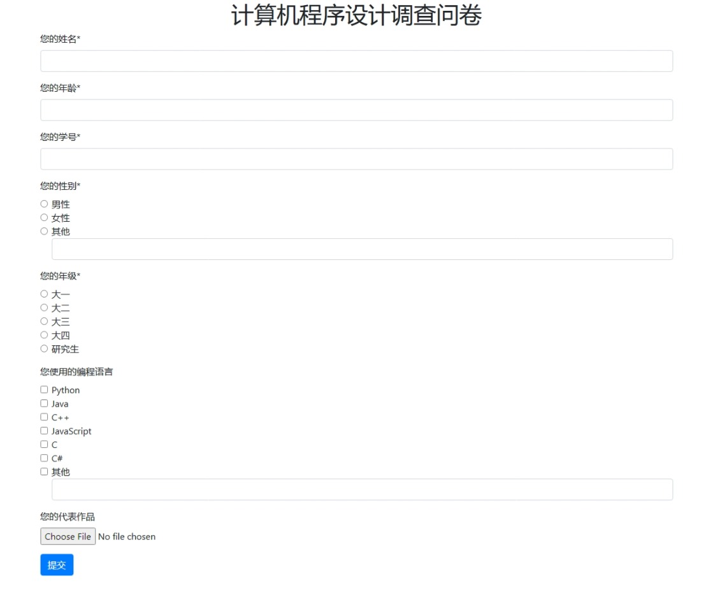
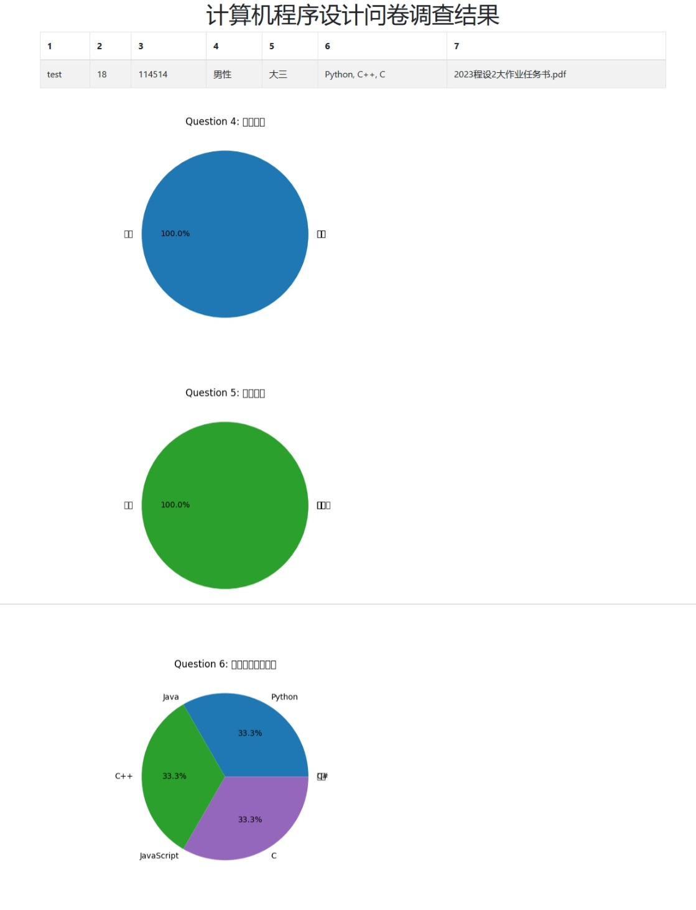

<h1><center>Python附加作业实验报告</center></h1>

## 调查问卷

> 使用`Python`语言设计一个调查问卷，调查问卷需有用户界面（样式不限），界面上显示调查问卷问题，如，您的姓名、您的年龄、您的学号等问题提示；用户能够以填空、单选、多选等形式输入中文/英文/数字等各类信息，并可以上传文件；界面有报错功能，如单选题多选则报错并提示用户。对单选题和多选题以图表的形式（样式不限）显示统计结果。
> 
> 备注：
> 
> ① 实验报告和代码打包上传info，压缩包文件名为：姓名+学号+附加题1；
> 
> ② 实验报告含有调查问卷内容及界面使用方法的详细说明。

<div STYLE="page-break-after: always;"></div>

## 调查问卷内容

__问卷标题：__计算机程序设计调查问卷

__问卷内容：__

1. 您的姓名（类型：文本）；
2. 您的年龄（类型：数字）；
3. 您的学号（类型：文本）；
4. 您的性别（类型：单选；选项：男性、女性、其他）；
5. 您的年级（类型：单选；选项：大一、大二、大三、大四、其他）；
6. 您使用的编程语言（类型：多选；选项：`Python`、`Java`、`C++`、`JavaScript`、`C`、`C#`、其他）；
7. 您的代表作品（类型：文件）

<div STYLE="page-break-after: always;"></div>

## 界面使用方法

请将源代码文件按以下目录排列：

```
Project
├── extra1.py
└── templates
    └── index.html
    └── result.html
```

建议使用`Linux`环境运行本程序，并安装、配置完成“中易宋体”（`simsun.ttc`）。

在运行程序前，请先在计算机中安装`matplotlib`、`pandas`、 `Flask`库，并保证网络通畅（否则可能无法加载`CSS`、`JS`、`jQuery`等文件导致网页样式异常）。

在运行程序时，仅需运行`extra1.py`，然后在浏览器中打开[`http://localhost:5000`](http://localhost:5000)（建议使用较新的`Chromium`内核的浏览器或`Firefox`浏览器）。

在运行程序时，填写完问卷后会自动跳转至[`http://localhost:5000/result`](http://localhost:5000/result)页面显示问卷结果。此时可以继续打开[`http://localhost:5000`](http://localhost:5000)填写另一份问卷，也可以随时打开[`http://localhost:5000/result`](http://localhost:5000/result)查看问卷结果。

上传的文件以及生成的图表保存在`resources`文件夹中。

需要关闭程序时，请在运行该程序的终端中按下`Ctrl + C`。

一些截图：







上图出现的字体显示异常是未安装中文字体导致的。

<div STYLE="page-break-after: always;"></div>

## 附录：源代码清单

#### `extra1.py`

```python
from flask import Flask, render_template, request, redirect, url_for, make_response
import pandas as pd
import matplotlib.pyplot as plt

app = Flask(__name__)

# 问卷的问题和选项
questions = [
    {
        "id": 1,
        "type": "text",
        "text": "您的姓名",
        "required": True,
        "options": None
    },
    {
        "id": 2,
        "type": "number",
        "text": "您的年龄",
        "required": True,
        "options": None
    },
    {
        "id": 3,
        "type": "text",
        "text": "您的学号",
        "required": True,
        "options": None
    },
    {
        "id": 4,
        "type": "radio",
        "text": "您的性别",
        "required": True,
        "options": ["男性", "女性", "其他"]
    },
    {
        "id": 5,
        "type": "radio",
        "text": "您的年级",
        "required": True,
        "options": ["大一", "大二", "大三", "大四", "研究生"]
    },
    {
        "id": 6,
        "type": "checkbox",
        "text": "您使用的编程语言",
        "required": False,
        "options": ["Python", "Java", "C++", "JavaScript", "C", "C#", "其他"]
    },
    {
        "id": 7,
        "type": "file",
        "text": "您的代表作品",
        "required": False,
        "options": None
    }
]

results = pd.DataFrame()

def hide_zero(pct):
    if pct == 0:
        return " "
    else:
        return f"{pct:.1f}%"

@app.route("/")
def index():
    return render_template("index.html", questions=questions)

@app.route("/submit", methods=["POST"])
def submit():
    global results
    data = {}
    for question in questions:
        qid = question["id"]
        qtype = question["type"]
        if qtype == "text" or qtype == "number":
            value = request.form.get(str(qid))
            data[qid] = value
        elif qtype == "radio":
            # value = request.form.get(str(qid))
            # data[qid] = value
            # if not value:
            #     return f"Please Check Question {qid}: {question['text']}"
            values = request.form.getlist(str(qid))
            data[qid] = values
            if values and values[-1] == '其他':
                other_value = request.form.get(str(qid) + "_other")
                # data[qid].append(other_value)  # 将其他选项的值添加到列表中
                data[qid][-1] = other_value
                # 如果用户没有输入'其他'选项的值，报错并提示用户
                if not other_value:
                    return f"请输入问题{qid}：{question['text']}的“其他”选项的值！"
        elif qtype == "checkbox":
            values = request.form.getlist(str(qid))
            data[qid] = values
            if values and values[-1] == '其他':
                other_value = request.form.get(str(qid) + "_other")
                # data[qid].append(other_value)  # 将其他选项的值添加到列表中
                data[qid][-1] = other_value
                # 如果用户没有输入'其他'选项的值，报错并提示用户
                if not other_value:
                    return f"请输入问题{qid}：{question['text']}的“其他”选项的值！"
        elif qtype == "file":
            file = request.files.get(str(qid))  # 获取用户上传的文件对象
            if file:  # 如果文件对象存在，保存文件到本地，并将文件名添加到字典中
                filename = file.filename
                file.save(f"./resources/{filename}")
                data[qid] = filename
            else:  # 如果文件对象不存在，将None添加到字典中
                data[qid] = None
    series = pd.Series(data)
    results = results.append(series, ignore_index=True)
    # 重定向到结果界面
    return redirect(url_for('result'))

@app.route("/result")
def result():
    global results
    # 结果为空
    if results.empty:
        return "无数据"
    # 否则，生成图表并显示结果
    else:
        # 对单选题和多选题进行统计，并生成饼图
        for question in questions:
            qid = question["id"]
            qtype = question["type"]
            # 如果是单选题或多选题，进行统计
            if qtype == "radio" or qtype == "checkbox":
                # 获取问题的选项
                options = question["options"]
                # 创建一个空的Series对象，用于存储统计结果
                counts = pd.Series([0] * len(options), index=options)
                for i, row in results.iterrows():
                    values = row[qid]
                    if values:
                        for value in values:
                            if value not in counts.index:
                                counts[value] = 0
                            counts[value] += 1
                # 生成饼图，并保存为图片文件，文件名为问题的id
                plt.rcParams['font.sans-serif'] = ['SimSun']
                plt.figure()
                plt.pie(counts, labels=counts.index, autopct=hide_zero)
                plt.title(f"Question {qid}: {question['text']}")
                plt.savefig(f"./resources/{qid}.png")
        # 返回渲染后的结果界面，传入结果和问题作为参数
        return render_template("result.html", results=results, questions=questions)

@app.route("/resource/<file_name>")
def read_file(file_name):
    if file_name.find('/') > 0:
        return
    image_data = open(f"./resources/{file_name}", 'rb').read()
    res = make_response(image_data)
    res.headers['Content-Type'] = 'image/png'
    return res

if __name__ == "__main__":
    app.run(debug=True)

```

#### `templates/index.html`

```html
<!DOCTYPE html>
<html lang="zh-CN">

<head>
	<meta charset="UTF-8">
	<title>计算机程序设计调查问卷</title>
	<!-- 偷懒，使用Bootstrap的CSS文件 -->
	<link rel="stylesheet" href="https://cdn.staticfile.org/twitter-bootstrap/4.5.2/css/bootstrap.min.css">
</head>

<body>
	<div class="container">
		<h1 class="text-center">计算机程序设计调查问卷</h1>
		<!-- 创建一个表单 -->
		<form action="/submit" method="post" enctype="multipart/form-data">
			
			<!-- 获取问题的id、类型、文本、是否必填和选项 -->
			
			
			
			
			
			<!-- 创建一个表单组 -->
			<div class="form-group">
				<!-- 必填加上*号 -->
				<label for="{{ qid }}">{{ qtext }}*</label>
				
				<!-- 文本 -->
				<input type="text" class="form-control" id="{{ qid }}" name="{{ qid }}" required="{{ qrequired }}">
				
				<!-- 数字 -->
				<input type="number" class="form-control" id="{{ qid }}" name="{{ qid }}" required="{{ qrequired }}">
				
				<!-- 单选 -->
				
				<div class="form-check">
					<input type="radio" class="form-check-input" id="{{ qid }}_{{ option }}" name="{{ qid }}"
						value="{{ option }}" required="{{ qrequired }}">
					<label class="form-check-label" for="{{ qid }}_{{ option }}">{{ option }}</label>
					
					<input type="text" class="form-control" id="{{ qid }}_other" name="{{ qid }}_other">
					
				</div>
				
				
				<!-- 多选 -->
				
				<div class="form-check">
					<input type="checkbox" class="form-check-input" id="{{ qid }}_{{ option }}" name="{{ qid }}"
						value="{{ option }}">
					<label class="form-check-label" for="{{ qid }}_{{ option }}">{{ option }}</label>
					
					<input type="text" class="form-control" id="{{ qid }}_other" name="{{ qid }}_other">
					
				</div>
				
				
				<!-- 文件 -->
				<input type="file" class="form-control-file" id="{{ qid }}" name="{{ qid }}">
				
			</div>
			
			<!-- 提交按钮 -->
			<button type="submit" class="btn btn-primary">提交</button>
		</form>
	</div>
	<!-- 使用Bootstrap的JS文件和jQuery文件 -->
	<script src="https://cdn.staticfile.org/jquery/3.5.1/jquery.min.js"></script>
	<script src="https://cdn.staticfile.org/twitter-bootstrap/4.5.2/js/bootstrap.min.js"></script>
</body>

</html>
```

#### `templates/result.html`

```html
<!DOCTYPE html>
<html lang="zh-CN">
<head>
    <meta charset="UTF-8">
    <title>计算机程序设计问卷调查结果</title>
    <link rel="stylesheet" href="https://cdn.staticfile.org/twitter-bootstrap/4.5.2/css/bootstrap.min.css">
</head>
<body>
    <div class="container">
        <h1 class="text-center">计算机程序设计问卷调查结果</h1>
        <table class="table table-bordered table-striped">
            <thead>
                <tr>
                    
                        <th>{{ col }}</th>
                    
                </tr>
            </thead>
            <tbody>
                
                    <tr>
                        
                            
                            
                                
                            
                            <td>{{ value }}</td>
                        
                    </tr>
                
            </tbody>
        </table>
        
            
            
            
            
            <!-- 单选题或多选题，显示饼图 -->
            
                
            
        
    </div>
    <script src="https://cdn.staticfile.org/jquery/3.5.1/jquery.min.js"></script>
    <script src="https://cdn.staticfile.org/twitter-bootstrap/4.5.2/js/bootstrap.min.js"></script>
</body>
</html>
```

