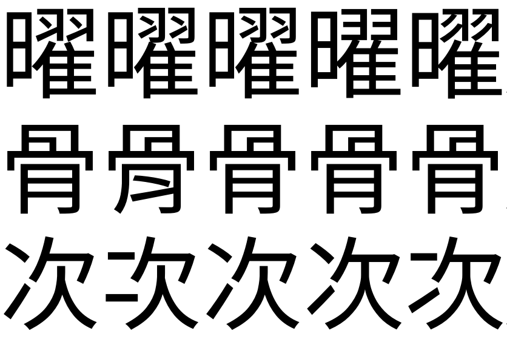

# 字符

撰写文档应该符合所用文字的语法规范，这样可以使得文档更加易读易懂，也使得文章更加严肃、正式。

## 标点符号

许多刚接触计算机的新手，对于标点符号的使用并不是很熟悉，这里简单介绍一下标点符号的使用。

### 全角和半角

在计算机中，标点符号分为「全角」（<span lang="ja">全角</span>）和「半角」（<span lang="ja">半角</span>）两种，全角标点符号占用两个字符的宽度，而半角标点符号占用一个字符的宽度。在中文中，标点符号一般使用全角，而英文中则使用半角。

???+ note "全角符号和半角符号的对应关系"

    下表与键盘和输入法无关，只是介绍在全角语境（中文等）和半角语境（英文等）中标点符号的对应关系。

    |                                       全角                                       |              半角               |    名称    |
    | :------------------------------------------------------------------------------: | :-----------------------------: | :--------: |
    |                                    `，` `、`                                     |               `,`               | 逗号、顿号 |
    |                                    `。` `．`                                     |               `.`               |    句号    |
    |                                       `！`                                       |               `!`               |   感叹号   |
    |                                       `？`                                       |               `?`               |    问号    |
    |                                       `；`                                       |               `;`               |    分号    |
    |                                       `：`                                       |               `:`               |    冒号    |
    |                       `“` `”` `‘` `’` `「` `」` `『` `』`                        |     `"` `'` `“` `”` `‘` `’`     |    引号    |
    | `（` `）`  `［` `］` `【` `】` `〖` `〗` `〔` `〕` `｛` `｝` `《` `》` `〈` `〉` | `(` `)` `[` `]` `{` `}` `<` `>` |    括号    |
    |                               `—`（一般两个连用）                                |               `-`               |   破折号   |
    |                               `…`（一般两个连用）                                |     `...`（实际上是三个点）     |   省略号   |
    |                                       `～`                                       |               `~`               |    波浪    |

???+ note "易混淆的符号"

    - `〈〉` `<>` `＜＞`：从左至右依次为：全角单书名号、半角尖括号/大于小于号、全角大于小于号。
    - 待补充

## 指定语言

在 Unicode 中，有许多字符，为了节省码位被合并在一起，但是这事实上是不太恰当的。这些字符在不同的语言中应当被写作不同的样式。下面我们来看几个例子。

<div style="text-align: center; font-size: 4em; line-height: 1em;">
<p><span lang="zh_CN">曜</span><span lang="zh_TW">曜</span><span lang="zh_HK">曜</span><span lang="ja">曜</span><span lang="ko">曜</span></p>
<p><span lang="zh_CN">骨</span><span lang="zh_TW">骨</span><span lang="zh_HK">骨</span><span lang="ja">骨</span><span lang="ko">骨</span></p>
<p><span lang="zh_CN">次</span><span lang="zh_TW">次</span><span lang="zh_HK">次</span><span lang="ja">次</span><span lang="ko">次</span></p>
</div>

??? note "看不出来？点我！"

    

从左到右依次为：简体中文（`zh_CN`）、台湾繁体中文（`zh_TW`）、香港繁体中文（`zh_HK`）、日文（`ja`）、韩文（`ko`）。这些字符在不同的语言中应当被写作不同的样式[^1]。

[^1]: 有人可能会说，台湾繁体中文和香港繁体中文没有区别啊？其实不然，这是安装在你的计算机操作系统上的字体的问题。如果你安装了支持香港繁体中文的字体，你就能看到这两个字符的区别了。

故而，我们在撰写文档时，对于不同的语言，应当使用不同的样式。在 HTML 中，我们可以使用 `lang` 属性来指定语言。

```html
<span lang="zh_CN">简体中文</span>
<span lang="zh_TW">台湾繁体中文</span>
<span lang="zh_HK">香港繁体中文</span>
<span lang="ja">日文</span>
<span lang="ko">韩文</span>
```