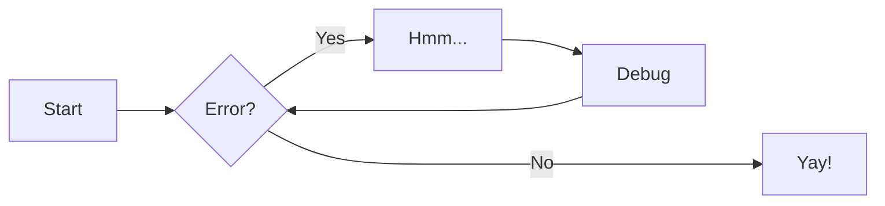
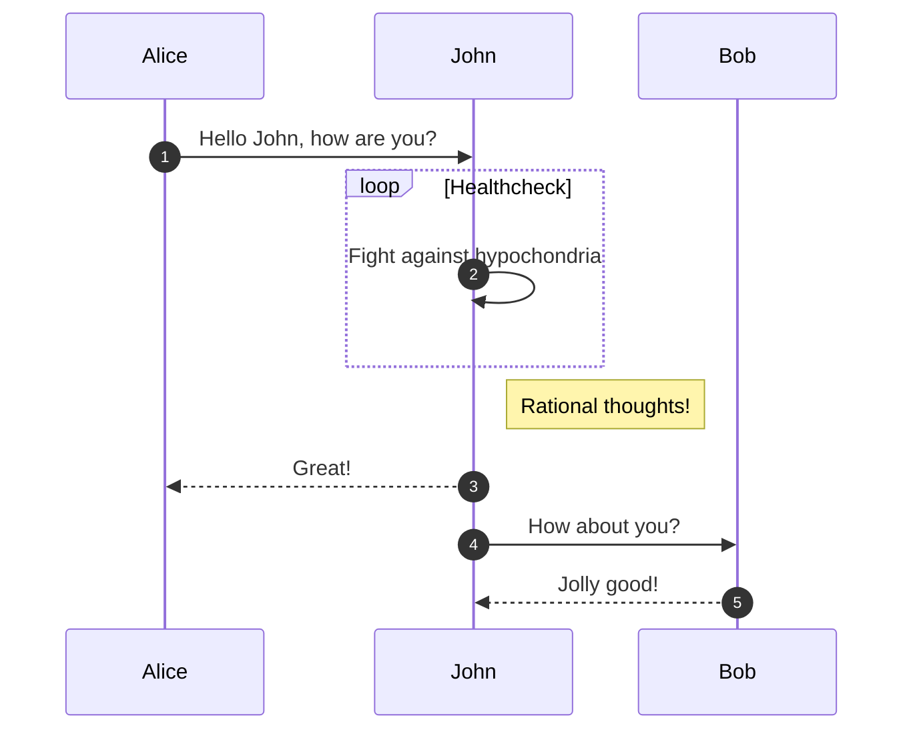
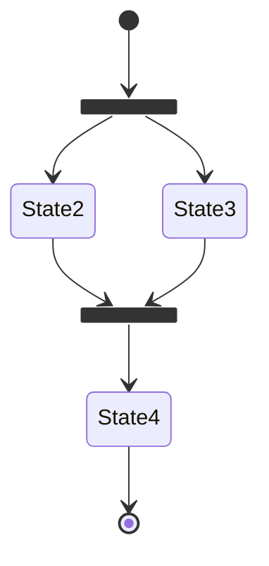
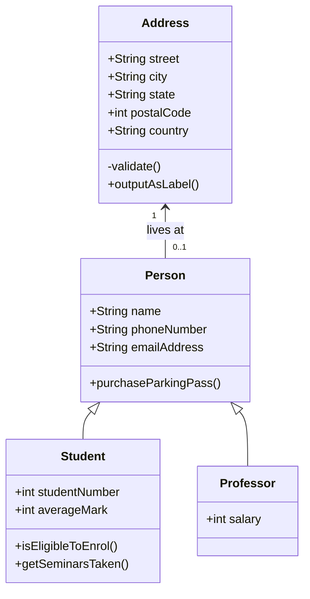

# Markdown

> 翻译自 [Markdown Guide](https://www.markdownguide.org/basic-syntax/)

Markdown 是 HTML 的超集，它兼容所有 HTML 语法，也可以通过简单的标记语法来格式化文本。

## 基本语法

这些是 John Gruber 最初设计文件中概述的元素。所有 Markdown 应用程序都支持这些元素。

``` markdown title="标题"
# H1
## H2
### H3
#### H4
##### H5
###### H6
```

<div class="result">
<h1>标题</h1>
<h2>标题</h2>
<h3>标题</h3>
<h4>标题</h4>
<h5>标题</h5>
<h6>标题</h6>
</div>

``` markdown title="粗体"
**bold text**
```

<div class="result" markdown>

**bold text**

</div>

``` markdown title="斜体"
*italicized text*
```

<div class="result" markdown>

*italicized text*

</div>

``` markdown title="引用"
> blockquote
```

<div class="result" markdown>

> blockquote

</div>

``` markdown title="有序列表"
1. First item
2. Second item
3. Third item
```

<div class="result" markdown>

1. First item
2. Second item
3. Third item

</div>

``` markdown title="无序列表"
- First item
- Second item
- Third item
```

<div class="result" markdown>

- First item
- Second item
- Third item

</div>

``` markdown title="代码"
`code`
```

<div class="result" markdown>

`code`

</div>

``` markdown title="水平线"
---
```

<div class="result" markdown>

---

</div>

``` markdown title="链接"
[Markdown Guide](https://www.markdownguide.org)
```

<div class="result" markdown>

[Markdown Guide](https://www.markdownguide.org)

</div>

``` markdown title="图片"

```

<div class="result" markdown>


</div>

## 扩展语法

这些元素通过添加额外的特性扩展了基本语法。并非所有 Markdown 应用程序都支持这些元素。

``` markdown title="表格"
| Syntax    | Description |
| --------- | ----------- |
| Header    | Title       |
| Paragraph | Text        |
```

<div class="result" markdown>

| Syntax    | Description |
| --------- | ----------- |
| Header    | Title       |
| Paragraph | Text        |

</div>

```` markdown title="代码块"
```
{
  "firstName": "John",
  "lastName": "Smith",
  "age": 25
}
```
````

<div class="result" markdown>

```
{
  "firstName": "John",
  "lastName": "Smith",
  "age": 25
}
```

</div>

``` markdown title="脚注"
Here's a sentence with a footnote. [^1]

[^1]: This is the footnote.
```

<div class="result" markdown>

Here's a sentence with a footnote. [^1]

[:octicons-arrow-down-24: 前往脚注](#fn:1)

[^1]: This is the footnote.

</div>

``` markdown title="定义列表"
term
: definition
```

<div class="result" markdown>

term
: definition

</div>

``` markdown title="删除线"
~~The world is flat.~~
```

<div class="result" markdown>

~~The world is flat.~~

</div>

``` markdown title="任务列表"
- [x] Write the press release
- [ ] Update the website
- [ ] Contact the media
```

<div class="result" markdown>

- [x] Write the press release
- [ ] Update the website
- [ ] Contact the media

</div>

``` markdown title="表情符号"
That is so funny! :joy:
```

<div class="result" markdown>

That is so funny! :joy:

</div>

``` markdown title="高亮"
I need to highlight these ==very important words==.
```

<div class="result" markdown>

I need to highlight these ==very important words==.

</div>

``` markdown title="下标"
H~2~O
```

<div class="result" markdown>

H~2~O

</div>

``` markdown title="上标"
X^2^
```

<div class="result" markdown>

X^2^

</div>

## Material for MkDocs

### [:material-alert-outline: 警告](https://squidfunk.github.io/mkdocs-material/reference/admonitions/)

``` yaml
markdown_extensions:
  - admonition
  - pymdownx.details
  - pymdownx.superfences
```

``` markdown title="警告"
!!! note

    Lorem ipsum dolor sit amet, consectetur adipiscing elit. Nulla et euismod
    nulla. Curabitur feugiat, tortor non consequat finibus, justo purus auctor
    massa, nec semper lorem quam in massa.
```

<div class="result" markdown>

!!! note

    Lorem ipsum dolor sit amet, consectetur adipiscing elit. Nulla et euismod
    nulla. Curabitur feugiat, tortor non consequat finibus, justo purus auctor
    massa, nec semper lorem quam in massa.

</div>

``` markdown title="自定义标题的警告"
!!! note "Phasellus posuere in sem ut cursus"

    Lorem ipsum dolor sit amet, consectetur adipiscing elit. Nulla et euismod
    nulla. Curabitur feugiat, tortor non consequat finibus, justo purus auctor
    massa, nec semper lorem quam in massa.
```

<div class="result" markdown>

!!! note "Phasellus posuere in sem ut cursus"

    Lorem ipsum dolor sit amet, consectetur adipiscing elit. Nulla et euismod
    nulla. Curabitur feugiat, tortor non consequat finibus, justo purus auctor
    massa, nec semper lorem quam in massa.

</div>

``` markdown title="没有标题的警告"
!!! note ""

    Lorem ipsum dolor sit amet, consectetur adipiscing elit. Nulla et euismod
    nulla. Curabitur feugiat, tortor non consequat finibus, justo purus auctor
    massa, nec semper lorem quam in massa.
```

<div class="result" markdown>

!!! note ""

    Lorem ipsum dolor sit amet, consectetur adipiscing elit. Nulla et euismod
    nulla. Curabitur feugiat, tortor non consequat finibus, justo purus auctor
    massa, nec semper lorem quam in massa.

</div>

``` markdown title="可折叠的警告"
??? note

    Lorem ipsum dolor sit amet, consectetur adipiscing elit. Nulla et euismod
    nulla. Curabitur feugiat, tortor non consequat finibus, justo purus auctor
    massa, nec semper lorem quam in massa.
```

<div class="result" markdown>

??? note

    Lorem ipsum dolor sit amet, consectetur adipiscing elit. Nulla et euismod
    nulla. Curabitur feugiat, tortor non consequat finibus, justo purus auctor
    massa, nec semper lorem quam in massa.

</div>

``` markdown title="可折叠、初始展开的警告"
???+ note

    Lorem ipsum dolor sit amet, consectetur adipiscing elit. Nulla et euismod
    nulla. Curabitur feugiat, tortor non consequat finibus, justo purus auctor
    massa, nec semper lorem quam in massa.
```

<div class="result" markdown>

???+ note

    Lorem ipsum dolor sit amet, consectetur adipiscing elit. Nulla et euismod
    nulla. Curabitur feugiat, tortor non consequat finibus, justo purus auctor
    massa, nec semper lorem quam in massa.

</div>

=== ":octicons-arrow-right-16: `inline end`"

    !!! info inline end "Lorem ipsum"

        Lorem ipsum dolor sit amet, consectetur adipiscing elit. Nulla et
        euismod nulla. Curabitur feugiat, tortor non consequat finibus, justo
        purus auctor massa, nec semper lorem quam in massa.

    ``` markdown
    !!! info inline end "Lorem ipsum"

        Lorem ipsum dolor sit amet, consectetur
        adipiscing elit. Nulla et euismod nulla.
        Curabitur feugiat, tortor non consequat
        finibus, justo purus auctor massa, nec
        semper lorem quam in massa.
    ```

    使用 `inline end` 向右对齐（从右到左书写的语言为左对齐）。

=== ":octicons-arrow-left-16: `inline`"

    !!! info inline "Lorem ipsum"

        Lorem ipsum dolor sit amet, consectetur adipiscing elit. Nulla et
        euismod nulla. Curabitur feugiat, tortor non consequat finibus, justo
        purus auctor massa, nec semper lorem quam in massa.

    ``` markdown
    !!! info inline "Lorem ipsum"

        Lorem ipsum dolor sit amet, consectetur
        adipiscing elit. Nulla et euismod nulla.
        Curabitur feugiat, tortor non consequat
        finibus, justo purus auctor massa, nec
        semper lorem quam in massa.
    ```

    使用 `inline` 向左对齐（从右到左书写的语言为右对齐）。

``` markdown title="支持的警告类型"
!!! note
    这是一个 note 警告。
!!! abstract
    这是一个 abstract 警告。
!!! info
    这是一个 info 警告。
!!! success
    这是一个 success 警告。
!!! question
    这是一个 question 警告。
!!! warning
    这是一个 warning 警告。
!!! failure
    这是一个 failure 警告。
!!! danger
    这是一个 danger 警告。
!!! bug
    这是一个 bug 警告。
!!! example
    这是一个 example 警告。
!!! quote
    这是一个 quote 警告。
```

<div class="result" markdown>

!!! note
    这是一个 note 警告。
!!! abstract
    这是一个 abstract 警告。
!!! info
    这是一个 info 警告。
!!! success
    这是一个 success 警告。
!!! question
    这是一个 question 警告。
!!! warning
    这是一个 warning 警告。
!!! failure
    这是一个 failure 警告。
!!! danger
    这是一个 danger 警告。
!!! bug
    这是一个 bug 警告。
!!! example
    这是一个 example 警告。
!!! quote
    这是一个 quote 警告。

</div>

### [:material-plus-circle: 注释](https://squidfunk.github.io/mkdocs-material/reference/annotations/)

``` yaml
markdown_extensions:
  - attr_list
  - md_in_html
  - pymdownx.superfences
```

``` markdown title="带注释的文本"
Lorem ipsum dolor sit amet, (1) consectetur adipiscing elit.
{ .annotate }

1.  :man_raising_hand: I'm an annotation! I can contain `code`, __formatted
    text__, images, ... basically anything that can be expressed in Markdown.
```

<div class="result" markdown>

Lorem ipsum dolor sit amet, (1) consectetur adipiscing elit.
{ .annotate }

1.  :man_raising_hand: I'm an annotation! I can contain `code`, __formatted
    text__, images, ... basically anything that can be written in Markdown.

</div>

``` markdown title="带嵌套注释的文本"
Lorem ipsum dolor sit amet, (1) consectetur adipiscing elit.
{ .annotate }

1.  :man_raising_hand: I'm an annotation! (1)
    { .annotate }

    1.  :woman_raising_hand: I'm an annotation as well!
```

<div class="result" markdown>

Lorem ipsum dolor sit amet, (1) consectetur adipiscing elit.
{ .annotate }

1.  :man_raising_hand: I'm an annotation! (1)
    { .annotate style="margin-bottom: 0" }

    1.  :woman_raising_hand: I'm an annotation as well!

</div>

``` markdown title="带注释的警告"
!!! note annotate "Phasellus posuere in sem ut cursus (1)"

    Lorem ipsum dolor sit amet, (2) consectetur adipiscing elit. Nulla et
    euismod nulla. Curabitur feugiat, tortor non consequat finibus, justo
    purus auctor massa, nec semper lorem quam in massa.

1.  :man_raising_hand: I'm an annotation!
2.  :woman_raising_hand: I'm an annotation as well!
```

<div class="result" markdown>

!!! note annotate "Phasellus posuere in sem ut cursus (1)"

    Lorem ipsum dolor sit amet, (2) consectetur adipiscing elit. Nulla et
    euismod nulla. Curabitur feugiat, tortor non consequat finibus, justo
    purus auctor massa, nec semper lorem quam in massa.

1.  :man_raising_hand: I'm an annotation!
2.  :woman_raising_hand: I'm an annotation as well!

</div>

``` markdown title="带注释的内容标签"
=== "Tab 1"

    Lorem ipsum dolor sit amet, (1) consectetur adipiscing elit.
    { .annotate }

    1.  :man_raising_hand: I'm an annotation!

=== "Tab 2"

    Phasellus posuere in sem ut cursus (1)
    { .annotate }

    1.  :woman_raising_hand: I'm an annotation as well!
```

<div class="result" markdown>

=== "Tab 1"

    Lorem ipsum dolor sit amet, (1) consectetur adipiscing elit.
    { .annotate }

    1.  :man_raising_hand: I'm an annotation!

=== "Tab 2"

    Phasellus posuere in sem ut cursus (1)
    { .annotate }

    1.  :woman_raising_hand: I'm an annotation as well!

</div>

```` html title="带注释的 HTML"
<div class="annotate" markdown>

> Lorem ipsum dolor sit amet, (1) consectetur adipiscing elit.

</div>

1.  :man_raising_hand: I'm an annotation!
````

<div class="result" markdown>
  <div class="annotate" markdown>

> Lorem ipsum dolor sit amet, (1) consectetur adipiscing elit.

  </div>

1.  :man_raising_hand: I'm an annotation!

</div>

### [:material-button-cursor: 按钮](https://squidfunk.github.io/mkdocs-material/reference/buttons/)

``` yaml
markdown_extensions:
  - attr_list
```

``` markdown title="按钮"
[灌注 Xuc 喵][Demo]{ .md-button }

  [Demo]: javascript:alert$.next("谢谢喵~")
```

<div class="result" markdown>

[灌注 Xuc 喵][Demo]{ .md-button }

  [Demo]: javascript:alert$.next("谢谢喵~")

</div>

``` markdown title="主要按钮"
[灌注 Xuc 喵][Demo]{ .md-button .md-button--primary }

  [Demo]: javascript:alert$.next("谢谢喵~")
```

<div class="result" markdown>

[灌注 Xuc 喵][Demo]{ .md-button .md-button--primary }

  [Demo]: javascript:alert$.next("谢谢喵~")

</div>

``` markdown title="带图片的按钮"

[灌注 Xuc 喵 :hot_face:][Demo]{ .md-button }

  [Demo]: javascript:alert$.next("谢谢喵~")

```

<div class="result" markdown>

[灌注 Xuc 喵 :hot_face:][Demo]{ .md-button }

  [Demo]: javascript:alert$.next("谢谢喵~")

</div>

### [:material-code-json: 代码块](https://squidfunk.github.io/mkdocs-material/reference/code-blocks/)

``` yaml
markdown_extensions:
  - pymdownx.highlight:
      anchor_linenums: true
      line_spans: __span
      pygments_lang_class: true
  - pymdownx.inlinehilite
  - pymdownx.snippets
  - pymdownx.superfences
```

```` markdown title="代码块"
``` py
import tensorflow as tf
```
````

<div class="result" markdown>

``` py
import tensorflow as tf
```

</div>

```` markdown title="带标题的代码块"
``` py title="bubble_sort.py"
def bubble_sort(items):
    for i in range(len(items)):
        for j in range(len(items) - 1 - i):
            if items[j] > items[j + 1]:
                items[j], items[j + 1] = items[j + 1], items[j]
```
````

<div class="result" markdown>

``` py title="bubble_sort.py"
def bubble_sort(items):
    for i in range(len(items)):
        for j in range(len(items) - 1 - i):
            if items[j] > items[j + 1]:
                items[j], items[j + 1] = items[j + 1], items[j]
```

</div>

```` markdown title="带注释的代码块"
``` yaml
theme:
  features:
    - content.code.annotate # (1)
```

1.  :man_raising_hand: I'm a code annotation! I can contain `code`, __formatted
    text__, images, ... basically anything that can be written in Markdown.
````

<div class="result" markdown>

``` yaml
theme:
  features:
    - content.code.annotate # (1)
```

1.  :man_raising_hand: I'm a code annotation! I can contain `code`, __formatted
    text__, images, ... basically anything that can be written in Markdown.

</div>

```` markdown title="去除注释字符的带注释的代码块"
``` yaml
# (1)!
```

1.  Look ma, less line noise!
````

<div class="result" markdown>

``` yaml
# (1)!
```

1.  Look ma, less line noise!

</div>

```` markdown title="带行号的代码块"
``` py linenums="1"
def bubble_sort(items):
    for i in range(len(items)):
        for j in range(len(items) - 1 - i):
            if items[j] > items[j + 1]:
                items[j], items[j + 1] = items[j + 1], items[j]
```
````

<div class="result" markdown>

``` py linenums="1"
def bubble_sort(items):
    for i in range(len(items)):
        for j in range(len(items) - 1 - i):
            if items[j] > items[j + 1]:
                items[j], items[j + 1] = items[j + 1], items[j]
```

</div>

=== "Lines"

    ```` markdown title="Code block with highlighted lines"
    ``` py hl_lines="2 3"
    def bubble_sort(items):
        for i in range(len(items)):
            for j in range(len(items) - 1 - i):
                if items[j] > items[j + 1]:
                    items[j], items[j + 1] = items[j + 1], items[j]
    ```
    ````

    <div class="result" markdown>

    ``` py linenums="1" hl_lines="2 3"
    def bubble_sort(items):
        for i in range(len(items)):
            for j in range(len(items) - 1 - i):
                if items[j] > items[j + 1]:
                    items[j], items[j + 1] = items[j + 1], items[j]
    ```

    </div>

=== "Line ranges"

    ```` markdown title="Code block with highlighted line range"
    ``` py hl_lines="3-5"
    def bubble_sort(items):
        for i in range(len(items)):
            for j in range(len(items) - 1 - i):
                if items[j] > items[j + 1]:
                    items[j], items[j + 1] = items[j + 1], items[j]
    ```
    ````

    <div class="result" markdown>

    ``` py linenums="1" hl_lines="3-5"
    def bubble_sort(items):
        for i in range(len(items)):
            for j in range(len(items) - 1 - i):
                if items[j] > items[j + 1]:
                    items[j], items[j + 1] = items[j + 1], items[j]
    ```

    </div>

### [:material-tab: 内容标签](https://squidfunk.github.io/mkdocs-material/reference/content-tabs/)

``` yaml
markdown_extensions:
  - pymdownx.superfences
  - pymdownx.tabbed:
      alternate_style: true
```

``` title="带代码块的内容标签"
=== "C"

    ``` c
    #include <stdio.h>

    int main(void) {
      printf("Hello world!\n");
      return 0;
    }
    ```

=== "C++"

    ``` c++
    #include <iostream>

    int main(void) {
      std::cout << "Hello world!" << std::endl;
      return 0;
    }
    ```
```

<div class="result" markdown>

=== "C"

    ``` c
    #include <stdio.h>

    int main(void) {
      printf("Hello world!\n");
      return 0;
    }
    ```

=== "C++"

    ``` c++
    #include <iostream>

    int main(void) {
      std::cout << "Hello world!" << std::endl;
      return 0;
    }
    ```

</div>

``` title="内容标签"
=== "Unordered list"

    * Sed sagittis eleifend rutrum
    * Donec vitae suscipit est
    * Nulla tempor lobortis orci

=== "Ordered list"

    1. Sed sagittis eleifend rutrum
    2. Donec vitae suscipit est
    3. Nulla tempor lobortis orci
```

<div class="result" markdown>

=== "Unordered list"

    * Sed sagittis eleifend rutrum
    * Donec vitae suscipit est
    * Nulla tempor lobortis orci

=== "Ordered list"

    1. Sed sagittis eleifend rutrum
    2. Donec vitae suscipit est
    3. Nulla tempor lobortis orci

</div>

``` title="警告中的内容标签"
!!! example

    === "Unordered List"

        ``` markdown
        * Sed sagittis eleifend rutrum
        * Donec vitae suscipit est
        * Nulla tempor lobortis orci
        ```

    === "Ordered List"

        ``` markdown
        1. Sed sagittis eleifend rutrum
        2. Donec vitae suscipit est
        3. Nulla tempor lobortis orci
        ```
```

<div class="result" markdown>

!!! example

    === "Unordered List"

        ``` markdown
        * Sed sagittis eleifend rutrum
        * Donec vitae suscipit est
        * Nulla tempor lobortis orci
        ```

    === "Ordered List"

        ``` markdown
        1. Sed sagittis eleifend rutrum
        2. Donec vitae suscipit est
        3. Nulla tempor lobortis orci
        ```

</div>

### [:material-table-edit: 数据表格](https://squidfunk.github.io/mkdocs-material/reference/data-tables/)

``` yaml
markdown_extensions:
  - tables
```

``` markdown title="数据表格"
| Method   | Description                          |
| -------- | ------------------------------------ |
| `GET`    | :material-check:     Fetch resource  |
| `PUT`    | :material-check-all: Update resource |
| `DELETE` | :material-close:     Delete resource |
```

<div class="result" markdown>

| Method   | Description                          |
| -------- | ------------------------------------ |
| `GET`    | :material-check:     Fetch resource  |
| `PUT`    | :material-check-all: Update resource |
| `DELETE` | :material-close:     Delete resource |

</div>

=== "左"

    ``` markdown hl_lines="2" title="左对齐的数据表格"
    | Method   | Description                          |
    | :------- | :----------------------------------- |
    | `GET`    | :material-check:     Fetch resource  |
    | `PUT`    | :material-check-all: Update resource |
    | `DELETE` | :material-close:     Delete resource |
    ```

    <div class="result" markdown>

    | Method   | Description                          |
    | :------- | :----------------------------------- |
    | `GET`    | :material-check:     Fetch resource  |
    | `PUT`    | :material-check-all: Update resource |
    | `DELETE` | :material-close:     Delete resource |

    </div>

=== "中"

    ``` markdown hl_lines="2" title="居中对齐的数据表格"
    |  Method  |             Description              |
    | :------: | :----------------------------------: |
    |  `GET`   | :material-check:     Fetch resource  |
    |  `PUT`   | :material-check-all: Update resource |
    | `DELETE` | :material-close:     Delete resource |
    ```

    <div class="result" markdown>

    |  Method  |             Description              |
    | :------: | :----------------------------------: |
    |  `GET`   | :material-check:     Fetch resource  |
    |  `PUT`   | :material-check-all: Update resource |
    | `DELETE` | :material-close:     Delete resource |

    </div>

=== "右"

    ``` markdown hl_lines="2" title="右对齐的数据表格"
    |   Method |                          Description |
    | -------: | -----------------------------------: |
    |    `GET` | :material-check:      Fetch resource |
    |    `PUT` | :material-check-all: Update resource |
    | `DELETE` | :material-close:     Delete resource |
    ```

    <div class="result" markdown>

    |   Method |                          Description |
    | -------: | -----------------------------------: |
    |    `GET` | :material-check:      Fetch resource |
    |    `PUT` | :material-check-all: Update resource |
    | `DELETE` | :material-close:     Delete resource |

    </div>

### [:material-graph-outline: 图表](https://squidfunk.github.io/mkdocs-material/reference/diagrams/)

``` yaml
markdown_extensions:
  - pymdownx.superfences:
      custom_fences:
        - name: mermaid
          class: mermaid
          format: !!python/name:pymdownx.superfences.fence_code_format
```

```` markdown title="流程图"

````

<div class="result" markdown>


</div>

```` markdown title="时序图"

````

<div class="result" markdown>


</div>

```` markdown title="状态图"

````

<div class="result" markdown>


</div>

```` markdown title="类图"

````

<div class="result" markdown>


</div>

### [:material-format-align-bottom: 脚注](https://squidfunk.github.io/mkdocs-material/reference/footnotes/)

``` yaml
markdown_extensions:
  - footnotes
```

``` title="带脚注的文本"
Lorem ipsum[^2] dolor sit amet, consectetur adipiscing elit.[^3]
```

<div class="result" markdown>

Lorem ipsum[^2] dolor sit amet, consectetur adipiscing elit.[^3]

</div>

``` title="脚注"
[^2]: Lorem ipsum dolor sit amet, consectetur adipiscing elit.
```

<div class="result" markdown>

[:octicons-arrow-down-24: 前往脚注](#fn:2)

  [^2]: Lorem ipsum dolor sit amet, consectetur adipiscing elit.

</div>

``` title="Footnote"
[^3]:
    Lorem ipsum dolor sit amet, consectetur adipiscing elit. Nulla et euismod
    nulla. Curabitur feugiat, tortor non consequat finibus, justo purus auctor
    massa, nec semper lorem quam in massa.
```

<div class="result" markdown>

[:octicons-arrow-down-24: 前往脚注](#fn:3)

[^3]:
    Lorem ipsum dolor sit amet, consectetur adipiscing elit. Nulla et euismod
    nulla. Curabitur feugiat, tortor non consequat finibus, justo purus
    auctor massa, nec semper lorem quam in massa.

</div>

### [:material-format-font: 格式化](https://squidfunk.github.io/mkdocs-material/reference/formatting/)

``` yaml
markdown_extensions:
  - pymdownx.critic
  - pymdownx.caret
  - pymdownx.keys
  - pymdownx.mark
  - pymdownx.tilde
```

``` markdown title="带修改建议的文本"
Text can be {--deleted--} and replacement text {++added++}. This can also be
combined into {~~one~>a single~~} operation. {==Highlighting==} is also
possible {>>and comments can be added inline<<}.

{==

Formatting can also be applied to blocks by putting the opening and closing
tags on separate lines and adding new lines between the tags and the content.

==}
```

<div class="result" markdown>

Text can be {--deleted--} and replacement text {++added++}. This can also be
combined into {~~one~>a single~~} operation. {==Highlighting==} is also
possible {>>and comments can be added inline<<}.

{==

Formatting can also be applied to blocks by putting the opening and closing
tags on separate lines and adding new lines between the tags and the content.

==}

</div>

``` title="带高亮的文本"
- ==This was marked==
- ^^This was inserted^^
- ~~This was deleted~~
```

<div class="result" markdown>

- ==This was marked==
- ^^This was inserted^^
- ~~This was deleted~~

</div>


``` markdown title="带上下标的文本"
- H~2~O
- A^T^A
```

<div class="result" markdown>

- H~2~O
- A^T^A

</div>

``` markdown title="键盘按键"
++ctrl+alt+del++
```

<div class="result" markdown>

++ctrl+alt+del++

</div>