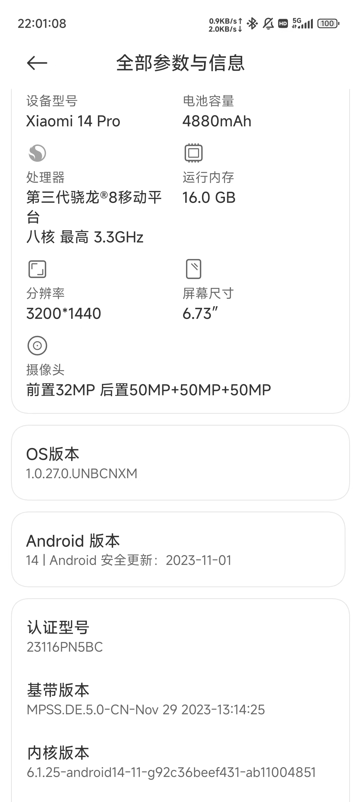

# Android

Android（/ˈænˌdrɔɪd/）是一个基于 Linux 核心与其他开源软件的开放源代码的移动操作系统，由谷歌成立的开放手持设备联盟持续领导与开发。

相较于 iOS 和 HarmonyOS，Android 最为开放，这为玩机提供了很大的便利。

然而，在各大手机厂商和软件厂商的“努力”下，Android 的开放性越来越差，留给用户的自由越来越少。对于喜欢玩机的用户来说，这是一件非常痛苦的事情。时至今日，最适合玩机的 Android 手机是 Google Pixel 系列。但是，Google Pixel 系列在中国大陆地区并没有销售。在中国大陆地区销售的 Android 手机中，最好选择 :simple-xiaomi: 小米手机和 :simple-oneplus: 一加手机。

## 解锁 Bootloader

玩机的第一步是获取 Root 权限。而获取 Root 权限的第一步是解锁 Bootloader。

需要先电脑中安装 SDK Platform-Tools，即 ADB 和 fastboot 工具包。在 Windows 中，可以通过[官方教程](https://developer.android.com/studio/releases/platform-tools)安装；在 Linux 中，可以通过包管理器安装，如 Arch Linux 中的 `android-tools` 包。

### 小米手机

Xiaomi 14 发售以来，申请解锁 Bootloader 需要达到以下要求：

- 小米社区等级达到 5 级
- 完成实名验证
- 参与答题（答题不合格需要等待 7 天后再次答题）
- 每年每用户最多解锁 3 台设备
- 解锁等待期为 72 小时

满足要求后，可以点击“设置”→“更多设置”→“开发者选项”→“绑定账号和设备”。一周后，可以用[官方解锁工具](http://www.miui.com/unlock/download.html)申请解锁 Bootloader。

## 获取 Root 权限

获取 Root 权限的方法有很多种，目前对于最新的 Android 版本有两种主流的方法：:simple-magisk: Magisk 和 KernelSU。

### Magisk

Magisk 是一款开源的 Android Root 解决方案，由 [topjohnwu](https://github.com/topjohnwu) 开发。它可以通过修改 `boot.img` 来获取 Root 权限。

{ align=left width=50% }
{ align=left width=50% }

Magisk 的原理是将 `boot.img` 中的 `init` 进程替换为 Magisk 的 `init` 进程，从而做到在启动时通过添加挂载点的方式修改系统分区，从而获取 Root 权限。Magisk 的优点是不需要修改系统分区，不会导致 OTA 更新失败。

目前常用的 Magisk 有三种，分别是由 [topjohnwu](https://github.com/topjohnwu) 开发的 [Magisk](https://github.com/topjohnwu/Magisk/releases) [:fontawesome-brands-github:](https://github.com/topjohnwu/Magisk)、在 Telegram 群流传的 Magisk Alpha [:fontawesome-brands-telegram:](https://t.me/s/magiskalpha) 和 [HuskyDG](https://github.com/HuskyDG) 修改的 [Magisk Delta](https://huskydg.github.io/magisk-files/) [:fontawesome-brands-github:](https://github.com/HuskyDG/magisk-files)。现在，由于许多软件添加了较为严格的针对 Magisk 的检测，所以如果要隐藏 Root 权限，需要使用 Magisk Alpha 或 Magisk Delta。但是，Magisk Alpha 可能更不稳定，Magisk Delta 可能更危险。

在刷机之前，我们需要先看看手机内核版本信息。打开“设置”→“关于手机”，找到“内核版本”一栏，查看内核版本信息。这是因为 Android 13 以来，ramdisk 从 `boot.img` 映像中移除，放在单独的 `init_boot.img` 映像中，故而需要不同的刷机方法。

??? note "内核版本信息的位置"
    
    === "Redmi K50 (Android 12)"
    
        
    
    === "Xiaomi 14 Pro (Android 14)"
    
        

=== "内核版本为 Android 12 及以下"

    在安装 Magisk 之前，我们需要先获取 `boot.img`。

    对于小米手机来说，可以访问 [XiaomiROM.com](https://xiaomirom.com/) 下载对应机型、对应版本（即当前手机运行的系统版本）的线刷包（`.tgz` 格式）或卡刷包（`.zip` 格式），然后解压，找到 `boot.img`。也可以在手机的“系统更新”中选择“下载最新完整包”，再在手机目录中的 `Download/download_rom` 文件夹中找到对应版本的 ROM，将它传输到电脑中，然后解压，找到 `boot.img`。

    如果在解压后的文件夹中找不到 `boot.img`，找到了 `payload.bin`，可以使用 `payload_dumper` [:fontawesome-brands-github:](https://github.com/vm03/payload_dumper) 来解压 `payload.bin`，然后找到 `boot.img`。

    ??? note "`payload_dumper` 的使用方法"
        
        确保电脑中安装了 Python 3，然后将仓库克隆到本地。

        === "HTTPS"
        
            ```bash
            git clone https://github.com/vm03/payload_dumper.git
            ```

        === "SSH"
        
            ```bash
            git clone git@github.com:vm03/payload_dumper.git
            ```

        然后，进入仓库目录，安装依赖。

        ```bash
        cd payload_dumper
        pip install -r requirements.txt
        ```

        将 `payload.bin` 放到仓库目录中，然后执行 `payload_dumper.py`。

        ```bash
        python payload_dumper.py payload.bin
        ```

        等待执行完成后，就可以在 `output` 文件夹中找到解压后的文件。

    ??? note "`payload_dumper_go` 的使用方法"

        从仓库的 [Releases](https://github.com/ssut/payload-dumper-go/releases) 页面下载对应平台的二进制文件，然后将 `payload.bin` 放到二进制文件所在的目录中，执行二进制文件。

        ```bash
        ./payload-dumper-go payload.bin
        ```

        等待执行完成后，就可以在 `output` 文件夹中找到解压后的文件。

    获取 `boot.img` 后，将 `boot.img` 传输至手机，安装 Magisk 或 Magisk Delta，打开，点击“安装”→“安装”→“选择并修补一个文件”，选择 `boot.img`，然后点击“下一步”→“继续”→“完成”，得到修补后的 `magisk_patched.img`。将 `magisk_patched.img` 传输至电脑，然后让手机进入 Fastboot 模式。

    ```bash
    adb reboot bootloader
    ```
    
    将 `magisk_patched.img` 刷入手机。

    ```bash
    fastboot flash boot magisk_patched.img
    ```

=== "内核版本为 Android 13 及以上"

    在安装 Magisk 之前，我们需要先获取 `init_boot.img`。

    对于小米手机来说，可以访问 [XiaomiROM.com](https://xiaomirom.com/) 下载对应机型、对应版本（即当前手机运行的系统版本）的线刷包（`.tgz` 格式）或卡刷包（`.zip` 格式），然后解压，找到 `init_boot.img`。也可以在手机的“系统更新”中选择“下载最新完整包”，再在手机目录中的 `Download/download_rom` 文件夹中找到对应版本的 ROM，将它传输到电脑中，然后解压，找到 `init_boot.img`。

    如果在解压后的文件夹中找不到 `init_boot.img`，找到了 `payload.bin`，可以使用 `payload_dumper` [:fontawesome-brands-github:](https://github.com/vm03/payload_dumper) 或 `payload_dumper_go` [:fontawesome-brands-github:](https://github.com/ssut/payload-dumper-go) 来解压 `payload.bin`，然后找到 `init_boot.img`。

    ??? note "`payload_dumper` 的使用方法"
        
        在电脑中安装 Python 3，然后将仓库克隆到本地。

        === "HTTPS"
        
            ```bash
            git clone https://github.com/vm03/payload_dumper.git
            ```

        === "SSH"
        
            ```bash
            git clone git@github.com:vm03/payload_dumper.git
            ```

        然后，进入仓库目录，安装依赖。

        ```bash
        cd payload_dumper
        pip install -r requirements.txt
        ```

        将 `payload.bin` 放到仓库目录中，然后执行 `payload_dumper.py`。

        ```bash
        python payload_dumper.py payload.bin
        ```

        等待执行完成后，就可以在 `output` 文件夹中找到解压后的文件。

    ??? note "`payload_dumper_go` 的使用方法"

        从仓库的 [Releases](https://github.com/ssut/payload-dumper-go/releases) 页面下载对应平台的二进制文件，然后将 `payload.bin` 放到二进制文件所在的目录中，执行二进制文件。

        ```bash
        ./payload-dumper-go payload.bin
        ```

        等待执行完成后，就可以在 `output` 文件夹中找到解压后的文件。

    获取 `init_boot.img` 后，将 `init_boot.img` 传输至手机，安装 Magisk 或 Magisk Delta，打开，点击“安装”→“安装”→“选择并修补一个文件”，选择 `init_boot.img`，然后点击“下一步”→“继续”→“完成”，得到修补后的 `magisk_patched.img`。将 `magisk_patched.img` 传输至电脑，然后让手机进入 Fastboot 模式。

    ```bash
    adb reboot bootloader
    ```
    
    将 `magisk_patched.img` 刷入手机。

    ```bash
    fastboot flash init_boot magisk_patched.img
    ```

刷入后重启手机即可。

```bash
fastboot reboot
```

### KernelSU

KernelSU 比 Magisk 更进一步，它是一个基于内核的 Root 解决方案，支持内核版本 5.10 及以上。目前 KernelSU 还不是很完善，使用时需时刻做好救砖准备。

在 [GitHub Releases](https://github.com/tiann/KernelSU/releases) 中下载 `.apk` 安装包，安装后打开会显示手机内核信息。再在 [GitHub Releases](https://github.com/tiann/KernelSU/releases) 中下载对应内核版本的 `boot.img`（注意你的手机的压缩格式，如小米手机通常使用 `gz` 或不压缩）。

手机进入 Fastboot 模式。

```bash
adb reboot bootloader
```

将 `boot.img` 刷入手机。

```bash
fastboot flash boot boot.img
```

刷入后重启手机即可。

```bash
fastboot reboot
```

## LSPosed

Xposed 是一个运行于 Android 操作系统的钩子框架。其通过替换 Android 系统的关键文件，可以拦截几乎所有 Java 函数的调用，并允许通过 Xposed 模块中的自定义代码更改调用这些函数时的行为。因此，Xposed 常被用来修改 Android 系统和应用程序的功能。

但是 XPosed 年久失修，不再支持高版本的 Android。LSPosed 是 Xposed 的一个分支，它支持 Android 8.1 ~ 14。

LSPosed 支持两种安装方式：Riru 和 Zygisk。本文只介绍基于 Magisk 的 Zygisk 安装方式。

### 安装 LSPosed

在 Magisk 设置中打开“Zygisk”，重启手机。在 [GitHub Releases](https://github.com/LSPosed/LSPosed/releases) 下载 LSPosed 的 Zygisk 压缩包，打开 Magisk，点击“模块”，点击“从本地安装”，选择下载的压缩包，刷入模块后重启手机。

### 打开 LSPosed 管理器界面

重启后，会出现一个通知：“LSPosed 已加载”。点击即可打开 LSPosed 管理器界面。

在 LSPosed 管理器设置中可以选择关掉这个通知。同时可以选择“创建快捷方式”，这样就可以在桌面上创建一个快捷方式，方便打开 LSPosed 管理器界面。

如果你关掉了这个通知，也没有创建快捷方式，可以打开拨号盘，输入 `*#*#5776733#*#*`（`*#*#LSPosed#*#*`），也可以打开 LSPosed 管理器界面。

### 安装模块

LSPosed 模块是以 `.apk` 安装包形式存在的。直接将它们当做普通应用安装，然后在 LSPosed 管理器界面中启用即可。

## 隐藏 Root 权限

有些应用会检测手机是否获取了 Root 权限，如果获取了 Root 权限，就会拒绝运行。这时，我们需要隐藏 Root 权限。

### MagiskHide

MagiskHide 是 Magisk 的一个功能，可以隐藏 Magisk 的一些文件，从而隐藏 Root 权限。

在 Magisk 设置中打开“MagiskHide”，点击“配置 MagiskHide”，选择需要隐藏 Root 权限的应用。

道高一尺，魔高一丈，这种方法在很多时候已经不管用了。

### Shamiko

{ align=right width=30% }

Shamiko 是一个基于 Magisk 和 Zygisk 的 Root 隐藏模块，它可以隐藏 Magisk 和 Zygisk 的一些踪迹，从而隐藏 Root 权限。不过具体能不能隐藏就随缘了。

在 [GitHub Releases](https://github.com/LSPosed/LSPosed.github.io/releases) 下载 Shamiko 的压缩包，打开 Magisk，点击“模块”，点击“从本地安装”，选择下载的压缩包，刷入模块后重启手机。

装完 Shamiko 后，可以使用 Momo（需在 [Magisk Alpha 的 Telegram 群](https://t.me/s/magiskalpha)中自行寻找安装包）来检测是否隐藏成功。