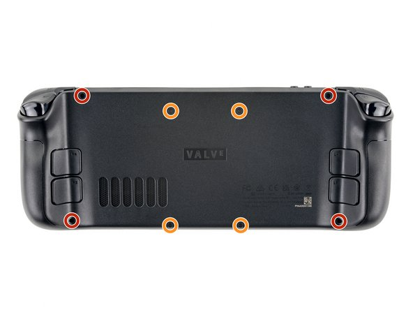
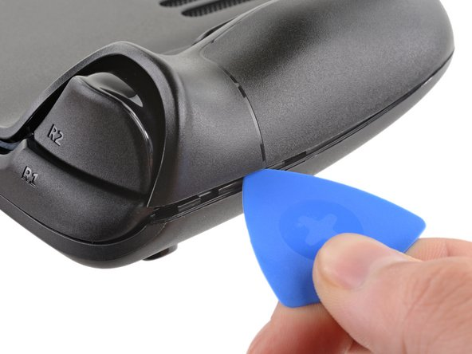
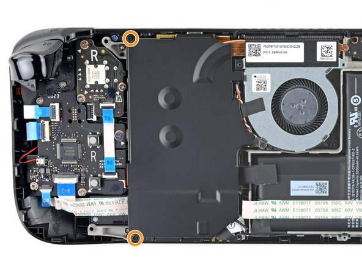
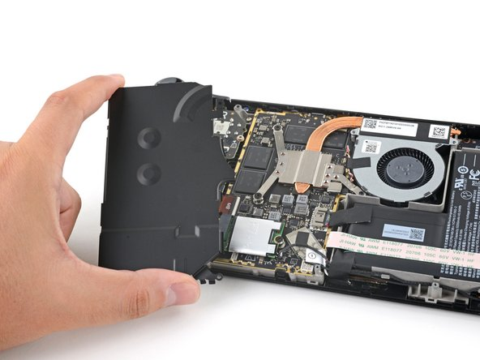
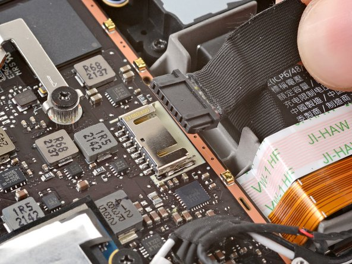
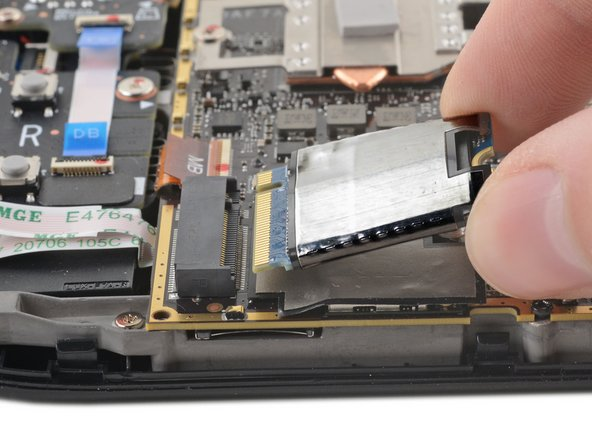

# SteamOS

以下内容默认是运行 SteamOS 3.0 的 Steam Deck 的介绍。

Steam Deck 是 Valve 公司开发的掌上游戏机，它运行 SteamOS 3.0。

Steam Deck 有 3 种型号，分别是 64GB eMMC、256GB NVMe SSD 和 512GB NVMe SSD，售价分别为 399 美元、529 美元和 649 美元。事实上，完全没有必要购买更大空间的机型。因为 Steam Deck 的存储空间是可以扩展的，它有一个 microSD 卡槽。但是，这个卡槽的速度不是很理想。你可以自己购买一块 M.2 2230 SSD（如西部数据 SN740），然后拆开 Steam Deck，将这块 SSD 安装到 Steam Deck 上。这样，你就可以拥有更大的存储空间，而且速度也会更快。

Steam Deck 出厂时搭载的系统是 SteamOS 3.0，但是你也可以选择安装 Windows 11。可是，这样就失去了折腾机器的乐趣，所以不建议这样做。

Steam Deck 的 CPU 是 AMD 的 Zen 2 架构，GPU 是 RDNA 2 架构。这两个架构都是目前最新的架构。所以，Steam Deck 的性能是非常强大的。它可以运行大部分的游戏，包括一些 3A 大作。但是，它的性能还是比不上 PC。所以，如果你想玩一些性能要求比较高的游戏，还是建议购买 PC。

## 验机

由于 Steam Deck 从未在中国大陆地区销售，所以需要找代购。但是代购的 Steam Deck 没有保修。所以需要验机。

首先摸一摸按键，看看有没有松动。比如，如果扳机键手感很奇怪，可以拆机，看里面的弹簧是否脱落。如果脱落了把它装回去就行了。

开机登录自己的 Steam 账号，然后打开 Steam，看看 Steam 是否能够正常运行。

SteamOS 基于 Arch Linux，所以无法连接清华大学校园网 `Tsinghua-Secure`。如果要在清华大学寝室使用 Steam Deck，请自己安装宽带或者忽悠你的室友安装宽带。

## 更换硬盘

Steam Deck 的存储空间是可以扩展的，它有一个 microSD 卡槽。但是，这个卡槽的速度不是很理想。64GB eMMC 的硬盘容量在今天未免过于捉襟见肘。（不会真的有人买 512GB 版本吧？）

可以自己购买一块 M.2 2230 SSD（如西部数据 SN740），然后拆开 Steam Deck，将这块 SSD 安装到 Steam Deck 上。这样，你就可以拥有更大的存储空间，而且速度也会更快。

??? note "安装步骤"

    拔掉 Steam Deck 的所有连接线和 SD 卡。
    
    

    移除后盖螺丝，拆下 Steam Deck 的背面盖。

    
    
    

    === "银色防护板"
    
        揭开防护板上的贴纸，拆下银色防护板的螺丝，拆下银色防护板。

        
        
        

    === "黑色防护板"

        拆下黑色防护板的螺丝，拆下黑色防护板。

        
        

    断开电池排线。

    

    更换 SSD。

    

    把所有东西装回去。

更换完 SSD 后，需要重新安装 SteamOS。遵循 [Steam Deck 恢复指示说明](https://help.steampowered.com/zh-cn/faqs/view/1B71-EDF2-EB6D-2BB3) 安装即可。

## 安装软件

SteamOS 3.0 自带了 Steam，所以不需要安装 Steam。（废话）

### Decky Loader

Decky Loader 是 Steam Deck 的自制插件启动器。它可用于设置菜单样式、更改系统声音、调整屏幕饱和度、更改其他系统设置等。

???+ note "安装步骤"

    进入 Steam Deck 设置，打开开发者模式，并在开发者模式中打开 CEF 远程调试。

    重启 Steam Deck。

    切换到 SteamOS 桌面模式。

    打开 Konsole，设置账户密码。

    ``` bash
    passwd
    ```

    安装 Decky Loader。

    ``` bash
    curl -L http://dl.ohmydeck.net | sh
    ```

    安装完成后，回到游戏模式，按下右侧摇杆下的快捷按钮，就可以打开 Decky Loader。

### ToMoon

由于中国大陆地区网络环境问题，导致连接 Steam 服务器不是那么方便。所以需要配置一下网络。

如果有方便安装加速器的路由器，可以直接在路由器上安装加速器。如果没有，可以在 Steam Deck 上安装代理等。

???+ note "安装步骤"

    在安装 Decky Loader 的基础上，在 Konsole 中执行以下命令。

    ``` bash
    curl -L http://i.ohmydeck.net | sh
    ```
