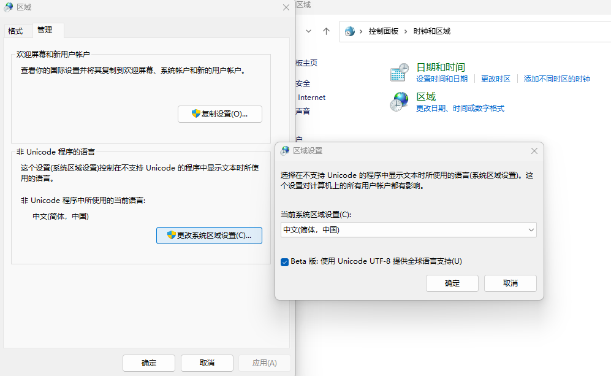

# Windows 11

Windows 11 是微软公司开发的操作系统。它是 Windows 10 的继任者，于 2021 年 10 月 5 日发布。由于 Intel 在 12 代酷睿处理器中加入了大小核技术，Windows 11 对于 12 代及以后的酷睿处理器的支持更好。Windows 11 也拥有 Windows 10 没有的新功能，如 WSA（Windows Subsystem for Android）等。

## 安装 Windows 11

可以在[微软官网](https://www.microsoft.com/zh-cn/software-download/windows11)下载镜像，也可以在 [MSDN](https://next.itellyou.cn/) 下载镜像。

可以选择在微软官网下载微软官方的 Media Creation Tool 来制作 U 盘安装介质，也可以下载 ISO 镜像后使用 [Rufus](http://rufus.ie/zh/) [:fontawesome-brands-github:](https://github.com/pbatard/rufus) 制作 U 盘安装介质。

### 跳过联网

新版本的 Windows 11 的安装过程中强制要求联网，否则无法继续安装。这给我们带来了很多不便。例如，如果是新购买的笔记本电脑，一旦联网激活后没有质量问题，就无法退货了。所以，我们需要跳过联网。

如果使用 Rufus 制作 U 盘安装介质，可以在制作前选择跳过联网。这样，安装时就不会联网。

如果已经进入了安装界面，需要联网时，可以按 ++shift+f10++ 打开命令提示符，然后输入

``` powershell
taskkill /f /im OOBENetworkConnectionFlow.exe
```

来跳过联网。

## 使用 Windows 11

### 将编码改为 UTF-8

Windows 11 默认使用 GBK 编码，这是陈旧而不合理的。现在大多数软件都使用 UTF-8 编码。我们可以将编码改为 UTF-8。

打开控制面板，选择“时钟和区域”，然后选择“区域”。在弹出的窗口中，选择“管理”，点击“更改系统区域设置”。在弹出的窗口中，选择“Beta: 使用 Unicode UTF-8 提供全球语言支持”复选框，然后点击“确定”按钮。最后，重启电脑。



值得注意的是，在中文环境下运行的 Windows 的 C 和 C++ 程序使用 `printf()` 输出是与源代码编码相同的，但是 `scanf()` 输入是 GBK 编码。这是因为 Windows 的 C 和 C++ 程序使用的是 Windows API，而 Windows API 使用的是 GBK 编码。所以，如果你想在 Windows 下使用 C 和 C++ 编程，可以使用 GBK 编码或者在 WSL 中编译运行。