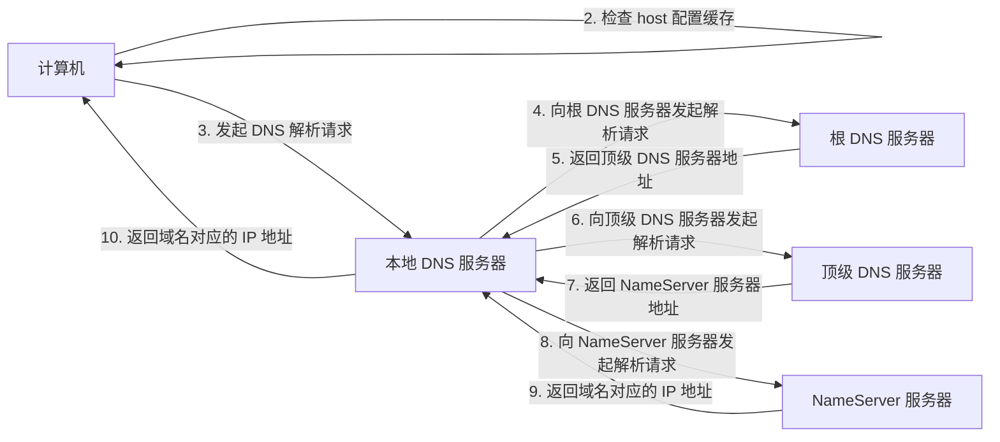

# DNS

DNS（Domain Name System，域名系统）是一个分布式数据库，它将域名映射到 IP 地址。当你在浏览器中输入域名时，浏览器会向 DNS 发送请求，DNS 会将域名映射到 IP 地址，然后浏览器就可以通过 IP 地址访问网站了。

## DNS 解析

DNS 解析是将域名映射到 IP 地址的过程。DNS 解析过程如下：

1. 计算机首先检查浏览器缓存，如果缓存中有域名对应的 IP 地址，就直接返回 IP 地址，DNS 解析结束。
2. 如果浏览器缓存中没有域名对应的 IP 地址，计算机就会检查 host 配置缓存，如果缓存中有域名对应的 IP 地址，就直接返回 IP 地址，DNS 解析结束。
3. 如果 host 配置缓存中没有域名对应的 IP 地址，计算机就会向本地 DNS 服务器发起 DNS 解析请求。
4. 本地 DNS 服务器会向根 DNS 服务器发起 DNS 解析请求。
5. 根 DNS 服务器会返回顶级 DNS 服务器地址。
6. 本地 DNS 服务器会向顶级 DNS 服务器发起 DNS 解析请求。
7. 顶级 DNS 服务器会返回 NameServer 服务器地址。
8. 本地 DNS 服务器会向 NameServer 服务器发起 DNS 解析请求。
9. NameServer 服务器会返回域名对应的 IP 地址。
10. 本地 DNS 服务器会返回域名对应的 IP 地址，计算机得到域名对应的 IP 地址，DNS 解析结束。

## DNS 解析记录

DNS 解析记录是 DNS 解析的结果。DNS 解析记录包含以下几种类型：

- A 记录：将域名映射到 IPv4 地址。
- AAAA 记录：将域名映射到 IPv6 地址。
- CNAME 记录：将域名映射到另一个域名。
- MX 记录：将域名映射到邮件服务器。
- NS 记录：将域名映射到 DNS 服务器。
- TXT 记录：将域名映射到任意文本。
- PTR 记录：将 IP 地址映射到域名。

其余类型的 DNS 解析记录不再赘述。

## :fontawesome-brands-cloudflare: Cloudflare

一般来说，域名注册商提供的 DNS 服务都是免费的，但是域名注册商提供的 DNS 服务一般都不是很好，尤其是那些中国大陆境外的域名注册商，它们的 DNS 服务在中国大陆的解析速度很慢。所以，我们需要一个好用的 DNS 服务。

Cloudflare 是一个 CDN（Content Delivery Network，内容分发网络）服务商，它提供了 DNS 服务。Cloudflare 的 DNS 服务是免费的，而且 Cloudflare 的 DNS 服务还提供了一些额外的功能，例如防火墙、DDoS 攻击防护、CDN 加速等等。

在域名注册商处将域名的 DNS 服务器修改为 Cloudflare 的 DNS 服务器，然后在 Cloudflare 中添加域名，就可以使用 Cloudflare 的 DNS 服务了。

### Proxy

Cloudflare 的 DNS 服务还提供了一个 Proxy 功能，它可以将域名映射到 Cloudflare 的 CDN 服务器，从而实现 CDN 加速 ~~（对于中国大陆用户来说，可能是减速）~~。但是它可以在一定程度上隐藏域名的真实 IP 地址，还可以防止 DDoS 攻击。